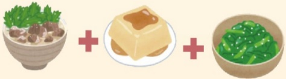

※ Comparison of calcium supplement ingredients on the market:

| Type           | Calcium Carbonate | Calcium Citrate | Calcium Lactate | Algae Calcium | Amino Acid Chelated Calcium |
|----------------|-------------------|------------------|------------------|---------------|-----------------------------|
| Vegetarian     | X                 | Vegan            | Dairy-based      | Vegan         | Vegan                       |
| Calcium content| 40%               | 21%              | 13%              | 32%           | 15%                         |
| Absorption rate| 25%               | 35%              | 29%              | 40%           | 80%                         |
| Source         | Pearl/Shell       | Chemically synthesized | Milk/Yogurt | Red algae     | Chemically synthesized     |
| Consumption method | After meals | Before or after meals | After meals | After meals | On empty stomach / before bed |

※ High-calcium foods:

※ High-vitamin D foods:

※ Sample food combinations for preventing sarcopenia:

| Food           | Calcium (mg/100g) |
|----------------|-------------------|
| Whole milk     | 100               |
| Black bean tofu | 335               |
| Black beans    | 176               |
| Traditional tofu | 140              |
| Bok choy       | 181               |
| White kale     | 146               |
| Red amaranth   | 122               |

| Food           | Vitamin D (μg/100g) |
|----------------|---------------------|
| Salmon         | 34.1                |
| Eel            | 20.7                |
| Sardine        | 17.3                |
| Tuna           | 5.3                 |
| Chicken egg    | 2.0                 |
| Dried shiitake mushrooms | 0.7       |
| Fresh shiitake mushrooms | 0.3       |

Breakfast: Cheese egg toast + sesame milk  

  

Lunch: Rice + pan-fried sea bream + shiitake and white kale stir-fry  

  

Dinner: Beef ramen + pickled tofu + stir-fried groundnut leaves  

  

Snack: Fruit yogurt / black fungus ice  

  

This copyright is not allowed to be reproduced, reprinted, or resold without the copyright holder's consent.  
Copyright holder: Yida Medical Foundation  
Form number: HA-3-0042(1)  
Size: 29.7x20cm, printed in March 2023, revised in February 2023  

Preventing falls  
Muscle is essential  
(Diet for preventing sarcopenia)  

