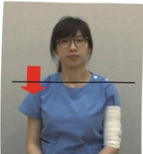

Rehabilitation Exercises in the First Phase After Mastectomy

Indications: First week after mastectomy (after removal of drainage tubes)

Video

Instruction

1. Deep breathing.

2. Coughing: After lightly pressing on the surgical site with both hands, cough to effectively clear mucus and avoid pain at the incision site.

3. Elevate the limb on the surgical side.

4. Movement of the distal limb on the surgical side:

Hold for 5 seconds, then relax.

Repeat 10 times.

Perform at least 5 sessions per day.

1. Alternate clenched fist and open hand movements

Remember to perform slowly and gently!

2. Alternate wrist movements

3. Alternate elbow movements

5. Gradually sit up, and only get out of bed when no dizziness occurs.

6. Gradually increase shoulder joint mobility to 90 degrees on the surgical side:

Hold for 5 seconds, then relax.

Repeat 10 times.

Perform at least 5 sessions per day.

## Warm-up Exercises

### 1. Shoulder elevation

### 2. Shoulder downward press

### 3. Forward rotation

### 4. Backward rotation

