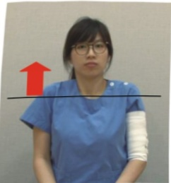

## Post-Mastectomy Stage 2 Rehabilitation Exercises

Indications: Week 2 after mastectomy (after removal of drainage tubes) to 4–6 weeks post-surgery

Video

Instruction

Objectives:  
1. For patients who have undergone mastectomy, achieve pre-surgical range of motion by week 4 post-surgery.  
2. For patients who have undergone breast reconstruction, achieve pre-surgical range of motion by week 6 post-surgery.

Exercises:  
1. Continue lifting the affected limb.  

2. Movements of the distal limb on the surgical side:  
- Hold for 5 seconds, then relax  
- Repeat 10 times  
- Perform at least 5 sessions per day  
Remember to move slowly and carefully  

1. Alternate clenched fist and open hand movements  

2. Alternate wrist movements

### 3. Alternate elbow movements  

3. Gradually increase the range of motion of the surgical-side shoulder joint to pre-surgical levels:  

Warm-up exercises  

- Hold for 5 seconds, then relax  
- Repeat 10 times  
- Perform at least 5 sessions per day  

1. Shoulder abduction  

### 2. Shoulder internal rotation  

### 3. Forward rotation  

### 4. Backward rotation  

