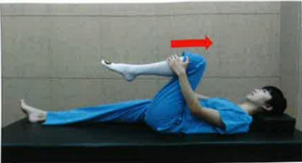
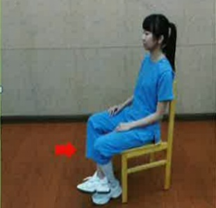

## Post-TKA Home Rehabilitation Exercises

Exercise Purpose: Gradually increase knee joint angle and strength, and restore daily activities as early as possible

Exercise Prescription: Hold for 10~15 seconds. Perform 15 repetitions, four times a day

## Warm-up Exercises

|  | Knee-to-chest Movement | Prone Knee Bend Movement |
|---|---|---|
|  |  |  |

*Knee Joint Movement*

|  | Sitting Position | Sitting Position |
|---|---|---|
|  | Knee Flexion Stretch | Knee Extension Stretch |
|  |  |  |
|  | Standing Position |  |
|  |  |  |

