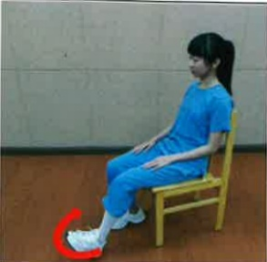
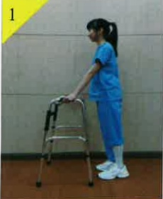

Pain-relieving exercises

| Foot dorsiflexion exercises | Knee extension exercises |
| --------------------------- | ------------------------- |
|  |  |
| (1) Use walker to walk forward (2) Lead with the operated foot | (3) The other foot follows |
|  |  |  |

## Notes:

(1) After returning home, it is recommended to perform home rehabilitation exercises four times daily, each session lasting about 30 minutes.

(2) For each exercise, maintain the strength for 5 to 15 seconds based on your recovery progress after surgery.

(3) After each exercise, apply ice for 10 to 15 minutes, and take prescribed medications as advised by your doctor to control pain effectively, which will lead to better rehabilitation outcomes.

(4) If severe pain occurs during exercise, seek medical attention immediately and receive appropriate treatment.

(5) For 6 to 8 weeks after surgery, use a walker to walk to prevent falls, until your doctor during outpatient follow-up deems it safe to resume normal activities.

(6) Within three months after surgery, when going up stairs, lead with the non-operated foot; when going down stairs, lead with the operated foot to protect the operated foot. Due to the risk of falling when going up and down stairs, family members are advised to accompany the patient.

| Contact Information |
| ------------------- |
| Yida Hospital: Address: No. 1, Yida Road, Jiaoshu Village, Yancheng District, Kaohsiung City. Phone: 07-6150011#2330 |
| Yida Cancer Treatment Hospital: Address: No. 21, Yida Road, Jiaoshu Village, Yancheng District, Kaohsiung City. Phone: 07-6150022#2340 |
| Yida Da Chang Hospital: Address: No. 305, Da Chang Road, Sanyin District, Kaohsiung City. Phone: 07-5599123#7531 |