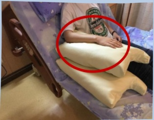
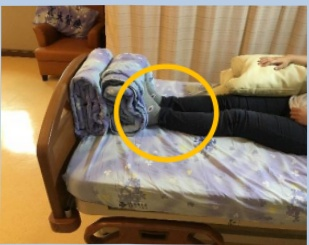

## Positioning Guidelines for Patients with Unilateral Weakness – Sitting Position

Benefits of sitting posture:  
1. Regulates blood pressure  
2. Reduces pressure sores  
3. Enhances sensory stimulation  
4. Affects lung capacity  

Make good use of the stronger side limbs  
to assist in body movement!  

Hold the headboard or rail with the stronger hand, and place the feet on the bed's backrest.  
Use both hands and feet simultaneously to lift the body until the head touches the headboard.  

Method One  
☐: Place a pillow under the affected side's elbow and forearm, palm down.  

Method Two  
☐: Place a cotton blanket or similar between the feet and the bed's backrest  

Prevent the buttocks from sliding down!!

## Method One:  
☐: Place the feet against a rolled cotton blanket at the bed's backrest  
Keep the knees straight and maintain a straight line from the back of the bed to prevent the buttocks from sliding down.  

Method Two:  
Place the feet against a rolled cotton blanket at the bed's backrest, and elevate the bed's backrest to prevent the buttocks from sliding down.