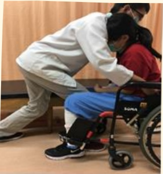

## Lift the patient (key point!)

● Patient leans forward

Caregiver shifts weight backward, slightly bends knees, keeps back straight

Method 1: Suitable for patients with one weak leg

Method 2: Suitable for patients with one or both weak legs

Caregiver must continuously hold the patient's knees with both feet

Safety check before sitting down

Patient maintains a forward-leaning posture before sitting稳

Avoid the patient's body leaning backward!

References

## Safety first — seek help if needed!

1. Davies, P. M. (2000). Steps to follow: the comprehensive treatment of patients with hemiplegia. Springer Science & Business Media.

2. Jian Meng-yue (2003). Physical therapy for stroke patients: comprehensive treatment for hemiplegic patients. Heki Publishing.

| Contact Information |
|---------------------|
| Yida Hospital: Address: No. 1, Yida Road, Jiaoshu Village, Yancheng District, Kaohsiung City. Phone: 07-6150011 |
| Yida Cancer Treatment Hospital: Address: No. 21, Yida Road, Jiaoshu Village, Yancheng District, Kaohsiung City. Phone: 07-6150022 |
| Yida Da Chang Hospital: Address: No. 305, Da Chang Road, Sancheng District, Kaohsiung City. Phone: 07-5599123 |