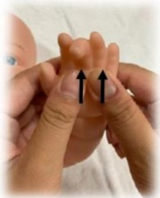

## E-DA HEALTHCARE GROUP

### 3. Hands

Start:
Slide from arm to wrist

Palms:
Gently push from wrist toward fingertips

Fingers:
Gently rub each finger

Back of hands:
Gently push from wrist toward fingertips

End:
Slide from wrist to arm

### 4. Back

Back rubbing:
Use palms to gently rub the baby's back, moving from head to buttocks

Full-body rubbing:
Gently rub the baby's back with palms to the heels of both feet

Circular massage:
Use the pads of the four fingers to draw small circles on the baby's back

Comb-style massage:
Form hands into a comb shape, massaging from back to buttocks

## References:

1. Zhang, Y., Duan, C., Cheng, L., & Li, H. (2023). Effects of massage therapy on preterm infants and their mothers: a systematic review and meta-analysis of randomized controlled trials. Frontiers in pediatrics, 11, 1198730.

2. Yoshida, S., & Funato, H. (2021). Physical contact in parent-infant relationship and its effect on fostering a feeling of safety. iScience, 24(7).

|           | Address of E-Da Hospital: No. 1, Yida Road, Jiaosu Village, Yancheng District, Kaohsiung City | Phone: 07-6150011 | Address of E-Da Cancer Treatment Hospital: No. 21, Yida Road, Jiaosu Village, Yancheng District, Kaohsiung City | Phone: 07-6150022 | Address of E-Da Dachang Hospital: No. 305, Dachang Road, Sancheng District, Kaohsiung City | Phone: 07-5599123 |
|-----------|------------------------------------------------------------------------------------------|------------------|------------------------------------------------------------------------------------------|------------------|------------------------------------------------------------------------------------------|------------------|
|           |                                                                                          |                  |                                                                                          |                  |                                                                                          |                  |

