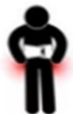

# Lumbar Surgery: Activities and Rehabilitation

Activities Guide

Rehabilitation Exercises

Back Pain

Doctor's Examination

Medication Treatment

Physical Therapy

Back Brace Assistance

Surgical Treatment

Back Pain Relief