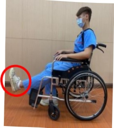
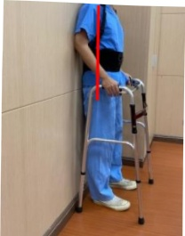

## Advanced Rehabilitation Exercises

Step in place (alternating leg lifts)

Point toes

Notes: (1) These rehabilitation exercises can be started before surgery.

(2) When wearing a back brace, if the back plate causes discomfort at the surgical wound, place a towel inside the back plate. The soft towel can reduce wound pain and improve comfort.

(3) Perform exercises only as long as no pain is felt at the surgical wound. If pain occurs, consult a physical therapist for adjustments to the exercise program.

(4) If dizziness or any discomfort occurs, stop the exercise immediately to prevent falls. Exercise intensity should be tailored to individual conditions and should not be excessive, as overexertion may cause pain at the surgical wound.

(5) Avoid turning over or bending to retrieve objects for three months.

(6) Avoid lifting heavy objects (total weight in both hands should not exceed 10 kg) for three months.

For further information, please consult the Rehabilitation Department of this hospital.

| Contact Information |
|---------------------|
| Yida Hospital: Address: No. 1, Yida Road, Jiaoshu Village, Yancheng District, Kaohsiung City; Phone: 07-6150011#2330 |
| Yida Cancer Treatment Hospital: Address: No. 21, Yida Road, Jiaoshu Village, Yancheng District, Kaohsiung City; Phone: 07-6150022#2340 |
| Yida Dachang Hospital: Address: No. 305, Dachang Road, Sancheng District, Kaohsiung City; Phone: 07-5599123#7531 |

Yida Medical Foundation, 29.7 × 42 cm, printed in November 2023

HA-11-0041(1), established in November 2023