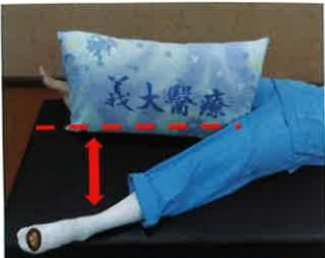

## Home Rehabilitation Exercises After Hip Replacement

Exercise Purpose: Gradually increase hip joint range of motion and strength, and restore daily activities as early as possible

Exercise Prescription: Hold for 10~15 seconds. Perform 15 repetitions, four times a day

Warm-up Exercises

| Foot Ankle Circles | Hip Abduction | Hip Flexion |
|-------------------|--------------|-------------|
|  |  |  |
| Hip Flexion | Hip Extension | Hip Abduction |
|  |  |  |
| Hamstring Stretch | Calf Stretch | Straight Leg Raise |
|  |  |  |

