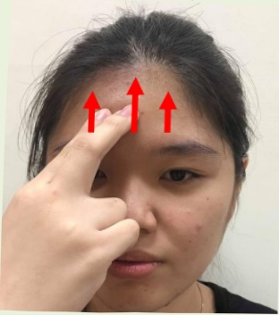

## Facial Nerve Palsy Rehabilitation Exercises

➢ Exercise prescription: Hold for 5–10 seconds, then relax; perform 15 times per session, four times daily

➢ Exercise prescription: Hold for 5~10 seconds, then relax; perform 15 times per session, four times daily

➢ Caution: If there is a wound on the face, avoid massage on the wound, or consult the rehabilitation department again

<table border=1 style='margin: auto; width: max-content;'>
<tr>
<td colspan="2">Massage area</td>
</tr>
<tr>
<td style='text-align: center;'></td>
<td style='text-align: center;'></td>
</tr>
<tr>
<td style='text-align: center;'>From the nostril to the forehead</td>
<td style='text-align: center;'>From the corner of the mouth to the ear</td>
</tr>
<tr>
<td style='text-align: center;'></td>
<td style='text-align: center;'></td>
</tr>
<tr>
<td style='text-align: center;'>From the corner of the mouth to the ear</td>
<td style='text-align: center;'>Massage at the corner of the mouth</td>
</tr>
<tr>
<td style='text-align: center;'></td>
<td style='text-align: center;'></td>
</tr>
</table>