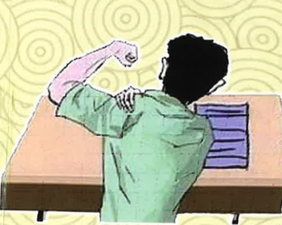

## Three. References

Qiu Zhihao (2019). "Treatment and rehabilitation of fifty-year-old shoulder pain." *Journal of the Chinese Endometriosis Women's Association*, 26(7-8), 18-19.

Yu Liangjian, Chen Shumei, Jin Mengjie (2019). "Exploration of the correlation between pain, functional capacity, and quality of life in patients with fifty-year-old shoulder pain." *Physical Therapy*, 44(2), 150-151.

Meiling, Xu Qingzhe, Chen Jingxiu (2020). *Health and fitness methods* (3rd ed., pp. 239-273). Taipei: Wen Nan Publishing.

## Yida Hospital

Address: No. 1, Yida Road, Jiaosu Village, Yanchao District, Kaohsiung City  
Phone: (07) 615-0011

## Yida Cancer Treatment Hospital

Address: No. 2, Yida Road, Jiaosu Village, Yanchao District, Kaohsiung City  
Phone: (07) 615-0022

## Yida Da Chang Hospital

Address: No. 305, Da Chang Road, Simei District, Kaohsiung City  
Phone: (07) 559-9123

This copyright is not allowed to be reproduced, reprinted, or resold without the consent of the copyright holder.

Copyright Holder: Yida Medical Foundation  

21*29.7cm Printed in February 2025 Revised in April 2023 HA-8-0005(4)

Understanding Traditional Chinese Medicine

Care for Shoulder Pain

