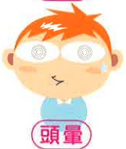

# Hypoglycemia Care

## What is Hypoglycemia?

Hypoglycemia usually refers to a blood glucose level below 70mg/dl, which can easily lead to hypoglycemic symptoms. Therefore, when blood glucose drops below 70mg/dl, one should be alert to the possibility of hypoglycemia.

## Why Does Hypoglycemia Occur?

1. Not eating on time after injection or medication

2. Excessive use of oral medication or insulin

3. Sudden increase in physical activity without appropriate snack supplementation

4. Prolonged fasting without eating

## How to Handle Hypoglycemia?

## The 15-Life-Saving Rule

## $ ^{*} $ What are the symptoms of hypoglycemia

1. Blood glucose below 70mg/dl

Immediately supplement with 15 grams of sugar, then check blood glucose again after 15 minutes

2. Blood glucose still below 70mg/dl

Supplement with another 15 grams of sugar, then check blood glucose again after 15 minutes

3. Blood glucose still below 70 mg/dl

## Immediate Hospitalization Required

## Source of Information:

Diabetes Education Core Curriculum 2022, Diabetes Education Society of the Republic of China (Taiwan)

## The following supplements are equivalent to 15 grams of sugar

3 pieces of 5g granulated sugar

3 packs of 5g sugar

Small bottle of lactic acid bacteria beverage

One teaspoon of syrup or honey

120cc-150cc sugared beverage

## Contact Information

Yi Da Hospital

Address: No. 1, Yi Da Road, Jiao Su Village, Yanchao District, Kaohsiung City

Yi Da Cancer Treatment Hospital

Address: No. 21, Yi Da Road, Jiao Su Village, Yanchao District, Kaohsiung City

Phone: 07-6150011, extension 5959

Yi Da Da Chang Hospital

Phone: 07-6150022, extension 6406

Yi Da Medical Foundation 21×29.7cm

Address: No. 305, Da Chang 1st Road, Sanmin District, Kaohsiung City

Printed in July 2024

Phone: 07-5599123, extension 7354

Revised in April 2024 HA-7-0014(2)