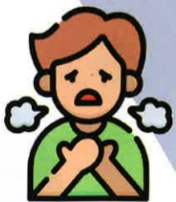
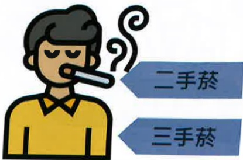
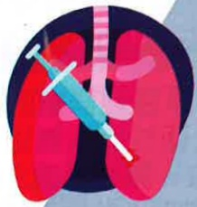
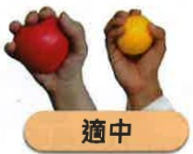
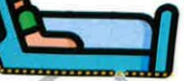
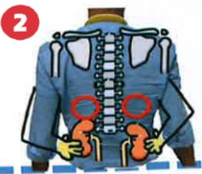
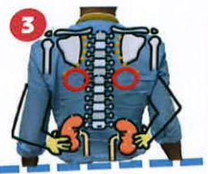
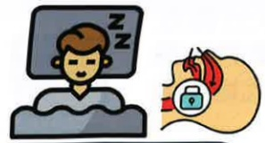

肺阻塞

(COPD)

照護手冊

義大醫療 呼吸胸腔科## 基本資料

姓名：___

生日

聯絡電話

主治醫師

個管師

聯絡方式

疾病相關## 口塚

一、什麼是肺阻塞..... 03  
二、肺阻塞診斷與治療概論..... 06  
三、肺阻塞藥物治療..... 09  
四、急性惡化症狀與處理..... 20  
五、肺阻塞非藥物治療..... 23  
(一)戒菸與疫苗注射..... 24  
(二)肺部復原運動..... 26  
(三)胸腔物理治療..... 35  
(四)肺阻塞共病與營養照護..... 37  
(五)居家氧氣治療..... 39  
六、文獻參考..... 41

## 一、 什麼是肺阻塞

肺阻塞(COPD)是一種呼吸道慢性發炎，不可逆之阻塞性疾病。引發慢性發炎的主因是呼吸道長期受到刺激(如：吸菸、粉塵、化學物質……)，此種發炎反應使呼吸道分泌黏液，進而造成支氣管阻塞，氣體無法順暢進出肺部，導致呼吸困难等問題。

健康的呼吸道

發炎的呼吸道

## 一、 什麼是肺阻塞

肺阻塞為台灣十大死因第9名(2022)，每年造成逾5000人死亡，佔台灣民眾死亡率的6%-10%，且第一次住院死亡率達22%。

常見症狀「咳嗽、有痰、喘不停」，常被以為是感冒或氣喘症狀而忽視，若有慢性咳嗽、咳痰，呼吸困难或者曾有暴露在危險因子的病史時，都建議就醫進一步檢查診斷。

## 一、 什麼是肺阻塞

## 危險因子

吸菸

三手菸

環境/職場

粉塵

## 家族史

肺部狀況

反覆感染## 二、 肺阻塞診斷與治療概論

## 診斷

## 三 

疾病史

家族史

吸菸史

危險因子

呼吸道症狀

## 呼吸胸腔科门诊

吸菸史

咳痰

呼吸道症状

喘

危險因子

(刺激性

物質暴露)

## 二、 肺阻塞診斷與治療概論

家族史

## 醫師看診與評估

## 有無吸菸?長期吸菸?

會不會常咳嗽？會不會常有痰？

會莫名其妙喘且越來越嚴重？

活動時(如 運動 爬梯 提重物)特別喘？

持續有喘的狀況？

長期暴露廚房油煙？

長期暴露職業性粉塵(石綿矽煤礦棉屑穀物...)或化學物質(硫酸硝酸氨氣)?

有家人或親戚曾患有肺阻塞？

## 診斷

## 三三三 

醫師評估必要時

胸部X光

或

胸部電腦斷層掃描

## 肺功能檢查

胸腔科重要的診斷檢查

以肺量計評估肺功能的方式

檢查時用力吸飽氣後用力

吐氣

以用力呼氣肺活量(FVC)及

力呼氣一秒量(FEV1)評估呼

氣氣流受阻的程度

FEV1/FVC < 70% 表示有

呼氣氣流受阻的情形

合併醫師評估各項症狀嚴重

度 吸菸習慣 危險因子暴露

胸部X光...等

來確立診斷為肺阻塞## 二、 肺阻塞診斷與治療概論

## 治療

改善症狀，延緩病情惡化，維持生活品質

藥物治療

## 非藥物治療

## 三、 肺阻塞藥物治療

## 吸入劑藥物

支氣管擴張劑是治療肺阻塞的主要藥物

單方

急救用

複方

短效乙二型交感神經刺激劑(SABA)

短效

短效乙二型交感神經刺激劑+短效型抗膽鹼藥物(SABA+SAMA)複方(含ICS)

保養用

長效乙二型交感神經刺激劑(LABA)

長效型抗膽鹼藥物(LAMA)

固定劑量複方

支氣管擴張劑

(LABA+LAMA)

固定合併吸入型

類固醇與長效乙

二型刺激劑

(LABA+ICS)## 三、 肺阻塞藥物治療

## 三、 肺阻塞藥物治療

## 吸入劑藥物

## 長效單方

## 緩釋型氣霧吸入劑

## 長效抗膽鹼藥物(LAMA)

商品名：

Spiriva Respimat

學名：

Tiotropium

中文名：

適喘樂 舒沛噴吸入劑

使用劑量：

每日1次，每次2噴

## 吸入劑藥物

## 緩釋型氣霧吸入劑

## 長效複方

## 雙長效合併支氣管擴張劑

(Fixed dual LABA+LAMA)

商品名：

Spiolto Respimat

學名：

Olodaterol + Tiotropium

中文名：

適倍樂 舒沛噴吸入劑

使用劑量：

每日1次，每次2喷

## 雙長效合併支氣管擴張劑

(Fixed dual LABA+LAMA)

商品名：

乾粉吸入劑

Anoro Ellipta

學名：

Vilanterol

+ Umeclidinium

中文名：___

安肺樂 易利達乾粉吸入器

使用劑量：

每日1次，每次1喷## 三、 肺阻塞藥物治療

## 三、 肺阻塞藥物治療

## 吸入劑藥物

## 長效複方

## 雙長效合併支氣管擴張劑

(Fixed dual LABA+LAMA)

## 乾粉吸入劑

商品名：

Ultibro Breezhaler

學名：

Indacaterol +

breezhaler

Glycopyrronium

中文名：

昂帝博 吸入器膠囊

使用劑量：

每日1次，每次1劑

## 雙長效合併支氣管擴張劑

(Fixed dual LABA+LAMA)

## 定量噴霧吸入劑

商品名：

Bevespi Aerosphere

學名：

Formoterol +

Glycopyrronium

中文名：

必肺宜 氣化噴霧劑

使用劑量：

每日2次，每次2噴

## 吸入劑藥物

## 長效複方## 三、 肺阻塞藥物治療

## 三、 肺阻塞藥物治療

## 吸入劑藥物

## 長效複方(含ICS)

## 固定合併吸入型類固醇與長效乙二型刺激劑(ICS+LABA)

商品名：

Relvar Ellipta

學名：

乾粉吸入劑

Fluticasone furoate

+ Vilanterol

中文名：

潤娃 易利達乾粉吸入劑

使用劑量：

每日1次，每次1噴

定量噴霧吸入劑

## 固定合併吸入型類固醇與長效乙二型刺激劑(ICS+LABA) 商品名：

## 乾粉吸入劑

Symbicort Turbuhaler

學名：

Budesonide

+ Formoterol

中文名：

吸必擴 都保粉狀吸入劑

使用劑量：

## 吸入劑藥物

每日2次·每次2噴

## 長效複方(含ICS)

## 固定合併吸入型類固醇與長效乙二型刺激劑(ICS+LABA)

商品名：

Seretide Evohaler MDI

學名：

Fluticasone propionate

+ Salmeterol

中文名：___

使肺泰 吸入劑

使用劑量：

每日2次，每次2喷

固定合併吸入型類固醇與長效乙二型刺激劑(ICS+LABA)

商品名：

Symbicort Rapihaler MDI

定量噴霧吸入劑

學名：

Budesonide

+ Formoterol

中文名：

吸必擴 氣化噴霧劑

使用劑量：

每日2次，每次2噴

## 三、 肺阻塞藥物治療

## 吸入劑藥物

## 長效複方(含ICS)

## 三、 肺阻塞藥物治療

## 吸入劑藥物

## 長效複方+ICS(三合一)

乾粉吸入劑

## 吸入型類固醇(ICS) + 長效抗膽鹼藥物(LAMA) + 長效乙二型刺激劑(LABA)

商品名：Trelegy Ellipta

學名：

Fluticasone furoate

+ Umeclidinium

+ Vilanterol

中文名：

肺樂喜 易利達乾粉吸入劑

使用劑量：每日1次，每次1噴

定量噴霧吸入劑

## 吸入型類固醇(ICS) + 長效抗膽鹼藥物(LAMA) + 長效乙二型刺激劑(LABA)

商品名：

Trimbow

學名：

Beclomethasone

dipropionate

+ Glycopyrronium

+ Formoterol

中文名：喘寶 定量吸入劑

使用劑量：每日2次，每次2噴## 三、 肺阻塞藥物治療

吸入劑藥物

長效 複方+ICS(三合一)

## 三、 肺阻塞藥物治療

吸入劑藥物

## 正確使用

未正確使用## 四、 急性恶化症狀與處理

## 症状

肺阻塞病人發生急性惡化的情況，主要為呼吸道症狀急遽加重，其症狀改變的程度超出平日之正常範圍，因而需要改變用藥

咳嗽變嚴重

痰液變多

痰液變濃稠

呼吸困难加劇

## 、急性惡化症狀與處理

預防與處理方式

避免上呼吸道感染

避免有害物質暴露

疫苗施打

口罩防護裝備保護

一旦有急性惡化的狀況，就應立即使用急求藥物並盡快就醫

泛得林

定量吸入器

備勞喘

定量吸入器

備喘全

定量噴霧液## 、急性惡化症狀與處理

肺功能下降

症状加劇

住院期間死亡率

第一年死亡率

加護病房住院率

呼吸器使用率

呼吸衰竭發生率

生活品質下降

## 五、 肺阻塞非藥物治療

戒菸與疫苗注射

肺部復原運動

胸腔物理治療

居家氧氣治療## 五、 肺阻塞非藥物治療

## 五、 肺阻塞非藥物治療

## 戒菸與疫苗注射

## 戒菸

菸草含超過7,000種化學物質，

其中數百種有毒，至少93種已知致癌物

吸菸為肺阻塞最主要危險因子，造成肺功能惡化，影響生活品質，且十大死因中多與吸菸有關(如瘧症、心血管疾病、中風…等)

## 據統計資料顯示

吸菸者較正常人罹患肺癌 $ ^{↑25} $ 倍而吸菸之肺阻塞者更 $ ^{↑120} $ 倍

## 疫苗注射

## 流感疫苗

每年10月~次年3月

月 65歲以上

公費23價/13價

兩劑間隔1年

*實際補助狀況，以最新政府公告政策為主

## 肺炎鏈球菌疫苗

## 新冠肺炎疫苗

随流行病毒株疫苗更新時施打

## 带狀皰疹疫苗

自費施打兩劑以上動作每日規律多次練習

每日練習次數與頻率 請依個人狀況增減調整

## 五、 肺阻塞非藥物治療

## 肺部復原運動

## 全方面的肺復原計畫

肺復原是經詳細的病人評估，依個別狀況所擬定的全面性介入療法，包括運動訓練、衛教(如疾病衛教、藥物衛教...)與健康行為促進，旨在改善肺阻塞病人的生理與心理狀況，並增進病人長期堅持有益健康的行為。

## 五、 肺阻塞非藥物治療

## 運動訓練

改善肌力與心肺功能，減少運動時呼吸困难改善日常活動與生活品質

## 噘嘴呼吸 & 腹式呼吸

透過呼吸訓練可增加吐氣時間來減少肺

## YouTube

部氣體滯留，有助於↓因運動引起的動

態過度充氣，改善病人呼吸困难狀況

呼吸訓練

## 五、 肺阻塞非藥物治療

## 以上動作每日規律多次練習

每日練習次數與頻率 請依個人狀況增減調整

## 五、 肺阻塞非藥物治療

## 水瓶(或啞鈴)訓練

透過上肢運動，改善上肢肌肉力量，提高運動耐力及呼吸強度，減緩呼吸喘不適程度。

## YouTube

## 上肢運動

建議頻率每周至少3次，

每次20-30分鐘

配合噉嘴呼吸效果更加，

練習次數可以依個人狀況調整## 五、 肺阻塞非藥物治療

## 五、 肺阻塞非藥物治療

## 彈力帶訓練

肱二頭肌訓練

## YouTube

斜方肌訓練

肱三頭肌訓練

建議頻率毎周至少3次，每次20-30分鐘

配合噘嘴呼吸效果更加，練習次數可以依個人狀況調整

## 走路(跑步機)

## YouTube

下肢運動訓練分為耐力訓練與阻力訓練，兩者結合訓練可增加運動能力與肌肉強度

走路與跑步機訓練適合平衡能力佳者，可搭配噉嘴與腹式呼吸同時訓練

下肢運動

走路運動 須穿著適當鞋子

平衡稍差者

可使用枴杖或助行器輔助

若家中有跑步機

可藉以調整適合的速度

建議頻率每周至少3次，每次15-20分鐘練習次數可以依個人狀況調整

## 坐到站

下肢運動

雙手交叉

抱於胸前

## YouTube

站起->坐下為1個動作

找一把穩固不易傾倒的椅子 坐於椅子上平衡較差者可將助行器置於前方輔助

通常20個動作為一個循環

動作數量可依個人狀況增減調整## 五、 肺阻塞非藥物治療

## 五、 肺阻塞非藥物治療

## 腳踏車運動

## 下肢運動

須穿著適當鞋子，輔以適度暖身運動，

若家中有固定式腳踏車，可藉以調整速度與

阻力

## YouTube

建議量 每週至少3次 每次15~20分鐘 運動過程中若有不適可暫停休息 訓練次數與頻率可依個人狀況增減調整

## 螃蟹走路訓練

適合穩定度足、可獨立行走者，

若穩定度不足但仍可獨立行走者，

建議訓練時扶牆輔助

## 下肢運動

雙腳大腿處彈力繩或彈力帶固定

向左5步再向右5步

雙腳打開與肩同寬

膝蓋微彎曲

上半身直立 不彎腰 手叉腰

雙側各重複4次為一個循環

## YouTube

若訓練後

腿部肌肉微癡

可適度熱敷緩解

運動過程中

若有不適

可暫停休息

訓練次數與頻率

可依個人狀況

增減調整

## 握力球(或握力器)

## YouTube

肌少症是一種全身性肌肉質量、力量及功能下降的綜合症狀，研究發現約有27%的

COPD病人有肌少症

握力不僅代表手部肌肉力量，更是最佳衡量整體肌肉力量之指標

COPD病人握力不足、骨骼肌與呼吸肌功能下降，

## 握力訓練

會增加急性發作風險及死亡率、造成肺功能惡化與影響

生活品質

研究發現握力每↓1公斤，COPD惡化的風險↑5%

握力球選擇

適中

過大

過小

每下2~5秒，20下為1組

每日至少3組，可依個人狀況調整## 五、 肺阻塞非藥物治療

## 五、 肺阻塞非藥物治療

## 節能技巧(又稱工作簡化技巧)

透過安排順序操作，節省精力、保持行動獨立

適當運用節能技巧能幫助呼吸困难、運動會喘的病人，

更輕鬆的完成日常生活活動，搭配呼吸訓練可降低進行

活動時所需的能量消耗，減少疾病所帶來的不適

節能技巧

坐著洗澡

使用長柄刷輔助

避免彎腰

## 胸腔物理治療

拍痰時機

飯前1小時

飯後2小時

拍痰工具

常見為

手成空心杯狀

拍痰杯、

拍痰棒...等

減少飽食時咳痰引起嘔吐造成吸入性肺炎

拍痰方式

以每秒3~5下的速度扣擊

建議每部位3-5分鐘

每日執行3次

注意事项

須避開引流管或開刀傷口及部分器官部位...等

如有發紺、呼吸困难、生命徵象改變、咳血

立即停止拍痰

## 五、 肺阻塞非藥物治療

## 前胸

半坐臥

## 上肺葉

床傾斜角度

建議45~60度

## 中肺葉 下肺葉

扣擊鎖骨下上肺位置

## 後背

前傾坐姿

## 後背雙側同時

頭低腳高 俯臥

適合年輕平衡感較佳無高血壓心血管高腦壓...等禁忌症者

後背

側臥

俯臥(3/4俯臥)

胸前用枕頭墊高

扣擊 (1) 腋下 (2) 腋下平行脊椎處 (3) 肩胛骨下方

## 五、 肺阻塞非藥物治療

肺阻塞共病與營養照護

共病

肺阻塞是一種慢性發炎的疾病，常合併有性疾病，可能影響肺阻塞的疾病控制

心血管疾病

骨質疏鬆

肺癌

支氣管擴張症

感染症

睡眠呼吸中止症## 五、 肺阻塞非藥物治療

## 營養照護

肺阻塞病人中約 30-60% 有營養不良問題維持理想體重和水份平衡是很重要的

另約 27% 有肌少症(為一種全身性肌肉質量、力量及功能下降的綜合症狀)

呼吸肌功能下降，會增加急性發作風險及死亡率、造成肺功能惡化與影響生活品質

## 優質營養攝取可改善症狀及提升生活品質

優質蛋白質

豆魚蛋肉

一掌心

少量多餐

飯量適中

避免太撐

影響呼吸

優質油脂及堅果類烹食拌炒不水煮

食慾不振

專用營養品

來湊

水分攝取維持身體代謝平衡

避免易脹氣

食物

豆類 花椰菜

洋蔥 糯米

*實際營養需求依個人狀況調整*

*若有問題可洽詢專業營養師*

## 五、 肺阻塞非藥物治療

## 居家氧氣治療

氧氣為一種治療方式，需要經過醫師處方使用治療目的

改善低血氧的合併症

減輕呼吸系統及心臟的負荷

減緩呼吸困难的症狀

提升生活品質及存活率## 五、 肺阻塞非藥物治療

## 缺氧徵兆

呼吸困难

心跳過快

冒冷汗

意識混亂

頭暈

嘴唇手指發紺

## 長期居家氧氣供應的設備

醫師會根據病人的活動能力、給氧流量和室內環境、經濟考量等因素選擇最佳氧氣供應設備常見有：

插電式/攜帶充電式

氧氣鋼瓶

氧氣製造機

## 六、 文獻參考

台灣胸腔暨重症加護醫學會(2017)·肺阻塞知多少-台灣肺阻塞全方位照護手冊·台北市：台灣胸腔暨重症加護醫學會

台灣胸腔暨重症加護醫學會(2021)·2021第一次使用吸入器就上手·台北市：台灣胸腔暨重症加護醫學會

台灣胸腔暨重症加護醫學會(2022)·2022台灣肺復原實務指引·台北市：台灣胸腔暨重症加護醫學會

台灣胸腔暨重症加護醫學會(2022)•2022奔跑吧! 小肺! -肺阻塞的肺部復健衛教手冊

台灣胸腔暨重症加護醫學會(2023)·台灣肺阻塞臨床照護指引·台北市：台灣胸腔暨重症加護醫學會

圖片來源：https://www.flaticon.com/

圖片來源：https://www.canva.com/肺阻塞照讎

義大

團隊

E-DA HOSPITAL

義大醫院

高雄市燕巢區

角宿里義大路1號

07-6150011

轉 5072

肺阻塞個管師

聯絡資訊

義大癌治療醫院

高雄市燕巢區角宿里義大路21號

07-6150022

轉 6477

肺阻塞個管師

義大大昌醫院

高雄市三民區大

昌一路305號

07-5599123

呼吸胸腔科門診

義大醫療財團法人 14.8x21cm

HA-9-0127(1) 2024.05新設 2024.08印制