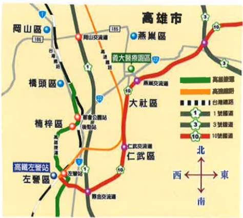

地址：高雄市824燕巢區角宿里義大路1號

電話：07-6150011

網址：edah@edah.org.tw

本著作權非經著作權人同意不得轉載翻印或轉售

著作權人：義大醫療財團法人

表單編號：HA-1-0064(2)

義大醫療財團法人 20X20cm 2016.05印製 2011.05修訂

## 便 秘

## 便 秘

## 一、 什麼是便秘：

解出乾、少量（少到50克/天）或不常解便

（經常少到三日一次）。

## 二、 便秘的原因有下列幾項：

1. 水分攝取不足。

2.食物攝取纖維量不夠。

3. 缺乏運動。

4. 憂鬱，生活壓力，緊張繁忙，削減胃腸功能，導致大腸肌肉緊張。

5. 肛門疾病（如：肛裂、肛門膿瘍、肛門狹窄

6. 藥物影響。

7. 懷孕。

8. 機械性阻塞：腫瘤。

9. 系統性疾病：糖尿病、中風。

## 三、 便秘的症状有下列幾項：

1. 排便次數少，排便困難。

2. 必須用力解便。

3. 排便時痛或有便血。

4. 排便後仍有便意。

5. 腹胀，腹痛。

6. 只能解出少量稀水便或滲便，這是嚴重便秘的後期症狀。

## 四、 便秘的预防及保健知識有下列幾項

1. 多喝開水，果汁或牛奶，以增加體內水分，利於乾糞便排出。

2. 多吃纖維素或維他命豐富的食物。

3. 細嚼慢嚥食物，並在食物中加添有助消化的物質。

4. 少喝含咖啡因或酒精或碳酸類之飲料，以防止削減你身體的水分。

5. 避吃精製食品或加工食品。

6. 少量多餐，在兩餐之間保持體力，並使您維持健康消化功能。

7. 要有充足睡眠和休息，避免生活壓力影響健康或導致消化不良。

8.保持每天進行適量運動，以增加血液循環，幫助體內消化機能。

9. 養成定時上大號的習慣，通常早餐後一小時內是最好的時機，不要趕，就算沒有排便，也專心的坐十分鐘。

10. 避免緊張、憂慮，多喝溫熱的水可促進腸子蠕動，不要使用通便劑。

11. 若無明顯改善，則需考慮腫瘤造成的機械性阻塞。