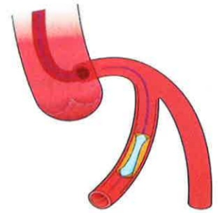

# 認識心導管檢查治療 及照護注意事項

資料來源：義大醫院3樓心導管室

## 目錦

一、何謂冠狀動脈疾病___P.2  
  
二、治療種類及方式___P.3  
  
三、心導管如何執行___P.4  
  
四、心導管檢查之併發症有哪些___P.8  
  
五、心導管執行之注意事項___P.9  
  
六、日常照顧需知___P.12  
  
七、問與答___P.12## 一、 何謂冠狀動脈疾病

心臟血管疾病之可怕，是在毫無預警的情況下，病人可能突然發生的猝死，讓人措手不及。而一般社會大衆容易忽略心臟病突發的可能。成人心臟病最常見的是冠狀動脈狹窄及阻塞，醫學上稱此類疾病為冠狀動脈疾病，也就是俗稱的狹心症。心臟跟身體所有的器官一樣，需要靠血管供給含氧血液，心臟的含氧血液靠著三條冠狀動脈供給，只要這些血管保持健康，心臟功能就能保持完整。然而，當冠狀動脈狹窄阻斷血液對心臟的氧氣供應時，就會引起胸痛，心肌因而缺氧進而抑制心肌收縮，使心臟不能搏出正常量的血液，有時甚至會損害控制心律的傳導系統，引起心衰竭或心律不整而導致死亡。

## 二、 治療種類及方式

## 一 般於醫學上大致分為：

## (一) 危險因子的預防及控制

包括避免食用高脂肪、高膽固醇食物，採取低鹽飲食、多攝取蔬菜水果、控制血壓、控制血糖、絕對戒煙、安排規律生活和定期運動，理想的運動方式是希望每週運動三次，每次運動30分鐘。

## (二) 藥物治療

藥物治療可以改善心臟功能，減少發作及症狀減輕，但不能讓狹窄血管還原。目前有多項藥物可用來增加氧氣之供應或減少氧氣之需求，例如硝酸鹽類、乙型交感神經阻斷劑、鈣離子阻斷劑、血管緊縮素轉換酶抑制劑、抗血小板凝集劑等。

## (三) 介入性治療

如果藥物治療效果不顯著，則可考慮接受心導管檢查，評估病灶是否適合進行氣球擴張術以及血管支架置放術等介入性治療，或者需要外科之冠狀動脈繞道手術。

## 三、 心導管如何執行

心導管是利用特製無菌導管經由股動脈(大腿鼠膝部)或橈動脈(手腕處)穿入冠狀動脈探查是否有血管狹窄或阻塞，如果有狹窄的病灶可能使用動脈氣球擴張術撐開狹窄的部位或支架置入。

### 1. 氣球擴張術(Balloon)

(1)將導引導管置放至冠狀動脈開口處：如下圖左

(2)置入導絲通過處：如下圖右

資料來源：義大醫院3樓心導管室

(3)將氣球導管沿著導線置入至病灶處：如下圖左

(4)將氣球導管擴張起來，將狹窄處撐開：如下圖右

資料來源：義大醫院3樓心導管室

(5)持續或反覆擴張氣球

數次：

如下圖左

(6)抽離氣球導管，評估血管擴張效果是否需要進一步置放血管支架：如下圖右

資料來源：義大醫院3樓心導管室
下圖為氣球導管擴張時的照片

資料來源：義大醫院3樓心導管室

## (二) 支架置放術

### 1. 支架的實物放大圖

(左圖為擴張前；右圖為擴張後之血管支架)

（說明：支架是鑲嵌在汽球上）資料來源：義大醫院3樓心導管室

(2) 支架置放過程模擬示意圖

資料來源：義大醫院3樓心導管室## (3) 支架擴張之後的照片圖示

資料來源：義大醫院3樓心導管室

## 四、 心導管檢查之併發症有哪些

嚴重的併發症包括：心律不整、急性心肌梗塞、血管傷害、腦中風、顯影劑造成腎功能損傷和心臟填塞，發生的機會平均小於1%。

## 五、 心導管執行之注意事項

## (一) 導管檢查前：

1. 生理學上評估：抽血、心電圖、X光檢查。

2. 同意書：必須包括病人及家屬的同意、簽章。

3. 皮膚準備：減少手術過程感染，執行檢查時，建議將雙側鼠蹊部剃毛(常見執行部位為手腕或鼠膝部)。

4. 禁食：隔日早上執行檢查，請午夜12點後禁食(包含水、食物)。隔日下午執行檢查，可吃早餐(7AM前進食完畢)，早餐後開始禁食(包含水、食物)。

5. 檢查當日請移除身上金屬飾品、活動性假牙，若有塗指甲油或口紅應擦拭乾淨。

6.檢查當日穿著病人服，不穿內衣褲。

7.疾病過去史：過敏體質(曾對顯影劑過敏)、出血不止等情形，請事先告知醫師。

8.脈動檢查：護理人員會為您測量血壓、脈搏並在雙腳脈搏跳動點做上記號，以利比較前後脈動強弱有無改變。

9.檢查前請排空膀胱。

## (二) 導管檢查中：

1. 採局部消毒及麻醉，使用特殊導管經由手臂或鼠蹊處的血管插入，順著血管到達心臟。2. 檢查過程中您是清醒的，進行的過程中可能需要您配合用力咳嗽，以促進冠狀動脈血流。

3. 注射顯影劑時，可能會有全身發熱、噁心、嘔吐的感覺，請您不用擔心，此感覺很快就會消失。

4. 執行過程中若有不適如胸悶、發冷、發熱、心悸及呼吸困难等症狀，請立即告知醫護人員。

## (三) 導管檢查後：

1. 檢查部位若為手腕，醫護人員使用止血加壓帶或紗布及寬膠 環繞加壓穿刺處，4小時後會開始漸進式拆除部份寬膠，隔天早上才會完全拆除，並重新換藥以防水膠膜固定，檢查的肢體勿出力，術後1星期內避免提重物。

2. 檢查部位若為鼠蹊部，若導管已在檢查室移除者，醫護人員會在您的穿刺部位使用加壓器直接加壓30分鐘止血，之後放置一個重約2公斤的砂袋加壓4小時，穿刺部位不可彎曲，保持砂袋於患處。砂袋加壓移除後需再平躺4-6小時勿翻身，以避免出血。檢查後可以採半坐臥，若無傷口出血，可於醫護人員檢視後，下床活動。

3. 行鼠蹊部之股動脈檢查且導管未移除者，導管拔除前須平躺，拔除導管後須以砂袋加壓4小時平躺6小時，臀部可左右移動，患肢關節須保持平直，不可彎曲、用力，腳踝可自由活動。術後可以採半坐臥，若無傷口出血，可於醫護人員檢視後，下床活動

4. 返室後應完全臥床休息4小時，因為躺臥時間較久，如需解尿請使用便盆或尿壺，6小時未解，請告知護理人員。若傷口於鼠蹊部者如要排便，請護理人員協助便盆或尿布使用。

5.24小時內盡量減少下床活動及避免用力解便，如有解便困難請告知醫護人員，以免傷口流血。

6. 護理人員會持續監測您的生命徵象、上肢或下肢血循及溫度。

7. 若有噁心、嘔吐、心悸、呼吸困难、胸痛、發燒、出血及檢查側的肢體有冰冷、蒼白、麻刺、疼痛感及異常腫脹感、瘀青、傷口紗布有濕熱、疼痛等不適情形，應即刻告知醫護人員。

8. 返室後可正常飲食，若無特殊禁忌例如：肝、腎疾病，建議多喝水，利顯影劑排出。

9. 檢查隔日早上，護理人員會為您去除敷料，傷口消毒並以紗布及防水膠膜覆蓋。若無不適當日則可碰水洗澡，隔日可去除紗布。

10. 檢查次日傷口旁偶有瘀青，請告知醫師檢視，約二至三週皮膚瘀青情形會逐漸消退。## 六、 日常照顧需知

1.返家一週內，避免做劇烈運動及髖關節或膝關節過度屈曲的活動如：爬山、快速上下樓梯、提重物等活動。

2. 請勿暴飲暴食，建議多吃蔬菜及適量蔬果，避免排便用力。

3. 出院後若有出現傷口處有疼痛、腫脹、出血不止及瘀青等不適，應立即返院追蹤。

4. 請規則服藥，藥物的作用主要防止血管再阻塞或症擽，如有服藥不適，可與醫師做討論與以調節，請勿自行停藥。

5. 定期回診追蹤，因仍有部份的病人胸痛可能會再復發，有可能為血管再次阻塞，而這種再度阻塞的情形常發生在術後6個月內。

6.期間有任何不適仍應返回門診求診。

## 七、 問與答

1. 執行完心導管治療後，其再次阻塞機率？

一般單純氣球擴張術後三至六個月後又發生狹窄的機率高達百分之30%至40%，所以大多數患者氣球擴張術後都會接受支架置放。置放一般金屬支架後一年內發生狹窄的機率會降至百分之12%至18%，若置放塗藥支架，則一年內發生再狹窄的機率會降至5-9%，約可比一般金屬支架降低一半的再阻塞機率。

## 八、 參考文獻

Jernberg, T., Hasvold, P., Henriksson, M., Hjelm, H., Thuresson, M., & Janzon, M. (2015). Cardiovascular risk in post-myocardial infarction patients: nationwide real world data demonstrate the importance of a long-term perspective. European heart journal, 36(19), 11631170. https://doi.org.edlibproxy.flysheet.com.tw:8443/10.1093/eurheartj/ehu505

Yin, W. H., Lu, T. H., Chen, K. C., Cheng, C. F., Lee, J. C., Liang, F. W., Huang, Y. T., & Yang, L. T. (2016). The temporal trends of incidence, treatment, and in-hospital mortality of acute myocardial infarction over 15 years in a Taiwanese population. International journal of cardiology, 209, 103113.

https://doi.org.edlibproxy.flysheet.com.tw:8443/10.1016/j.ijcard.2016.02.022## 義大醫院

地址: 824005高雄市燕巢區角宿里義大路1號

服務電話: 07-6150011

## 義大癌治療醫院

地址: 824005高雄市燕巢區角宿里義大路21號

服務電話: 07-6150022

## ☑義大大昌醫院

地址: 807066高雄市三民區大昌一路305號

服務電話: 07-5599123

本著作權非經著作權人同意不得轉載翻印或轉售

著作權人：義大醫療財團法人

14.8×21cm 2025.08印製 2024.04修訂 HA-1-0163(4)