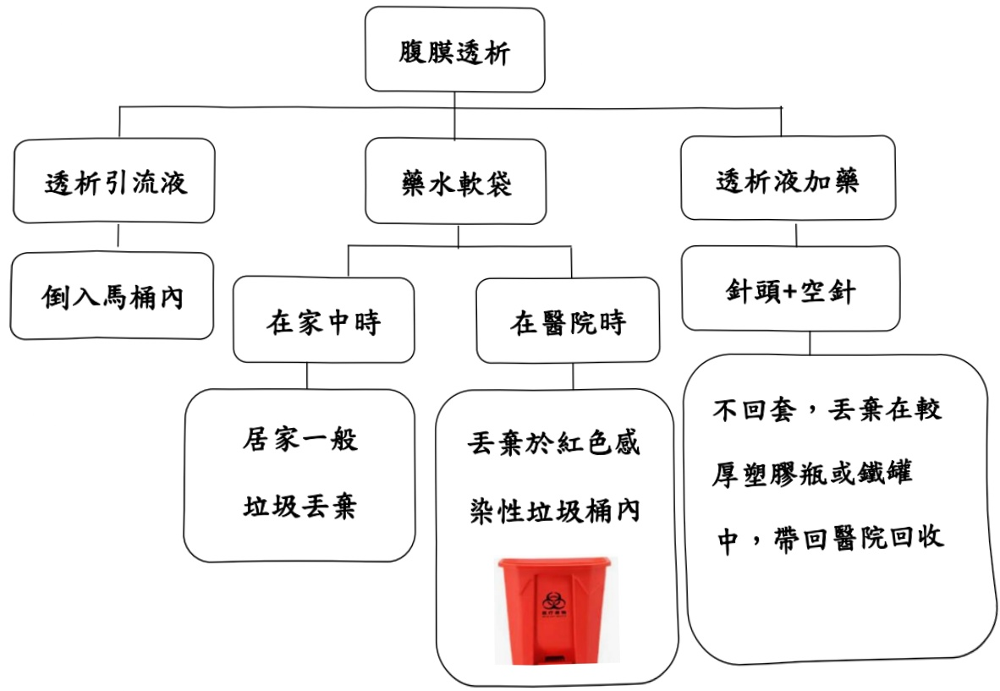

## 腹膜透析後引流液及其他廢棄物的處理

## 一、 適用對象：腹膜透析病人

## 二、 處理原則：

## (一) 在家中時：

1. 將透析引流液袋子剪開，將透析液倒入馬桶沖掉。

2. 透析液軟袋及廢棄管組，丟棄於家用一般垃圾桶，比照居家一般廢棄垃圾處理。

## (二) 在醫院時：

透析液軟袋、機器管組及小白帽等廢棄物，因有接觸體液，屬於

感染性，應丟棄於紅色感染性垃圾桶內。

## 三、 處理流程：

E-DA HEALTHCARE GROUP

2024.02.29 12:29:70

大器炼财图法人

<table border=1 style='margin: auto; width: max-content;'><tr><td colspan="3">聯絡資訊</td></tr><tr><td style='text-align: center;'>義大醫院</td><td style='text-align: center;'>義大惡治療藥院</td><td style='text-align: center;'>義大昌醫院</td></tr><tr><td style='text-align: center;'>地址:高雄市燕樂區角宿里義大路1號 電話:07-6150952</td><td style='text-align: center;'>地址:高雄市燕樂區角宿里義大路21號 電話:07-6150022</td><td style='text-align: center;'>地址:高雄市三民區大昌一路305號 電話:07-6150208</td></tr></table>

翁淑满、蔡慧玲(2014).居家腹膜透析手册.百特醫療。

參考資料：

<table border=1 style='margin: auto; width: max-content;'><tr><td style='text-align: center;'>1. 倒人馬桶</td><td style='text-align: center;'>2. 冲水</td><td style='text-align: center;'>3. 藥水軟袋丟入垃圾桶</td><td style='text-align: center;'>4. 洗手</td></tr></table>

四、處理透析引流液順序：