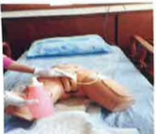

# 亞急性呼吸照護中心 衛教手冊

莪大醫療## 亞急性呼吸照護中心入住說明

## 一、 治療計畫說明

病人入住後，將由主治醫師評估並開始進行呼吸訓練與脫離呼吸器計畫。

## 二、 治療結果與後續安排

1. 如呼吸訓練成功脫離呼吸器，將觀察5天，即可轉至一般病房繼續照顧。

2. 若評估短期內無法脫離呼吸器，將會與家屬討論轉至慢性呼吸照護病房(RCW)或安排居家照護，由本院出院準備服務小組協助後續照護計畫與轉介安排。

## 三、 住院期間的特殊情況

若病人病況不穩定或需要接受外科手術，醫師將視情況安排病人返回加護病房(ICU)接受進一步治療。

## 四、 重大傷病申請

呼吸器使用連續天數大於21天者，即可申請呼吸衰竭且連續使用呼吸器21天以上之重大傷病(住院期間可由本院代辦)，申請至審核期間約7~14天左右。（審核單位為中央健康保險局非本院胸腔科醫師認定）。## 自我介紹

主動自我介紹，並配戴識別證，可由病室外的名牌得知其三班照護的護理師

03003

## 3 A03

班：

小夜班：

大夜班：

## 會客原則

為了有效的感染控制，會限制探訪的時間及兩位人數的限定，也需要落實隔離防護穿著隔離衣、戴口罩、洗手，避免造成交互感染，如延遲會客，仍會完成30分鐘的會客時間

## 確實洗手避免感染

▶因孩童的抵抗力較弱，十二歲以下兒童限制進入。

▶患有傳染性疾病之訪客限制進入，如有呼吸道感染症狀請全程配戴口罩。

▶進入亞急性呼吸照護中心時記得將您的手機關機，因病人身上有許多管路及儀器，易受電磁波影響，也請您及您的家屬瞭解放置任何管路的目的及重要性，故勿自行移動病人及必要性會給予保護性約束措施。

## 疼痛照護

術後傷口及管路的放置易造成疼痛不適，醫護人員進行每兩小時評估疼痛指數，並適度給予止痛劑使用，可以減輕疼痛及不適感。

疼痛評估

針劑、口服止痛

## 預防跌倒

臥床時使用床欄，針對高危險群跌倒病人，加強標示，會客結束離開前，請確認雙側床欄皆已拉起。

## 預防失禁性皮膚炎及壓傷

使用呼吸器臥床病人，由於身體病生理情況，易引起失禁性皮膚炎及壓傷，做好失禁性皮膚炎及壓傷預防，可降低失禁性皮膚炎及壓傷的發生。

長效保膚霜

乾洗潔膚液

無痛保護膜

泡棉敷料## E-DA HEALTHCARE GROUP

## 氣切造口簡介

▶氣切是在氣管環上切開一個開口與氣管相通，稱其切開口為氣管造口術，常以氣切簡稱。

1. 呼吸衰竭無法脫離呼吸器  

2. 疾病因素需要長期依賴呼吸器  

3. 隨時有呼吸道阻塞危險的病人

## 氣切跟氣管內管有什麼差別

## 氣切管

放置位置

由頸部氣切造口置入氣切管，不經過口腔，口腔清潔度較佳。

放置管路風險小

鬆開氣囊取出氣切管重新放置，放置過程時間短、風險小。

## 管路長度短

氣切管較短，痰液清潔度較佳、呼吸省力，脫離呼吸器機率較高。

生活品質

經過訓練可說話及進食，

溝通較方便。

## 氣管內管

放置位置

管路經由口腔、喉嚨至

氣管，口腔清潔度較

差，黏膜易受損

## 放置管路風險高

經喉頭鏡確認氣管位置再置入氣管內管，放置過程時間長、風險高。

## 管路長度長

氣管内管較長，痰液不易清除、呼吸較費力，脫離呼吸器機率較低。

## 生活品質

無法說話及進食，長期放置，容易導致喉嚨腫脹及聲帶受損。## 氣切造口護理

▶ 每日應執行氣切造口護理至少一次，如Y紗、氣切固定帶濕了或髒了，需馬上更換。

使用優碘消毒氣切造口時需停留2分鐘以達消毒效果。

消毒範圍應大於紗布，避免新紗布汙染。

每日觀察氣切造口周圍皮膚是否有紅腫及分泌物等發炎徵象。

更換氣切固定帶時需固定氣切管，避免管路滑脫。

氣切固定帶固定鬆緊度約留2指寬度，防止過緊或過鬆。

矽膠氣切套管每個月更換一次。

重新建立溝通方式，如以筆紙、手勢、讀唇語等方式。

## 氣切造口護理

## 尿管護理

如病人需要密切監測尿液，或是急性尿滯留而放置導尿管使用，若導尿管照護不當易造成感染，故每日應清潔會陰部及導尿管。

1. 將便盆或尿布垫在病人臀部下方，以沖洗壺沖水

2. 用肥皂水或沐浴乳塗抹於病人尿道口、會陰部及尿管上段處再以清水沖洗乾淨

3. 將病人尿道口、會陰部及尿管上段以濕紙巾擦乾

4. 協助更換乾淨尿布或衣褲

5. 尿袋位置須維持在膀胱以下，尿袋口離地3公分以上，且開口應隨時關閉，尿袋內尿量超過1/2至2/3應倒掉義大醫院 亞急性呼吸照護中心

地址：高雄市燕巢區角宿里義大路1號

電話：07-6150011轉3391、3392

本著作權人非經著作權人同意不得轉載翻印或轉售

著作權人：義大醫療財團法人

義大醫療財團法人 2025.09印製 2025.07新設 HA-1-0224(1)