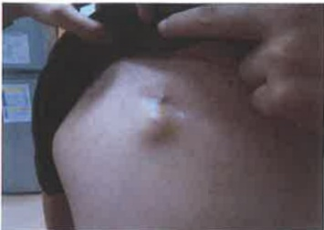

## 貳、植入式注射座（port-A）的認識與介紹

## 一、 何謂植入式注射座（port-A）：

Port-A (venous access implantable port, Port-A) 俗稱人工血管，是一種人工靜脈血管，它是一種矽質合成品，其分為球體部及導管兩個部份，有一個注射入口和一條含鎖扣的導管（圖一），管子長約70公分（植入體內大約15-20公分），經由頭臂靜脈到上腔靜脈通到右心房上方。注射區植入鎖骨下胸腔壁的皮下組織，因此不會干擾正常生活，外觀看起來大小如十元硬幣般突起（圖二）。

(圖一)

(圖二)

## 二、 如何装置植入式注射座（port-A）：

一般病人可安排住院或門診經由外科醫師局部麻醉下或全身麻醉，由鎖骨下方切開約4~5公分的小傷口，將導管由週邊靜脈進入插入中央靜脈內，再將注射座植入皮膚下。