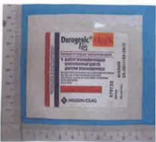

3. 活動方面並不受限制，但需避免太激烈的運動，且安裝人工血管之同側手臂，應避免360度的旋轉、提舉過重物品及直接的碰撞，以免人工血管移位。

4. 人工血管若不使用，須定期每1-2個月返診或視情況開單；經批價後至注射室，以含抗凝劑(Heparin)的生理食鹽水沖洗一次，以免導管阻塞。

5. 請留意每次人工血管的回血情形，以提供醫師或護理師下次判斷人工血管功能的重要訊息。

## 參、吩坦尼穿皮貼片劑

一、學名：Fentanyl

二、藥品外觀/商品名/中文名

<table border=1 style='margin: auto; width: max-content;'><tr><td style='text-align: center;'></td><td style='text-align: center;'></td><td style='text-align: center;'></td></tr><tr><td style='text-align: center;'>多瑞喜穿皮贴片劑</td><td style='text-align: center;'>多瑞喜穿皮贴片劑</td><td style='text-align: center;'>平舒疼口頰溶片</td></tr><tr><td style='text-align: center;'>Durogesic D-Tans</td><td style='text-align: center;'>Durogesic D-Trans</td><td style='text-align: center;'>Painkyl</td></tr><tr><td style='text-align: center;'>12  $ \mu $ g/hr/patch</td><td style='text-align: center;'>25  $ \mu $ g/hr/patch</td><td style='text-align: center;'>200mcg/buccal soluble films</td></tr></table>