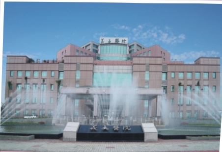

## 健保給付

活體腎移植者的術前評估及手術，不需要自費，僅需要負擔部分費用（如額外的病房費用或伙食費）即可。

## 血型不相容、交叉試驗陽性之活體腎臟移植

以往活體捐贈因血型不相容或與捐贈者交叉試驗陽性而無法進行活體腎移植。現在，手術前受贈者必須接受血漿置換術

(plasmapheresis) 及免疫抑制藥物等治療來改善，是否接受脾臟切除術，則須經醫生評估過再做決定。其整個移植流程及相關問題皆應仔細與醫師討論。

## 五 等親圖

腎臟移植門診、器官移植中心及聯絡電話：

泌尿科 王華斌醫師 禮拜一/禮拜二/禮拜三上午

、禮拜四下午

泌尿科 江朝洋醫師 禮拜三下午、禮拜四早上、禮拜六早上

協調師：

諮詢電話：07-6150011分機5853、5852、5855

## 義大醫院

地址:高雄市燕巢區角宿里義大路1號

電話(07)615-0011

網址：http://www.edah.org.tw

本著作權人非經著作權人同意不得轉載翻印或轉售著作權人：義大醫療財團法人

29.7×21cm 2024.01印製 2023.12修訂 HA-9-0013(2)

## 活體親屬腎臟捐贈

