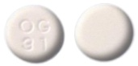
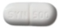

## Aspirin (Bokey)

## Clopidogrel (Plavix) 75mg/tab

## 舒栓寧膜衣錠

## Cilostazol (Pletaal)

## Dipyridamole

## 25 mg/tab

## 降血糖藥物

## Warfarin(Cofarin)(Mafarin)

## Dapagliflozin and Metformin (Xigduo XR)

Metformin 1000mg/tab

## Glimepiride and Metformin (Glimet)

利控糖膜衣錠

## Metformin (Ankomin)

## Sitagliptin and Metformin(Janumet)

+ Metformin 500mg/tab

## V ildagliptin and Metformin(Galvus Met)

## 長期服用藥物請依照醫師指示繼續服用，不需停藥；唯糖尿病藥物請於檢查當日早上暫勿服用，並隨身攜帶藥物至健診中心

服用抗血小板、抗凝血劑、銀杏、納豆、魚油、Q10等藥物，請與您的醫師評估停藥7天之可行性，以減少息肉切除術後傷口出血的機率