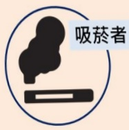

肺阻塞围际關心您

若有疑問

歡迎諮詢胸腔科醫師

## 肺炎

是一種肺部感染性疾病，由細菌或病毒透過空氣或飛沫傳染，

常見症狀：發燒、咳嗽、呼吸急促或呼吸困难、胸痛等，可能導致敗血症，危及生命。

## 肺炎鏈球菌

最常見造成肺炎的細菌，

也可能造成中耳炎、鼻竇炎、支氣管炎、腦膜炎等。

主要傳染方式：帶菌者咳嗽或打噴嚏之飛沫傳染、觸摸過被細菌汙染之物品。

肝.腎.心.肺等慢性病

## 肺炎鏈球菌疫苗種類

## 13 價

結合型疫苗 PCV13 原自費

2023 65歲↑符合條件公費

保護效期較長

兩劑需間隔一年

 $ ^{*} $ 實際補助狀況，以當下政府最新政策為準

23價

多醣體疫苗 PPV23

原

71歲↑公費

2023

65歳 ↑ 公費

保護效期約 5年

## 建議施打之高危險族群

糖尿病

腦血管疾病.失智症

吸菸者