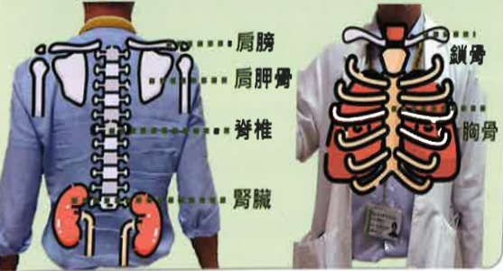

## 拍痰時機

飯前1小時或飯後2小時

減少飽食時咳痰引起嘔吐 造成吸入性肺炎

拍痰方式與工具

常見為手成空心杯狀 拍痰杯 拍痰棒 等方式以每秒3~5下的速度扣擊

建議每部位3-5分鐘，每日執行3次

## 注意事項

拍痰時須避開引流管或開刀傷口等，且拍後背時避開肩膀(腭胛骨)、脊椎、腎臟，拍前胸時避開胸骨、鎖骨等器官或部位

如有發紺、呼吸困难、生命徵象改變、咳血立即停止拍痰

上肺葉

## 中肺葉下肺葉

