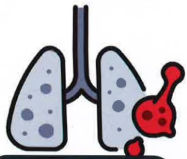
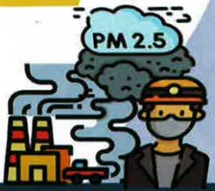

## 四、 急性恶化症狀與處理

## 症状

肺阻塞病人發生急性惡化的情況，主要為呼吸道症狀急遽加重，其症狀改變的程度超出平日之正常範圍，因而需要改變用藥

咳嗽變嚴重

痰液變多

痰液變濃稠

呼吸困难加劇

## 、急性惡化症狀與處理

預防與處理方式

避免上呼吸道感染

避免有害物質暴露

疫苗施打

口罩防護裝備保護

一旦有急性惡化的狀況，就應立即使用急求藥物並盡快就醫

泛得林

定量吸入器

備勞喘

定量吸入器

備喘全

定量噴霧液