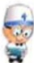

## 什麼是全靜脈營養？

全靜脈營養療法，是將身體所需的蛋白質、脂肪、維生素、礦物質經由大血管滴入高營養高濃度的溶液，以維持身體所需。一般所說的營養針只是葡萄糖和少量胺基酸(蛋白質)溶液由靜脈輸入體內，這和全靜脈營養輸入體內的濃度是不一樣的。

## 全靜脈營養的成分

1. 醣類：提供能量的來源。

2. 脂肪乳劑：提供能量的來源。

3. 胺基酸：組織的修復。

4.電解質：鈉、鉀、鎂、鈣、磷酸鹽、醋酸鹽。

5. 维生素：脂溶性及水溶性维生素。

6. 微量元素：鈷、鉻、錳、鋅。

## 什麼樣的人需要全靜脈營養？

1. 癌症病人受疾病或治療的影響，進食量不足，改善營養狀況。

2.需要暫時禁食或腸胃道功能不良，經由靜脈營養提供身體所需。

3.嚴重創傷：例如燒傷、腹部重挫傷。

4. 診斷為中度以上之營養不良者。

5. 新生兒先天性異常：例如短腸症。

6.早產兒：體重過輕。

