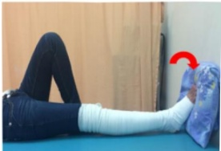
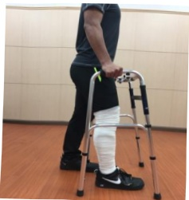

## 七、 術後第六天以上(含第六天)

1. 被動性患膝關節角度運動：每天 2 次，每次 30 分鐘。執行角度 100 度。

2. 冰敷：每天 4 次，每次 15 分鐘。

3. 足背運動：每天 4 次，每次 15 下。

4. 股四頭肌及膕旁肌運動：每天 4 次，每次 15 下。

5. 直抬腿運動：每天 4 次，每次 15 下。

6. 屈膝伸膝牵拉運動：每天 4 次，每次 15 下。

7. 下床活動輔具輔助行走：每天 4 次，每次 5 分鐘。

術後復健運動

做完復健運動後，記得幫您

的膝關節

喔！

