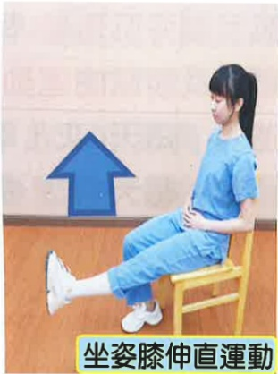

5. 髋外展運動及髋屈曲運動：每天4次，每次15下。

6. 髋彎曲、髋伸直運動：每天4次，每次15下。

7. 髋外展運動：每天4次，每次15下。

8. 坐姿膝伸直運動：每天4次，每次15下。

彈性襪肢體為手術患肢示意圖

彈性襪肢體為手術患肢示意圖

9. 使用助行器步行：每天4次，每次5分鐘。提升體能及下肢肌耐力，助行器使用如第25頁。

## 五、 術後第四天以上

1. 冰敷：每天4次，每次15分鐘。

2. 足背運動：每天4次，每次15下。

3. 足踝绕圈運動：每天4次，每次15下。

4. 股四頭肌及腦旁肌運動：每天4次，每次15下。

5. 髋外展運動及髋屈曲運動：每天4次，每次15下。

6. 髖彎曲、髖伸直運動：每天4次，每次15下。

7. 髋外展運動：每天4次，每次15下。

8. 坐姿膝伸直運動：每天4次，每次15下。

9. 大腿後側肌群伸展運動：每天4次，每次15下。

10. 小腿後側肌群伸展運動：每天4次，每次15下。

大腿後側肌群伸展運動

彈性襪肢體為手術患肢示意圖

小腿後側肌群伸展運動

彈性襪肢體為手術患肢示意圖

11. 使用助行器步行：每天4次，每次5分鐘。提升體能及雙下肢肌耐力，助行器使用如第25頁。

## 六、 正確使用助行器行走運動與上下樓梯的方式

1. 助行器行走運動

彈性襪肢體為手術患肢示意圖