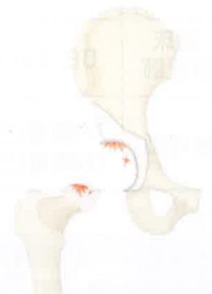
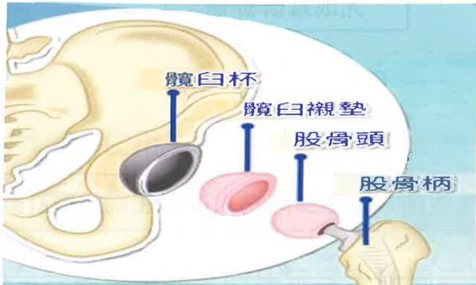

## 貳、認識髖關節置换術

## 一、 簡介

髖關節是連接骨盆與大腿之間的關節，它是由髖臼與股骨頭所構成，是我們在走路與行動時很重要的關節。當髖關節已經損壞，以致走路疼痛、患肢無力，嚴重者會造成行走不便，初期門診追蹤，先以藥物治療及患肢復健，若藥物及復健治療均無法緩解疼痛或變形，造成行走不便，即須進行全髖關節置換術。

正常髖關節

饒關節退化

饒關節退化

股骨頭缺血性壞死

## 二、 何謂全髖關節置换術

全人工髖關節組成是模擬人體髖關節構造來取代有病變或損傷的關節，由人工髖臼元件、人工股骨頭、人工髖臼墊片和人工股骨元件所組成，提供一個更穩定的髖關節，有效減輕疼痛、增加關節的活動。

## 三、 適應症

1. 先天性髋關節發育不良

2. 退化性髋關節炎

3. 類風濕性髖關節炎

4. 外傷性髖關節炎

5. 股骨頭缺血性壞死

6. 股骨頸骨折

