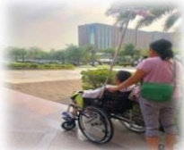

## E-DA HEALTHCARE GROUP

## 如何治療？

首先改善會造成譫妄的原因，如：治療感染問題、調整藥物、控制疼痛、解決便秘或尿滯留等。如有過度激動、干擾治療時，可給予低劑量的抗精神病藥物。

## 照護原則：

<table border=1 style='margin: auto; width: max-content;'><tr><td style='text-align: center;'>1.</td><td style='text-align: center;'>提供足夠的水份及營養，以維持電解質平衡，可以帶病人喜歡的食物，但記得先詢問醫護團隊哪些食物不可以吃。</td></tr><tr><td style='text-align: center;'>2.</td><td style='text-align: center;'>可使用眼鏡、助聽器、寫字板、圖卡等輔助溝通，以促進有效溝通，並使用低頻、和緩的語調，簡短而清楚的語句來溝通。</td></tr><tr><td style='text-align: center;'>3.</td><td style='text-align: center;'>白天保持窗簾拉開，經常提醒病人當下的日期、時間、地點、樓層、住院的原因、目前接受的治療等資訊。</td></tr><tr><td style='text-align: center;'>4.</td><td style='text-align: center;'>利用時鐘、手錶、日曆等，放置熟悉的物品，例如照片、收音機等，加強對人、時、地、物之定向感。</td></tr><tr><td style='text-align: center;'>5.</td><td style='text-align: center;'>增加白天的活動，保持白天清醒、避免昏睡，如：外出散步、曬太陽、與家屬互動、播放熟悉音樂、看電視、參與社區活動等。</td></tr><tr><td style='text-align: center;'>6.</td><td style='text-align: center;'>儘早協助下床活動或坐輪椅、肢體運動，一天至少3次，減少白天臥床時間，預防壓傷、深層靜脈拴塞、肺桧塞情形發生。</td></tr><tr><td style='text-align: center;'>7.</td><td style='text-align: center;'>提供夜間適當休息及睡眠，但避免過度或不當使用鎮靜安眠藥。</td></tr><tr><td style='text-align: center;'>8.</td><td style='text-align: center;'>除非不得已的狀況，儘量避免約束，因身體約束可能會使病人的情緒更憤怒及活動受限，造成功能衰退。</td></tr></table>

## 参考文献：

陳人豪(2020)・譫妄症・台灣老年學暨老年醫學會主編，老年病症候群(二版，15-28頁)・合記。

<table border=1 style='margin: auto; width: max-content;'><tr><td colspan="3">聯絡資訊</td></tr><tr><td style='text-align: center;'>義大醫院地址：高雄市燕巢區角宿里義大路1號電話：07-6150011 分機：</td><td style='text-align: center;'>義大癌治療醫院地址：高雄市燕巢區角宿里義大路21號電話：07-6150022 分機：</td><td style='text-align: center;'>義大大昌醫院地址：高雄市三民區大昌一路305號電話：07-5599123 分機：</td></tr></table>

美大聚療財團法人 21×29.7cm 2024.08 印製

2024.05 修訂 HA-1-0216(2)