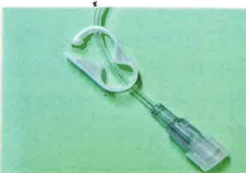

## 攜帶式居家化療注意事項

## 一、 什麼是攜帶式輸液器(居家奶瓶)

是一種輕便、一次性使用的居家化療藥物輸注裝置，以持續正壓方式讓藥物輸進人體，非常安全，且能維持日常生活與職場工作正常運行，保有生活品質的一種常見治療。

## 二、 攜帶式化療輸液器注意事項

(一) 可以透過輸液器外殼的標注線來觀察藥物輸注的過程。(圖一)

(圖一)

(二) 居家攜帶式輸液器每小時僅輸注5到10毫升，因此不需要時常盯著檢查，通常要經過六到八小時才能觀察到儲藥囊有較明顯的變化。(圖二)

(圖二)

(三)若觀察到儲藥囊有“突出顆粒”浮現時，即可判斷藥液輸注已結束。（圖三）用打火機，點火柴等有火源的東西。

(圖三)

(四) 居家攜帶式輸液器實際完成給藥結束時間與預期結束時間，相差2.5小時~5小時都屬於正常範圍。

(五)為了維持輸注速率穩定，請勿將居家攜帶式輸液器暴露於過熱或過冷之溫度下。

(六) 洗澡時水溫勿過熱，不宜泡澡，可擦澡或淋浴，淋浴時避免淋濕人工血管注射處。

(七)輸液管路為特殊設計，不會因姿勢及壓迫管路而造成輸液中斷，請勿擔心。

(八) 睡覺時建議將輸液器放在枕頭旁邊，避免放在床頭櫃或床旁桌，以免翻身時輸液器管路拉扯掉落地面而破損。

(九) 外出時請將居家攜帶式輸液器放置在腰包中，不要暴露在外，避免不必要的碰撞或拉扯。

## 三、 返家時人工血管的注意事項

（一）施打居家化學治療時穿著舒適衣服，並妥善固定管路，注射處肢體不可以提重物，或作旋轉之動作。

（二）注射導管勿拉扯，如有拉扯情形，請重新檢視注射部位及導管之安全性。

(三)當注射器滴畢時，勿關閉管夾（空氣不會跑入管內），若藥物於半夜滴註完畢，可於天亮後再返院移除即可。或意識混亂、嗜睡的情形要儘速看醫師。

勿關閉管夾(保持開啟)

## 四、 下列情形發生時須立即返回醫院處理

(一)若人工血管處有異常之紅、腫、熱、痛感，需立刻關閉卡夾並返院。

(二)若藥物滲漏、針頭脫位請立刻關閉人工血管上的管夾，以大量清水沖洗被藥物潑到的皮膚15分鐘並更換衣服，立即返院處理。

立刻關閉

