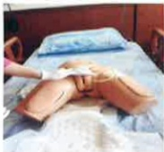

## 氣切造口護理

▶ 每日應執行氣切造口護理至少一次，如Y紗、氣切固定帶濕了或髒了，需馬上更換。

使用優碘消毒氣切造口時需停留2分鐘以達消毒效果。

消毒範圍應大於紗布，避免新紗布汙染。

每日觀察氣切造口周圍皮膚是否有紅腫及分泌物等發炎徵象。

更換氣切固定帶時需固定氣切管，避免管路滑脫。

氣切固定帶固定鬆緊度約留2指寬度，防止過緊或過鬆。

矽膠氣切套管每個月更換一次。

重新建立溝通方式，如以筆紙、手勢、讀唇語等方式。

## 氣切造口護理

## 尿管護理

如病人需要密切監測尿液，或是急性尿滯留而放置導尿管使用，若導尿管照護不當易造成感染，故每日應清潔會陰部及導尿管。

1. 將便盆或尿布垫在病人臀部下方，以沖洗壺沖水

2. 用肥皂水或沐浴乳塗抹於病人尿道口、會陰部及尿管上段處再以清水沖洗乾淨

3. 將病人尿道口、會陰部及尿管上段以濕紙巾擦乾

4. 協助更換乾淨尿布或衣褲

5. 尿袋位置須維持在膀胱以下，尿袋口離地3公分以上，且開口應隨時關閉，尿袋內尿量超過1/2至2/3應倒掉