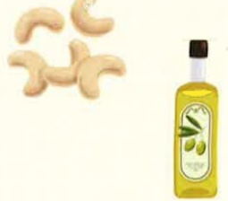

4. 多利用刺激性较低的调味品

如：糖、醋、花椒、八角、五香、蒽、蒜、番茄酱或勾芡，以促进食慾。

5. 若要去除滷肉、燉湯的油脂，可先存放在冰箱內，冷卻後去掉上層油脂後再加熱食用。

### 1. 選擇天然原態的食物，避免加工食品

如：蛋糕、饼乾、零食、肉丸、甜不辣、米血、火鍋料、奶茶（奶精）、奶昔、冰淇淋等，廣泛存在隱藏油脂。

食物選擇要均衡，以充分供給各類的營養素，可增加全穀雜糧類、水果類、脫脂奶粉等食物，以補足因脂肪受限而減少的熱量。

補充脂溶性維生素A、D、E、K

若長期使用低油飲食者，應適當補充。

當胰臟、膽薁炎、腹瀉及其他脂肪消化、吸收、運送及代謝異常之急病急性發作時，宜先禁食，循序漸進採清流質→流質→軟質→一般飲食。

參考資料來源：

1. 楊淑惠等編著（2014）。膳食療養學三版 台北市：永大

義大醫院

地址：高雄市燕巢區角宿里義大路1號

電話：07-6150011

義大癌治療醫院

地址：高雄市燕巢區角宿里義大路21號

電話：07-6150022

義大大昌醫院

地址：高雄市三民區大昌一路305號

電話：07-5599123

本著作權非經著作權人同意不得轉載翻印或轉售

著作權人：義大醫療財團法人

20X20cm 2017.08印製 2025.02修訂 HA-3-0004(3)

## 低油飲食

