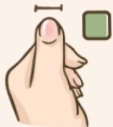
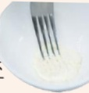

## 一、 什麼是咀嚼吞嚥困難？

當食物從嘴巴進入到胃的過程中發生一些狀況，導致無法適當地將食物咀嚼成小塊或順利吞下食物，就是發生了「咀嚼吞嚥困難」。

## 二、 咀嚼吞嚥困難有甚麼影響？

長期的咀嚼吞噬困難，容易因為減少進食的意願，導致營養不良。也因為此時容易讓食物及液體誤入到氣管、甚至掉入肺部，導致吸入性肺炎等合併症。

## 三、 誰容易發生咀嚼吞嚥困難

1. 腦

傷→腦中風, 頭部外傷, 腦瘤。

2. 神經退化→帕金森，失智。

3. 頭頸癌→口腔癌，舌癌，喉癌，鼻咽癌。

4. 老化衰弱及其他(肺炎等)

## 四、 咀嚼吞嚥困難基本飲食原則

1. 留意過硬、過黏、過乾、太大等易嗆咳食物(如堅果，麵包，麻糬，魚丸等)。

2. 容易在嘴裡散開、有小顆粒不均質、或會在嘴裡改變質地的食物，亦容易導致嗆咳。

3. 食物需濕潤軟嫩，餐具可輕易切割。

4. 如攝取液體有困難，可用增稠劑適當增加黏稠度幫助吞嚥。

5. 因每餐進食量容易變少，建議增加點心(少量多餐)滿足營養需求。

## 五、 臺灣飲食質地分類應用

咀嚼吞嚥進食困擾

是

營養師或

專業醫事人員

一般飲食

吞噬障礙

牙口

咀嚼差

液體飲品質地調整

固體食物質地調整

## 均質糊狀食

從湯匙上

整塊滑落

## 中稠度流食

從湯匙上

緩慢滴下

不會附著

##  $ ^{*} $ 均質糊狀

流動性差、緩慢流動不太需要咀嚼即可吞。

→優格

##  $ ^{*} $ 不易滴落的液體

滑順，沒有結塊，可用杯子或湯匙食用。

→濃湯、米糊

## 低稠度流食

從湯匙上

柱狀流動

##  $ ^{*} $ 些微稠度的液體

吸取時需花一些力氣。

→米漿、濃縮配方

## 微稠度流食

從湯匙上馬上流光

##  $ ^{*} $ 流動性高的液體

比水稍微濃稠。

→豆漿、均衡配方

## 易咬普通食

不容易壓成小塊分開

## 牙龈碎软食

壓食物需用力

才能壓碎

1.5

## 舌頭壓碎食

## 不需用力就能 壓碎食物

## 不須咬泥食

餐具劃

過表面

留下痕跡

##  $ ^{*} $ 不限制食物尺寸

牙齒功能不佳，但仍可咀嚼食物，且舌頭可推送食物幫助進食。

## →大黑豆乾/蘿蔔塊

###  $ ^{*} $ 1.5公分塊狀

牙齒無法咀嚼，只能靠牙齦咀嚼食物和舌頭推送食物幫助進食。

→板豆腐/蘿蔔丁

###  $ ^{*} $ 0.4公分粒狀

牙齒、牙齦無法咀嚼，但可靠舌頭和上顎壓碎食物。

## →嫩豆腐/蘿蔔粒

##  $ ^{*} $ 均質糊狀

牙齒、牙齦無法咀嚼，且舌頭也無法壓碎食物。→豆花/蘿蔔泥