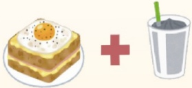

※市售鈣片成分比較：

<table border=1 style='margin: auto; width: max-content;'><tr><td style='text-align: center;'>種類</td><td style='text-align: center;'>碳酸鈣</td><td style='text-align: center;'>檸檬酸鈣</td><td style='text-align: center;'>乳酸鈣</td><td style='text-align: center;'>海藻鈣</td><td style='text-align: center;'>胺基酸螯合鈣</td></tr><tr><td style='text-align: center;'>素食</td><td style='text-align: center;'>X</td><td style='text-align: center;'>全素</td><td style='text-align: center;'>奶素</td><td style='text-align: center;'>全素</td><td style='text-align: center;'>全素</td></tr><tr><td style='text-align: center;'>鈣含量</td><td style='text-align: center;'>40%</td><td style='text-align: center;'>21%</td><td style='text-align: center;'>13%</td><td style='text-align: center;'>32%</td><td style='text-align: center;'>15%</td></tr><tr><td style='text-align: center;'>吸收率</td><td style='text-align: center;'>25%</td><td style='text-align: center;'>35%</td><td style='text-align: center;'>29%</td><td style='text-align: center;'>40%</td><td style='text-align: center;'>80%</td></tr><tr><td style='text-align: center;'>來源</td><td style='text-align: center;'>珍珠/貝殼</td><td style='text-align: center;'>化學合成</td><td style='text-align: center;'>牛奶/優格</td><td style='text-align: center;'>紅藻</td><td style='text-align: center;'>化學合成</td></tr><tr><td style='text-align: center;'>食用方式</td><td style='text-align: center;'>飯後</td><td style='text-align: center;'>飯前/飯後皆可</td><td style='text-align: center;'>飯後</td><td style='text-align: center;'>飯後</td><td style='text-align: center;'>空腹/睡前</td></tr></table>

※高鈣食材：

※高維生素D食材：

※預防肌少症食物搭配範例：

<table border=1 style='margin: auto; width: max-content;'><tr><td style='text-align: center;'>食物</td><td style='text-align: center;'>鈣(毫克/100克)</td></tr><tr><td style='text-align: center;'>全脂鲜奶</td><td style='text-align: center;'>100</td></tr><tr><td style='text-align: center;'>黑豆干</td><td style='text-align: center;'>335</td></tr><tr><td style='text-align: center;'>黑豆</td><td style='text-align: center;'>176</td></tr><tr><td style='text-align: center;'>傳統豆腐</td><td style='text-align: center;'>140</td></tr><tr><td style='text-align: center;'>芥藍菜</td><td style='text-align: center;'>181</td></tr><tr><td style='text-align: center;'>白莧菜</td><td style='text-align: center;'>146</td></tr><tr><td style='text-align: center;'>紅鳳菜</td><td style='text-align: center;'>122</td></tr></table>

<table border=1 style='margin: auto; width: max-content;'><tr><td style='text-align: center;'>食物</td><td style='text-align: center;'>维生素D (微克/100克)</td></tr><tr><td style='text-align: center;'>鲑 鱼</td><td style='text-align: center;'>34.1</td></tr><tr><td style='text-align: center;'>鳗 鱼</td><td style='text-align: center;'>20.7</td></tr><tr><td style='text-align: center;'>鲭 鱼</td><td style='text-align: center;'>17.3</td></tr><tr><td style='text-align: center;'>鲔 鱼</td><td style='text-align: center;'>5.3</td></tr><tr><td style='text-align: center;'>雞 蛋</td><td style='text-align: center;'>2.0</td></tr><tr><td style='text-align: center;'>乾香菇</td><td style='text-align: center;'>0.7</td></tr><tr><td style='text-align: center;'>鮮香菇</td><td style='text-align: center;'>0.3</td></tr></table>

早餐：起司蛋吐司+芝麻牛奶

午餐：五穀飯+煎秋刀魚+香菇燴莧菜

晚餐：牛肉麵+滷豆腐+燙地瓜葉

點心：水果優格/黑木耳凍

本著作權非經著作權人同意不得轉載翻印或轉售

著作權人：義大醫療財團法人

表單編號：HA-3-0042(1)

29.7X20cm 2023.03印製 2023.02修訂

預防跌倒

肌不可少

(肌少症預防飲食)

