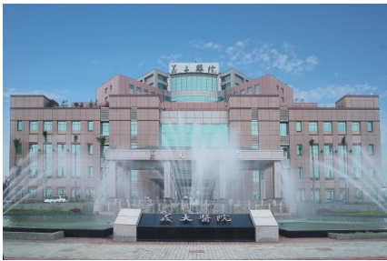

## 參、捐贈手術說明

肝臟具有再生的功能，一般人僅需要標準肝臟的15~20%就可供應正常生理需求，但執行捐贈手術中需優先考量活體捐贈者的安全，所以捐贈時需至少保留捐贈者肝臟總體積的35%。決定活體肝贈捐贈體積大小依受贈者體重而定，一般捐出體積為受贈者體重的0.8~1%，選擇捐贈部位又依成人、幼童、受贈者體重而有不同的分割方式，其說明如下：

肝左側葉（約15%）

肝左葉（約35%）

## 肆、 肝臟捐贈手術可能發生的併發症

肝臟捐贈為一項重大的手術，根據文獻統計捐贈死亡率為0.6~1%。執行此項手術可能出現的併發症有：肋膜積水、腹內感染及腹膜炎、膽汁滲漏、腸沾黏、傷口感染等，上述併發症總發生率為10%左右。大多數的併發症使用藥物治療就會痊癒，只有極少數需要進一步得侵入性治療。

## 伍、 術後恢復及追蹤

肝臟捐贈手術總住院天數約為10天，手術後會有短暫的肝功能異常，約2~3個星期就會恢復正常，而半年後肝臟可再生至原來體積的90%。手術後一個月即可從事輕便工作，術後3~4個月就可恢復負重性工作及激烈性活動。出院後仍需定期回門診追蹤。

## 義大醫院

地址:高雄市燕巢區角宿里義大路1號

電話:(07)615-0011

分機:5855、5853、5852

網址:http://www.edah.org.tw

