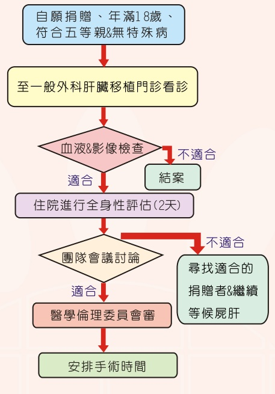

## 活體肝臟捐贈者 手術前評估流程

## 活體肝臟捐贈手術簡介

第一例的活體肝臟捐贈手術距今也有近三十年的歷史。根據衛生福利部公布肝臟移植一年存活率達93%，而五年存活率則達75%。肝臟移植是治療肝臟發生不可逆損傷時的一線生機，但肝臟捐贈來源嚴重缺乏，所以活體肝臟捐贈提供了病人另一種選擇。

## 肝臟移植受贈者 手術前評估流程

## 壹、 捐赠者應具備的條件

(一)自願捐贈。

(二)符合五等親以内親屬。

## (三) 需年滿18歲 (應經法定代理人出具書面同意)。

(四)配偶應與捐贈肝臟者生有子女或結婚2年以上，但結婚滿1年後經醫師診斷為移植適應症者則不在此限。

## 貳、五等親說明

