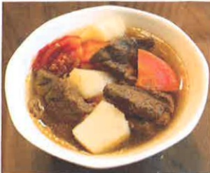
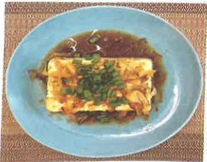
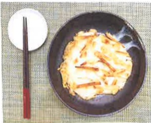
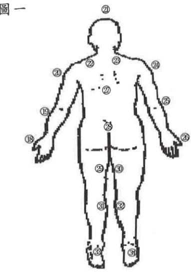
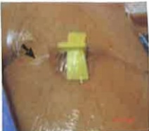

## 基本資料

| ♦姓名 | ♦病歷號碼 | ♦出生日期 | ♦性 別 | ♦疾病診斷 | ♦主治醫師 | 腫瘤個案管理護理師 | 姓名 | 聯絡方式 |
|------|----------|----------|--------|-----------|-----------|---------------------|------|----------|
|      |          | 年  月  日 | ☐男  ☐女 |           |           |                     |      |          |

## 目錄

壹、認識化學治療及常見副作用處理.....1  
貳、植入式注射座(port-A)的認識與介紹.....10  
參、吩坦尼穿皮貼片使用.....12  
肆、癌症飲食.....17  
伍、常見化學治療藥物副作用.....38  
陸、個人專屬化學治療紀錄.....45  
柒、如何紀錄我的疼痛.....47  
捌、認識化學治療藥物外滲.....49## 壹、 認識化學治療及常見副作用處理

## 一、 認識化學治療

## (一) 、化学治療的目的

1.治療癌症，甚至根治某些癌症。

2. 緩解癌細胞生長。

3. 遏阻癌细胞擴散。

4. 减轻因癌症所引起的症状。

5. 改善患者的生活品質。

## (二) 、化学治療的作用原理

正常細胞從生長到死亡都有規律的生命週期，當細胞突變或致癌物質等刺激累積相當的基因變化則可能形成「癌細胞」，化學治療就是使用抗癌藥物來抑制癌細胞的分裂或影響其重要生理關鍵步驟，進而消滅癌細胞。

## (三) 、化學治療在何處進行？

1. 化學治療一般是在化學治療室或病房以點滴注射方式進行。

2. 可以在家裹口服或使用攜帶式注射器進行治療。## (四) 、化學治療的療程為多久？

接受化學治療的時間長短及次數，主要是依據病人罹患何種腫瘤，依化療藥物藥理作用、以往是否用過這種藥物的反應程度來決定。可能每天、每週、每月給予治療，但通常在兩次治療中會有一段休息期，讓身體有機會重新製造健康的新細胞，重新獲得體力。

## (五) 、化学治療的效果如何？

會使用多種方式來了解化學治療對病人的效果，例如：身體檢查、血液檢查、電腦斷層掃瞄、X光檢查、骨髓檢查及切片等。

## 二、 化學治療常見的副作用及處理

## (一) 、化學治療常見副作用

1. 噁心、嘔吐

2. 血球與血小板降低

3. 口腔黏膜炎

4. 掉髮

5. 腸胃道症狀（便秘、腹瀉）

## (二) 、化學治療常見副作用處理

1. 噁心、嘔吐

(1)避免嗆到，臥床時可採坐姿或抬高頭部。

(2)少量多餐，細嚼慢嚥，避免產氣食物、含油脂或辣味食物，可減輕噁心、嘔吐及腹脹不適。

(3)噁心感的時間多半在早上，可以在起床後先吃些乾糧，例如：吐司、餅乾、麥片等。

(4) 鼓勵高營養、高熱量的食物。

(5) 鼓勵攝取水份以免脫水。

(6)清涼的飲品，例如：果汁、運動飲料或湯品，可減緩胃部不適幫助食慾。

(7)口乾舌燥時可以在口裡含些冰塊或是薄菏片。

(8)嘔吐完，可用開水或檸檬水漱口，消除口腔味道，減緩不適。

(9)聽音樂、看電視、與家人聊天等轉移注意力以減輕噁心感。

(10)嚴重噁心、嘔吐，依醫師指示給予止吐劑。### 2. 血球與血小板降低

(1) 白血球降低：易發生感染情況。

A. 避免攝取生食，食物皆應烹煮，若生食水果則需去皮為宜。

B. 處理生食與熟食砧板、菜刀等器具分開，不可混用，每次使用後須以溫水及清潔劑清洗

C. 多攝取高熱量高蛋白飲食（除非因其他疾病而有飲食禁忌）。

D. 常洗手，减少出入公共場所，必要時戴上口罩，減少感染。

E.維持病人皮膚和黏膜的完整性，以免增加感染的機率；男性刮鬍子時建議使用電鬍刀，避免刮傷；避免使用灌腸、肛門及直腸塞劑。

F.家中擺設應簡單，室內不要養殖花草盆栽或放置鮮花，因為不流動的水、泥土、花粉等容易孳生細菌。

G.醫師會依血球報告進行處置，如必要時給予注射白血球生長激素。

(2)貧血：會有疲倦、虛弱、怕冷、暈眩等貧血現象。

A.充分休息，以不影響夜晚睡眠為原則，白天可以小睡片刻。

B. 姿势改變時動作要放慢，以免引起頭暈的現象。

C. 攝取富含鐵質的食物，例如：動物的內臟、牛肉、蛋黃、深綠色蔬菜、乾豆類、核果類等。

D.醫師會依血液報告進行處置，如必要時給予輸血。(3) 血小板偏低：易造成瘀血，牙龈出血、月經時間延長、凝血時間延長等，嚴重時甚至可能有血尿、解血便或黑便。

A. 使用較軟毛的牙刷，較不會傷害牙齦引起出血。

B. 排便後可用溫水坐浴，小心擦拭肛門周圍。

C. 避免碰撞與穿緊身衣褲。

D. 不要任意的服用藥物，尤其是像阿司匹林類等止痛藥，服藥前先詢問醫師。

E. 輕輕的擤鼻涕，避免挖鼻孔，如果因天候改變造成鼻黏膜乾燥而不適，可以用凡士林輕輕的擦一層，以保持濕潤，或戴上口罩保持濕潤。

F. 避免任何外伤以免造成出血不易停止。

G. 如果有不正常出血請立即就醫。

H. 醫師會依血液報告進行處置，必要時予以血小板輸血。

## (4) 口腔黏膜炎

A.每餐飯後養成習慣刷牙，有口腔潰瘍可以選用較無刺激性的牙膏，利用軟紗布環繞手指或棉棒替代牙刷輕輕擦拭，清潔口腔。

B. 避免戴假牙。

C. 避免使用有刺激性的或含有酒精成分的漱口水，建議每2-4小時可用生理食鹽水漱口，若已有口腔潰瘍則應每1-2小時漱口。D. 多飲水，隨身攜帶水壺，如果沒有疾病限制每日至少飲2500cc，飲食攝取應均衡，特別是蛋白質與維生素C的補充。

E. 避免飲食乾燥或粗硬的食物，進食時可以拌湯軟化食物，如果已有口腔潰瘍則可以少量多餐，食用流質食物。另外也應避免食用酸性及刺激性食物，例如油炸類、辛辣類、或是抽菸飲酒。

F. 嘴唇可以擦護唇膏保持濕潤以免龜裂。

G.如果感到口乾可以饮用一些增加唾液分泌的饮料，例如酸梅湯、檸檬汁、也可以口嚼無糖口香糖(若已有口腔潰瘍則應避免)或使用增加唾液的牙膏刷牙。

H. 口腔溃疡引起疼痛时可以使用以下一些方法缓解疼痛：

 $ ^{*} $ 以口含冰塊降低疼痛。

*以取用冰凉的飲品，例如奶昔、霜淇淋、冰棒等，既可降低疼痛亦可補充熱量。

 $ ^{*} $ 必要時可以用口腔止痛噴劑或請醫師開局部麻醉劑調成漱口水漱口，也可以請教醫師給予口內膏(Kenalog in orabase)以幫助減輕疼痛。(5)掉髪

A. 使用較溫和無刺激性的洗髮精。

B. 避免燙髮，也避免過度的洗頭及吹整。

C. 使用質地較柔軟的梳子，不要使用髮捲來定型。

D. 長髮者可以剪短頭髮，讓頭髮顯得多也比較好整理。

E. 可以利用頭巾、帽子或假髮來修飾與保暖。

## (6) 胃肠道症状

A. 腹瀉

(A) 注意水分與電解質的補充，當有腹瀉時可適當的補充運動飲料，嚴重時依醫師指示注射點滴補充

(B)採少量多餐的方式，選擇低纖食物避免增加腸蠕動引起絞痛，例如吐司、白飯、麵條、魚肉、去皮雞肉等，也應避免油膩、辛辣、油炸類食物。腹瀉嚴重應改採清流質類飲食，例如米湯、運動飲料。

(C)避免攝取會產氣的食物，例如韭菜、豆類、奶類及其製品。

(D)腹瀉可能會引起鉀流失，可視情況攝取含鉀較多的食物，例如：香蕉、柳丁、橘子、馬鈴薯。

(E)觀察排便顏色、性質、量及次數，如果次數過多可能刺激肛門口造成不適，因此每次排便後改用溫水洗淨及輕輕擦拭。

(F) 如果腹瀉情形未改善，應就醫。### B. 便秘

(A)每天至少攝取2500cc以上的飲水(包含湯、果汁等)，吃水果與蔬菜。

(B)可攝取烏梅汁、紅棗汁、梅子汁類皆有促進排便的效果。

(C)攝取高纖食物，例如全麥麵包、五穀雜糧、柑橘類、香蕉、柚子、蔬果汁(不過濾)、地瓜等。

(D)可以採用溫水坐浴，並必要時請醫師開軟便劑服用或是灌腸。

(E)腹部按摩可增加肠蠕动，步骤如下：

用手掌順時鐘方向在腹部做環型按摩，以增加腸蠕動，每次約做15-20分鐘；每天固定同一時間進行，早餐飯後30分鐘執行效果最好。(如圖一)

腹部按摩（圖一）（三）、如有下列情況需儘速就醫

1. 流血不止或大面積瘀青。

2. 皮膚出現紅點或其他過敏反應。

3. 發燒（耳溫超過38.5度）、發冷或顫抖，請勿任意服用退，若有需要請與醫師討論。

4. 注射部位潰爛或腫痛。

5.任何不尋常之疼痛。

6. 呼吸急促。

7. 嚴重腹瀉或便秘。

8. 血尿或血便。

9.嘔吐厲害無法進食。

10. 口腔炎嚴重或疼痛厲害。

## 貳、植入式注射座（port-A）的認識與介紹

## 一、 何謂植入式注射座（port-A）：

Port-A (venous access implantable port, Port-A) 俗稱人工血管，是一種人工靜脈血管，它是一種矽質合成品，其分為球體部及導管兩個部份，有一個注射入口和一條含鎖扣的導管（圖一），管子長約70公分（植入體內大約15-20公分），經由頭臂靜脈到上腔靜脈通到右心房上方。注射區植入鎖骨下胸腔壁的皮下組織，因此不會干擾正常生活，外觀看起來大小如十元硬幣般突起（圖二）。

(圖一)

(圖二)

## 二、 如何装置植入式注射座（port-A）：

一般病人可安排住院或門診經由外科醫師局部麻醉下或全身麻醉，由鎖骨下方切開約4~5公分的小傷口，將導管由週邊靜脈進入插入中央靜脈內，再將注射座植入皮膚下。## 三、 為何要裝置植入式注射座（port-A）及有何好處：

長期接受化學治療的病人其血管及皮膚上都可能出現靜脈栓塞或變硬的現象，進而增加注射的困難及病人身體和心理上的痛苦，倘若不慎造成化學藥劑滲漏時，可能因此造成局部血管及組織壞死。

植入式注射座（port-A）的設計是特別為需要長期及重複輸注藥物的病患設計；免除病患反覆靜脈穿刺注射的痛苦，所以既安全又簡便；不僅可以做藥物注射或連續性藥物輸注，且可用來血液抽取檢驗，甚至血液製品、營養物或其他液體亦可從此注入。

## 四、 植入式注射座（port-A）日常自我照顧：

1. 術後傷口會貼有美容膠並以無菌紗布覆蓋。美容膠不需更換，讓它自然脫落就可以，但每天須注意傷口有無紅、腫、熱、痛或分泌物、滲血過多等體溫變化情形；若有上述情形，表示傷口可能有感染，應立即回診給醫師診視。

2. 手術當日醫師會預約回診時間，返家期間洗澡請用擦澡方式，回診醫師評估傷口癒合後才可採淋浴方式。|  |  |  |
|---|---|---|
|  |  |  |
| 多瑞喜穿皮贴片劑 | 多瑞喜穿皮贴片劑 | 平舒疼口頰溶片 |
| Durogesic D-Tans | Durogesic D-Trans | Painkyl |
| 12 μg/hr/patch | 25 μg/hr/patch | 200mcg/buccal soluble films |## 三、 作用：

麻醉性镇痛劑，用來解除癌症及其他疾病引起的疼痛控制。

## 四、 使用方法：【贴片】

1. 選擇適當部位以清水加以清潔，並擦乾。

2. 撕開Durogesic貼片包裝及保護膜，將貼片貼上，以手掌緊壓30秒，使貼片完全平貼於皮膚上，

尤其是貼片邊緣位置（若怕脫落可用透明膠帶加強左右兩邊）。

3. 以清水洗手，勿使用肥皂或其他清潔用品，並記錄貼上時間。

4. 用過之Durogesic貼片，取下後對折黏後放回原包裝袋，並確實記錄撕下的時間，下次回診時連同記錄表和使用過的貼片，一併交回藥局。

## 吩坦尼穿皮貼片劑處方箋及使用記錄表

贴片规格：□ 12μg/h □ 25μg/h □ 50μg/h

单位：___

病患姓名：___ /病患號碼：___ / ☐男☐女

出生日期：___ / 身分經號：___ / ☐居家使用 ☐住院使用(床號)：___

| 11期 | 用法用量 | 静脉溶血及 化学制剂使用 | 使用花镜 | 凹皱花镜 | 侧脚背景 | 描述 |
|------|----------|--------------------------|----------|----------|----------|------|
|      |          |                          | 内上品片 100000 | 操作人员 数量 | 操作员 100000 | 操作人员 数量 | 操作员 100000 | 操作员 数量 | 操作员 100000 |
| 104 | 2PC ST | XXX 货币 MXXXXXXX | 1004 10:00 | XXX XXX | 1007 10:00 | XXX XXX | 1004 10:00 | 1007 10:00 | 1004 10:00 |
| 104 | 2PC QOD | XXX 货币 MXXXXXXX | 1007 10:00 | XXX XXX |          |          | 1004 10:00 | 1007 10:00 | 1004 10:00 |## 五、 贴片使用時之注意事項：

1. 貼片應貼於上身軀幹(前胸.後背.上臂)或大腿毛髮較少的平坦處，避開傷口、發紅或放射線治療部位。

2. 貼黏部位-須完全乾燥。

毛髮過長者：應儘可能以剪刀剪短但勿採剃刀刮除方式。

- 若需清洗：應以清水清洗，勿使用肥皂或其他清潔用品。

3. 更换貼片時，黏貼位置須更換。

4. 贴片不可剪开使用。

## 【口頰溶片】

(1)當每天使用日夜連續型類鴉片藥物控制慢性疼痛，若突然開始有疼痛(疼痛指數>4)，就可以使用。

(2)等待溶解時，避免移動貼片。通常15-30分鐘會溶解，溶解後才能進食。

(3)請勿切割或撕裂貼片。

(4)請勿咀嚼或吞下貼片。

(5)如果使用兩片以上貼片：◎勿將貼片疊放 ◎貼片可置於口腔任意一側。(6)兩次劑量間必須至少間隔2小時，才能以PAINKYL治療新一次的突發性癌疼痛。

(7)除非已預備服使用，否則請勿打開包裝。一旦打開，請立即將整片PAINKYL用畢。

(8)您務必持續使用您的全天候類鴉片止痛藥。

## 六、 副作用：

眩晕、思睡、顫抖、咽部與喉部痙攣、低血壓、不安、焦慮、心律不整、錐體症狀、抑制心智、迷幻作用、噁心、嘔吐、呼吸抑制、窒息、肌肉僵硬、心跳過慢等不舒服狀況，請告知醫師。

## 七、 其他注意事项：

1. 用 Durogesic 貼片的患者若發燒，藥物吸收約增加原來的 1/3，須特別注意 Durogesic 毒性的發生。

2. 使用Durogesic贴片的患者可正常沐浴，但应避免泡热水澡，或将贴片直接接触热源（热水袋、电毯）。

3. 無醫師指示，勿任意改變貼片劑量或停止使用。

4. 保存在乾燥室溫下，且放在兒童拿不到的地方。## 肆、 癌症飲食

## 一、 預防癌症的飲食原則：

1. 均衡營養的飲食，維持適當體重。

2. 足夠且適量的水分攝取（成人建議每日攝取量：30毫升/公斤體重）。

3.增加高纖維食物的攝取，如蔬菜、水果、全穀類、乾豆類等幫助排便。

4.多攝食含抗氧化物質的食物，如深綠色、深黃色之新鮮蔬菜。

5. 减少高脂肪饮食及高温油炸的食物。

6.多選用新鮮及天然食物，少食用醃漬、醃燻、燒烤的食物。

7. 避免太烫或刺激性食物。

8.不宜選用變質、過期或有異味之食物。

9. 限量飲酒。

10. 生活作息正常规律。

## 二、 因疾病或接受治療造成不適，影響飲食及改善方法：癌症飲食系列：影響食慾的改善方式及菜單示範

## (一) 味覺改變

## ★飲食原則及改善方法：

1. 酸甜不苦辣：烹調時可利用糖、檸檬、醋加強，避免苦味強的食物，如芥菜。

2. 你濃我濃：選用味道較濃的食物調味，如九層塔、八角、香菇、洋蔥、香菜等辛香料增加食物風味。

3. 烹調小技巧：在烹調肉類前可用少許油、果汁或酒醃漬。

4. 烹調方法變變變：以增強視覺、嗅覺的刺激。

## ★黃金雞肉菇菇燉飯

【材料】

白米1.5杯、栗子南瓜1/4颗、

洋葱1/2颗、玉米笛5支、

雞腿肉塊1盒、鴻喜菇1/2包、

起司片1-2片、蒜末3瓣、鹽1/4小匙、

冷開水(1)1杯半、冷開水(2)1杯。

【作法】

1. 白米以等量冷水浸泡1-2小時。

2. 栗子南瓜1/3切丁、2/3刨絲。

洋蔥切丁、蒜頭切末、鴻喜菇切丁、玉米筍切片。

3. 一大匙油熱鍋，洋蔥、蒜末爆香，加入玉米筍拌炒。

4. 洋葱炒软至半透明後，加入南瓜拌炒。

5. 白米連同浸泡的水，一起加入拌炒。再加入雞肉、鴻喜菇炒勻。稍微拌炒至肉色變白。

6. 加入一杯冷開水及鹽，煮沸後小火燜煮10分鐘。熄火後，放入起士片拌勻，再悶5-10分鐘，即可起鍋。## ★清燉牛肉湯

## 【材料】

牛腱肉1000g、紅蘿蔔1條(約350g)、白蘿蔔600g、洋蔥1顆(約400g)、蒜頭10瓣、薑片8片、月桂葉2片、八角2顆、花椒粒1茶匙、青蔥2支、鹽巴適量、米酒50c.c.、水1.5-2公升。

## 【作法】

1. 牛腱洗净、白蘸茼和紅蘸茼切大塊、洋蔥對半切、蒜頭去除外皮、青蔥洗淨後打結備用。

2. 準備一鍋冷水（足夠淹過牛腱），放入牛腱，以中大火氽燙，煮至沸騰後，再繼續煮3分鐘，熄火，取出牛腱，用冷水洗淨表面雜質備用。

3. 牛腱放凉，等到不烫手後再切成片或塊狀。

4. 準備一個滷包袋，放入薑片、月桂葉、八角、花椒粒，再把袋口封好。

5. 取一深鍋，放入牛腱、紅白蘿蔔、洋蔥、蒜頭、滷包袋、青蔥、米酒和清水（水少湯濃郁、水多湯爽口），整鍋放入電鍋，外鍋放兩杯水，按下開關煮至開關跳起後燜 20 分鐘，之後外鍋再加兩杯水續煮。

6. 取出滷包袋和青蔥丟棄，起鍋前再放入鹽巴調味即完成。## (二) 噁心嘔吐

## ★飲食原則及改善方法：

1. 較清淡的食物，如：海綿蛋糕、清流質食物；清涼的飲料，可減輕症狀。

2. 飯前30-60分鐘避免喝液態食物；盡量以吸管小口飲用。

3. 少量多餐，避免太甜或油腻的食物。

4. 在起床前後及運動前吃較乾的食物（餅乾、土司），可抑制症狀。

5. 運動後勿馬上進食。

6. 接受化学治療、放射治療前2小時內要避免進食。

7. 注意水分電解質的平衡。

## ★清蒸鱸魚

【材料】

鱸魚1隻、薑絲及蔥絲適量、米酒少許、鹽1/2小匙、蠔油1大匙。

【作法】

1. 鱸魚取出鰓和內臟 → 清洗乾

淨後，水份用餐巾紙擦乾，魚身上劃二刀，並抹上鹽。

2. 將鱸魚放入薑絲及蔥段，倒入米酒及蠔油，炒菜鍋加入水放入蒸墊，再將鱸魚放入鍋子內。

3. 炒菜鍋蓋上鍋蓋，先轉中火水沸後，再轉小火蒸10分鐘，即可上桌。## ★上海菜飯

## 【材料】

青江菜5株、低脂豬絞肉120g、白米2杯、香菇頭8根、蒜頭4瓣、薑1小塊、雞高湯2杯、油適量、鹽適量、醬油1大匙。

## 【作法】

1.青江菜洗净，將葉子與莖分開切段、香菇頭切小丁、蒜頭及薑切末備用。

2. 冷鍋下油及蒜末、薑末，以中火炒出香味。

3. 放入絞肉炒至變色、聞到肉香後，放入香菇頭拌炒一下，再放入青江菜莖一同拌炒均勻，並加入適量鹽及醬油調味。

4. 倒入洗净滙乾的白米，與菜料拌炒均勻。

5. 加入2杯雞高湯，加蓋煮至鍋邊冒白煙，轉小火續煮15分鐘。

6. 開蓋將飯稍微攪拌後試吃飯的軟硬度(如不夠軟就加蓋再煮一下)，放入剩餘的青江菜葉，攪拌均勻後關火加蓋悶2分鐘即可。## ★薏苡仁大棗小米粥

## 【材料】

小米1/3杯、高湯、山楂10公克、薏苡仁20公克、大棗20粒、胡蘿蔔半條。

## 【作法】

1. 小米洗净泡於清水中待用，

薏苡仁打成粉。

2. 大棗洗净，用刀切開除去核，和山楂一起放入高湯中一起煮。

3. 將小米放入棗、山楂之高湯中，並加入胡蘿蔔絲一起煮至小米熟透後，再加入薏苡仁粉一併攪拌，均勻後即可上桌。

## (三) 食慾不振、體重減輕

## ★饮食原則及改善方法：

1. 少量多餐：高營養密度食物或營養品應優先食用，正餐吃固體食物為主，等點心再補充液體食物。

2. 烹調變變：色、香、味的調配，餐餐不一樣。

3.餐前動一動：適度活動增加食慾。

4. 營養小精兵抵抗病魔：補充營養，努力進食，不可誤餐，吃一口算一口。

5. 營造愉快用餐環境。

6. 遵醫囑服用增加食慾的藥物或補充適量的維生素、礦物質。## ★迷迭香烤雞腿

## 【食材】(4人份)

大雞腿2根。

【醃料】

迷迭香少許、醬油1湯匙、鹽少許、糖1茶匙、酒少許。

【作法】

1. 大雞腿洗淨切塊，用醃料醃30分鐘。

2. 将雞腿肉移入預熱的烤箱，以  $ 200^{\circ} $ C 的火力烤30分鐘即可。

## ★蒸牛肉丸子

【食材】

牛絞肉200g、豬絞肉50g、香菜末15g、蔥末15g、紅辣椒絲(裝飾)。

調味料 A：鹽1茶匙、細砂糖2大匙、白胡椒粉1/4茶匙、太白粉2大匙、水100ml。

調味料 B：香油1大匙。

【作法】

1. 将调味料 A 的材料混合备用。

2. 將牛絞肉攪拌至有黏性後，分次加入調味料A，攪拌至水份完全吸收。

3. 接著加入豬絞肉、香菜末、蔥末和香油，拌勻後做成丸狀。

4. 將肉丸放入盤中，電鍋外鍋放半杯水，蒸好後用紅辣椒絲裝飾，即可上桌。## (四) 口乾

## ★飲食原則及改善方法：

1. 含冰塊、咀嚼口香糖、飲用淡茶、檸檬汁或高熱量飲料等。

2.食物製成較滑潤的型態，如：果凍、肉泥凍、布丁等，亦可和肉汁或肉湯一起進食，有助吞嚥。

3. 避免調味太濃的食物，如太鹹、太濃或辣的食物。

4. 避免含酒精饮料。

5. 常漱口，但不可滥用漱口水，保持口腔濕潤，防止口腔感染，亦保護牙齒。

6. 避免用口呼吸，必要时可用人工唾液，减少口乾感。

## ★翡翠香菇吻仔魚粥

## 【材料】

菠菜1把、雞蛋2顆、香菇6朵、吻仔魚1盒、洋蔥1/4盒、糙米飯1杯、高湯適量、水適量、鹽少許、白胡椒少許。

【作法】

1. 自製翡翠：

(1)將菠菜洗淨，留下葉子，將菠菜和雞蛋放入攪拌量杯中，利用攪拌棒將菠菜和雞蛋混合均勻。

(2)將菠菜蛋汁倒入平底鍋中，過程中要不斷攪動，以免沾鍋，等汁收乾，就可以起鍋。

2. 洋葱、香菇切碎。

3. 在鍋中倒點油，將洋蔥加入稍微拌炒，再加入香菇繼續拌炒。

4. 闻到香味就可以加入翡翠和吻仔魚，再拌炒一下。

5. 加入糙米飯和適量高湯或水，煮到自己喜歡的稠度口感，加入鹽及胡椒調味，即可起鍋。## ★蝦仁腸粉

## 【材料】

腸粉－在來粉75g、太白粉35g、水300g。

蝦仁及醃料－蝦仁12隻、鹽1小匙、白胡椒少許、香油1小匙、蛋白1顆。

醬汁－白醬油少許、黑醬油少許、香油1小匙、水適量。

## 【作法】

1. 將腸粉材料(在來粉、太白粉、水)拌勻。

2. 取一大鍋子煮沸水後要將蒸盤蒸熱即倒入在來水1/4 蓋上鍋蓋蒸3分鐘（此配方可作四份）。

3. 等待的時間來調醬汁，將所有醬汁材料混合均勻。

4. 蒸好3分鐘後打開鍋蓋會看到平

滑已蒸熟的餅皮。

5. 取出蒸盤，稍微將邊邊用手撥起，再小心的將餅皮撕起。

6. 鋪上三尾蝦仁包好。

7. 取一瓷盤放入蒸盤中，蓋上鍋蓋約蒸8分鐘。

8. 取出，淋上醬汁、灑上蔥花，即可完成。

## ★蒸蛋

【材料】

雞蛋2顆、蒜末1顆、冷開水適量、醬油1-2小匙。

【作法】

1. 在碗裡打兩個蛋，用筷子將蛋液打勻。

2. 加入蒜末與醬油，用筷子拌勻，

表層盡量不要有泡泡。

3. 沿著碗沿加入冷水，讓水隨著碗壁流到蛋液中防止氣泡產生。（水的量約與蛋液相同，加多蒸蛋更滑嫩，加少較硬，視個人口味而定）

4. 放入電鍋中，外鍋加一杯水，蒸約10-15分鐘即可。## ★優格杯

## 【材料】

奇亞籽10g、芒果1碗、火龍果1碗、優格120g、鮮奶50ml、玉米脆片適量(可不加)。

## 【作法】

1. 奇亞籽用牛奶浸泡至膨潤後備用。

2. 芒果及火龍果洗淨去皮後，

分別打成泥狀備用。

3. 選擇適當大小的杯子，依序填入奇亞籽→火龍果泥→優格→芒果泥。

4. 視個人喜好及接受度，撒上玉米脆片，即可完成。

## (五) 口腔潰瘍

## ★饮食原則及改善方法：

1. 避免刺激性食物，例如：酒精饮料、碳酸饮料、檸檬汁、調味太重的辛香料(例如：辣椒粉、胡椒粉、咖喱粉)、醃漬物、粗糙生硬的食物(例如：炸雞、生菜沙拉)。

2. 選用質地軟嫩的食物或將食物剁碎，切細以利吞嚥。

3. 利用勾芡或加入些肉汁、肉湯一起進食幫助吞嚥。

4. 用果汁機將水果打成泥漿狀，方便吞嚥。

5. 經常漱口，去除食物殘渣及細菌，保持衛生有助於傷口癒合。

6. 用吸管來進食，避免碰觸傷口。

7. 進食高熱量、富含蛋白質的食物以利傷口癒合。

8. 選用質地軟嫩、細碎的食物以助於咀嚼與吞嚥，

例如：果汁牛奶、奶酪、優格、市售營養品。## ★酪梨鲜奶

## 【材料】

酪梨1顆、鮮奶200cc、布丁1個。

【作法】

1. 將酪梨削去外皮並切成小塊備用。

2. 將酪梨塊與其餘材料放入果汁機

中攪打約10秒即暫停一下，再續攪打約20秒即可。

## ★營養冰磚

【材料】

商業配方營養品1罐（依照個人病況作適當選擇）。

【作法】

1. 将營養品倒入至製冰盒中

2. 放入冷凍庫中冷凍，待完全結冰，即完成。

## (六) 吞嚥困難

★飲食原則及改善方法：

1. 選擇質軟、細碎的食物，並以勾芡方法烹調，亦可和肉汁、肉湯同時進食可幫助吞嚥。

2. 使用可增加食物黏稠性之材料製備餐食。例如：太白粉、地瓜粉、市售增稠劑。

3. 採用流質營養品或布丁、糙米漿、麵茶等。

## ★麵線糊

【材料】

紅麵線100g、蝦米5g、

醬油25-30g、烏醋20g、

鹽適量、柴魚片1大把、

紅蔥酥2-2.5匙、水/高湯1000cc

、糖1-1.5大匙、白胡椒粉适量、太白粉水适量。

調味料：香菜適量、蒜泥適量、烏醋適量、沙拉油2湯匙。

## 【作法】

1. 煮一鍋熱水，將紅麵線丟下去稍微川燙一下，以去除附著在麵線上多餘的塭味。撈起來瀝乾的麵線可以用剪刀或菜刀將其切成段(每段約10公分左右)後，放置一旁備用。

2. 蝦米泡水後瀝乾，平底鍋倒入油，爆香蒜頭和蝦米後，到入水/高湯。

3. 再倒入醬油、烏醋、白胡椒粉、鹽、紅蔥酥、捏碎的柴魚片到鍋中。待鍋滾後，倒入太白粉水做勾芡（可分次倒入太白粉水欠芡，以免不小心勾得太濃稠）。

4. 接著倒入剛剛川燙好且已切成段(每段約10公分)的紅麵線（此時需要稍微攪拌，以免麵線黏鍋）。

5. 起鍋後，麵線上面鋪上香菜、磨好的蒜泥、烏醋，即可完成。## ★焦糖布丁

## 【材料】

焦糖：水10克+20克、細砂糖50克

布丁液：細砂糖100克、

鮮奶1000cc、雞蛋5顆。

## 【作法】

1. 煮焦糖：少量的水加入细砂糖，

以小火煮滾，煮至糖的周圍出現金黃焦色時，再以湯匙輕輕地由外往中心輕撥，使焦色均勻。隨後小心倒入少量的水，拌勻後即快速舀入布丁模中。

註：(1)烹煮的過程中避免過度攪拌。

(2)煮焦糖於2次加水時，請小心輕倒，避免噴濺。

2. 雞蛋拌勻後加入細砂糖(A)。

3. 鮮奶以小火加熱至微溫不燙手後，緩緩倒入(A)中拌勻。

4. 盛入烤模：將(3)過篩去除雜質，盛入已有焦糖的烤模中至九分滿，以隔水加熱方式入烤箱烤，入150度烤箱烤約50分鐘。

## (七) 胃部灼热感

## ★饮食原則及改善方法：

1. 避免濃厚調味、煎炸、油膩的食品。

2. 少量多餐。

3. 喝少量牛奶(约一杯)，有助症状减轻。

4. 經由醫師處方服用制酸藥物。## ★百香優格水果沙拉

【材料】

優格50公克、百香果20公克、蘋果40公克、香蕉30公克、小蕃茄30公克。

【作法】

将所有水果洗净、去皮去籽，

切片盛装，淋上硬格即可食用。

## ★柴魚豆腐

【材料】

盒裝豆腐100公克、柴魚片2公克、醬油膏15公克、蔥末3公克。

【作法】

將豆腐倒扣盛盤，淋上醬油膏，再灑上柴魚片、蔥末即可。

## (八) 腹痛、腹部痙攣

## ★飲食原則及改善方法：

1. 避免食用粗糙、多纖維易產氣的食物，如豆類、洋蔥、高麗菜、韭菜、青花菜、啤酒、牛奶、碳酸飲料。

2. 避免食用刺激性的食品或调味品。

3. 少量多餐；食物温度不可太热或太冷。

## ★雞蛋絲瓜麵線

## 【材料】

絲瓜1條、麵線1把、薑絲1大匙、雞蛋2顆、沙拉油1湯匙、鹽1小匙、香油少許。

## 【作法】

1. 絲瓜去皮切塊，薑切絲，雞蛋

打勻備用。

2. 炒鍋中放入1大匙油，將蛋液倒入，並以筷子迅速撥炒成一塊塊蛋花，盛起備用。

3. 炒鍋中不需再放油，直接放入絲瓜，加入水蓋過絲瓜，放入2的蛋花，蓋上鍋蓋，悶煮3分鐘。

4. 滾開後，放入麵線煮約2–3分鐘至麵線熟了；加入少許鹽、薑絲拌勻即熄火，再滴上幾滴香油即可。## ★地瓜稀飯

【材料】

地瓜50公克、白米60公克。

【作法】

1. 地瓜洗净、去皮、刨絲。

2. 白米洗净後加水、地瓜絲後放入電鍋中，煮熟即可。

## (九) 腹瀉

★飲食原則及改善方法：

1. 採用低纖維食物來減少糞便體積，必要時可使用元素飲食。

2. 注意水分及電解質的補充(運動飲料)。

3. 多選用鉀含量高的食物(清肉湯、橘子汁、蕃茄汁、香蕉、馬鈴薯)。

4. 少量多餐。

5. 若牛奶及奶製品會加重腹瀉，可改成無乳糖產品。

6. 避免攝取過量的油脂、油炸類食物或者是過甜的食物。## ★馬鈴薯煎餅

## 【材料】

馬鈴薯320g、沙拉油適量、黑胡椒粉適量、鹽適量。

## 【作法】

1. 將馬鈴薯去皮，刨成絲，置於

冷水中浸泡20分鐘。

2. 將水倒掉，用手將馬鈴薯絲的水擠乾。

3. 鍋中倒入適量油，鍋熱後，將馬鈴薯絲倒入鍋中，以中小火煎12分後翻面，再煎12分鐘至兩面金黃，最後撒上鹽和黑胡椒粉，即可完成。

## (十) 腹脹

## ★饮食原則及改善方法：

避免食用易產氣、粗糙、多纖維的食物，包括：

1. 牛奶、豆類或豆類製品。

2. 飲料、零食、汽水、可樂、口香糖、薄荷及其製品。

3. 蔬果：香蕉、韭菜、花椰菜、高麗菜、榴槤。

4. 堅果類：花生、杏仁、瓜子、腰果等。

5. 洋蔥、馬鈴薯、牛奶、碳酸飲料等。

6. 少量多餐，輕微運動或散步。

7. 正餐中不可喝太多湯汁及飲料，可於飯前30-60分鐘飲用。

8.進餐時細嚼慢嚥，勿講話以免吞入過多空氣。

9. 不碰菸酒、茶、咖啡、辛辣生冷、坚硬酥脆、過酸過甜、油炸的食物。## ★小黄瓜炒雞丁

## 【材料】

雞胸肉350g、小黃瓜100g、薑泥1/2小匙、醬油膏1大匙、米酒1小匙、太白粉1大匙、白胡椒粉少許、鹽適量、沙拉油適量。

## 【作法】

1. 雞肉切大丁，加入薑泥、米酒與醬油膏拌匀。

2. 再加入一大匙太白粉，拌匀。

3. 熱油鍋，放入雞肉兩面煎上色。

4. 放入切滚刀狀的小黄瓜，加入1-2大匙的水，盖上盖子燜煮約3-5分鐘。（小黄瓜的軟度依燜煮時間長短而不同，可自行斟酌）。

5. 燜煮好後，加入些許鹽與白胡椒調味，即可完成。

## ★蒲瓜煎饼

## 【材料】

瓠瓜1條、胡蘿蔔2條、雞蛋3顆、蔥2支、中筋麵粉1/4杯、地瓜粉1湯匙、鹽1茶匙、白胡椒粉1茶匙、沙拉油適量。

## 【作法】

1. 將瓠瓜和胡蘿蔔，削皮、刨絲備用。

2. 將切好的蔥花、雞蛋加入。

3. 調味：加入鹽、白胡椒粉各1茶匙。

4. 再加入中筋麵粉、地瓜粉拌勻。完成的蔬菜糊備用。

5. 不沾鍋熱鍋，些許油擦拭全鍋，以湯勺舀調好的蔬菜糊倒入鍋中，以鍋鏟抹平蔬菜糊。

6. 蔬菜糊煎至金黄色、翻面續煎。待煎餅熟了後即可盛盤。## (十一) 便秘

## ★饮食原則及改善方法：

1. 多選用含高纖維質的食物，如：蔬菜、水果、全穀雜糧類。

2. 喝足夠的水分或液體食物。

3. 心情放輕鬆，適度運動並養成良好的排便習慣。

## ★腐皮鮮蔬捲

## 【材料】

豆腐皮3塊、四季豆9-12根、胡蘿蔔半根、太白粉少許、鹽少許、醬油適量、沙拉油適量。

## 【作法】

1. 胡蘿蔔切成條狀，少許油炒胡蘿蔔，再加少許鹽調味。

2. 四季豆切成適當長度，川燙後撈起，備用。

3.一塊豆腐皮可包四捲，將豆皮攤開，放入三根四季豆和少許紅蘿蔔，捲起來(橫切後一半的豆皮)，以少許太白粉封口。

4. 少許油，將封口處朝下面向鍋底，煎至有點金黃色，加入適量醬油、水，煮滾熟透後即可。## ★綜合果汁

【材料】

香蕉1條、木瓜小顆半顆、

奇異果2顆、水600ml

(依個人喜好調整)。

## 【作法】

1. 所有水果均洗净後去皮切塊備用。

2. 将所有水果及水放入果汁機中攪打均匀，即完成。

## (十二) 贫血及维生素缺乏

## ★饮食原則及改善方法：

多攝取下列食物，均衡營養：

1. 高生物價值的蛋白質：魚、肉、蛋、奶類及黃豆製品（如：豆腐、豆干）。

2. 鐵質豐富食物：牛肉、豬肉、黑棗、葡萄乾、鮭魚、肝臟、貝類。

3. 維生素C含量高食物：菠菜、蕃茄、柑橘、檸檬、鳳梨、草莓。

4. 維生素B12食物：肝、肉、蛋、貝類、乾酪等。

5. 避免以茶葉、咖啡為飲料，影響鐵質吸收。

6. 建議以新鮮果汁取代，幫助鐵質吸收。## ★紫米紅豆湯

## 【材料】

紅豆1杯半、紫米1杯半、二砂糖或黑糖70g。

## 【作法】

1. 將紅豆洗淨，加水於鍋中，煮至滾後，關火。

2. 倒掉热水，红豆馬上放入冰箱冷

3. 將紫米洗淨，倒入冷凍好的紅豆，總共倒約9杯的水於鍋中（紫米X3倍，紅豆X3倍）。喜歡湯汁多一些的，加入的水可以用這個比例：紫米X4倍，紅豆X4倍。

4. 電鍋外鍋放2杯水，煮好後，再悶約15分鐘。

5. 放入二砂糖或黑糖，調一下甜味。電鍋再放1杯水繼續煮一下，煮好後，再悶15分鐘，即可完成。

## ★醬香鮮蚵

## 【材料】

鮮蚵600g、豆腐1盒、蔥3根、蒜4-5瓣、辣椒1條、糖1小匙、米酒1大匙、醬油2大匙、沙拉油適量。

## 【作法】

1. 蚵仔仔細清洗乾淨(如果怕腥味，可以用米酒、醬油、太白粉先醃過)，蔥切小段、豆腐切小塊、蒜切末。

2. 煮一鍋沸騰的水，沸騰後熄火，把鮮蚵到下去，用泡的方式約一分鐘，取出滛水備用。

3. 起油鍋，放蔥白、蒜末、辣椒爆香，爆香後加入醬油、豆腐，用小火燒煮入味。

4. 最後倒入鮮蚵、米酒、蔥段，續煮拌炒均勻，即可完成。伍、常見化學治療藥物副作用

| 學名 | 商品名/中文名 | 副作用 |
|------|---------------|--------|
| Abiraterone | Zytiga 澤珂錠 | 腸節腫脹、肌肉不適、水腫、熱潮紅、腹瀉 |
| Afatinib | Giotrif 妥復克膜衣錠 | 腹瀉、口腔炎、皮疹、痤瘡型皮膚炎、搔癢 |
| Albumin-Bound Paclitaxel | Abraxane 亞伯杉注射劑 | 掉髮、骨髓抑制、周邊神經病變、噁心、嘔吐、心電圖異常、腹瀉、食慾降低、肝功能異常 |
| Alectinib | Alecensa 安立適膠囊 | 疲倦、便秘、水腫、噁心、咳嗽、皮痧 |
| Anastrozole | Anazo 安納柔膜衣錠 | 腹腸不適、熱潮紅、無力、頭痛等症狀 |
| Arsenic trioxide | Asadin 伸定注射劑 | 疲倦、噁心、嘔吐、心搏過速、咳嗽、呼吸喘 |
| Asparaginase | Leunase 樂拿舒注射劑 | 皮疹、血小板減少、脂肪肝、厭食、噁心、嘔吐 |
| Atezolizumab | Tecentriq 癌自禦 | 疲倦、食慾降低、呼吸困難、咳嗽、噁心 |
| Axitinib | Inlyta 抑癌特膜衣錠 | 腹瀉、高血壓、疲倦、食慾降低、噁心 |
| Azacitidine | Vidaza 委丹札注射劑 | 噁心、嘔吐、貧血、血小板減少症、白血球減少症 |
| Bendamustine | Innomustine 普癌汰 | 骨髓抑制、感染、噁心、嘔吐、輸注反應 |
| Bevacizumab | Avastin 癌思停注射劑 | 高血壓、掉髮、疲倦、噁心、嘔吐、蛋白尿、骨隨抑制 |
| Bicalutamide | Bicalutamide 必可多膜衣錠 | 噁心、嘔吐、腹瀉、搔癢、熱潮紅現象 |
| Bleomycin | Bleocin 撲類惡 | 腹炎、口腔黏膜炎、色素沉著、皮膚角質過度增生、間質性肺炎、肺纖維化 |伍、常見化學治療藥物副作用（續一）

| 學名               | 商品名/中文名           | 副作用                                                                 |
|--------------------|-------------------------|------------------------------------------------------------------------|
| Bortezomib         | Velcade 萬科注射劑       | 食慾不振、噁心、嘔吐、關節疼痛、肌痛                                   |
| Capecitabine       | Xeloda 截瘤達膜衣錠     | 腹瀉、手足痛、脹紅、口腔炎、疲倦                                       |
| Carboplatin        | Kemocarb 爾定康注射液   | 掉髮、腹痛、耳毒性、嘔吐、噁心、疼痛、骨髓抑制、電解質流失(鈉、鉀、鈣、鎂) |
| Ceritinib          | Zykadia 立克癌膠囊       | 疲倦、噁心、嘔吐、腹瀉、貧血、肝毒性、皮滲                             |
| Cetuximab          | Erbitux 爾必得舒注射液   | 疲倦、周邊神經痛、皮膚脫屑、癥瘡疹、皮滲、噁心、嘔吐、胃腸不適           |
| Chlorambucil       | Leukeran 瘤克寧錠       | 可能引起胃腸道不適、口腔潰瘍的症狀                                     |
| Cisplatin          | Kemoplat 克莫抗癌注射液 | 腎損傷、耳鳴、高頻率聽力喪失、末梢神經病變                             |
| Crizotinib         | Xalkori 截剋瘤膠囊       | 視覺疾患、嘔吐、噁心、腹瀉、便秘                                       |
| Cyclophosphamide   | Endoxan 癌得星           | 掉髮、閉經、出血性膀胱炎、骨髓抑制、腹瀉、嘔吐、噁心                   |
| Cyproterone        | Androcur 安得卡錠       | 貧血、肝臟毒性、胸部腫脹感、倦怠、體重改變                             |
| Cytarabine         | Cytosar 赛德薩注射劑     | 骨髓抑制、皮滲、高尿酸血症、掉髮、黏膜炎、貧血、肝功能下降、發燒         |
| Dacarbazine        | Dacarbazine 達卡巴仁注射劑 | 輸液部位疼痛和灼熱、厭食、噁心、嘔吐、腹瀉、貧血、骨髓抑制、肝毒性、流感樣症狀 |
| Dasatinib          | Sprycel 柏萊膜衣錠       | 腹痛、腹瀉、噁心、嘔吐、骨隨抑制、體液滯留、肌痛                       |伍、常見化學治療藥物副作用(續二)

| 學名 | 商品名/中文名 | 副作用 |
|------|---------------|--------|
| Docetaxel | Nolbaxol活克癌注射液 | 掉髮、神經毒性、體液滯留、胃炎、腹瀉、噁心、嘔吐 |
| Doxorubicin(Crystal) | Adriblastina艾徽素注射劑 | 心臟毒性、掉髮、體液變色、皮疹、感覺不過、高尿酸 |
| Enzalutamide | Xtandi安可坦軟膠囊 | 疲倦、熱潮紅、背痛、便秘、腹瀉 |
| Epirubicin | Pharmorubicin泛艾徽素 | 心臟毒性、掉髮、骨隨抑制、熱潮紅、噁心、嘔吐 |
| Erlotinib | Tarceva得舒緩錠 | 紅疹、腹瀉、食慾不振、噁心、嘔吐 |
| Estramustine | Estracyt抑癌膠囊 | 噁心、嘔吐、水腫、呼吸困難、體液滯留 |
| Etoposide | Fytosid癌妥滅靜脈注射液 | 骨隨抑制、嘔吐、噁心、掉髮、白血球減少症 |
| Etoposide | Vepesid滅必治軟膠囊 | 骨隨抑制、嘔吐、噁心、掉髮、白血球減少症 |
| Everolimus | Afinitor癌伏妥錠 | 胃黏膜炎、感染、無力、疲憊、咳嗽、腹瀉 |
| Exemestane | Aromasin諾曼癌素糖衣錠 | 熱潮紅、噁心、嘔吐、食慾降低 |
| Fludarabine | Fludara福達樂靜脈凍晶注射劑 | 感染、白血球減少、咳嗽、噁心嘔吐、發燒疲倦 |
| Fluorouracil | 5-FU好復注射液 | 掉髮、指甲脫落、手足症候群、皮疹、癥癢、光敏性、腹瀉、食慾下降、噁心、嘔吐、口腔黏膜炎、頭痛 |
| Gefitinib | Iressa艾瑞莎膜衣錠 | 腹瀉、皮疹、皮膚乾燥及面齙 |伍、常見化學治療藥物副作用(續三)

| 學名 | 商品名/中文名 | 副作用 |
|------|---------------|--------|
| Gemcitabine | Gemmis健仕注射液 | 骨髓抑制、噁心、嘔吐、蛋白尿、肝功能異常 |
| Hydroxyurea | Hydrea愛治膠囊 | 發燒、血球數下降、腸胃不適、發疹、疲倦、嗜睡 |
| Idarubicin | Zavedos艾達徽素注射劑、艾達徽素膠囊 | 骨髓抑制、心肌毒性、肝臟毒性、胃炎、噁心、嘔吐 |
| Ifosfamide | Holoxan好克癌注射劑 | 骨髓抑制、掉髮、噁心、嘔吐、血尿 |
| Imatinib | Leevk利伏抗膜衣錠 | 頭痛、腸胃不適、水腫、疲倦 |
| Ipilimumab | Yervoy益伏注射劑 | 疲倦、腹瀉、搔癢、皮疹、結腸炎 |
| Irinotecan | Innocan癌可癒 | 骨髓抑制、腹瀉、噁心、嘔吐、腹部痙攣、掉髮、粘膜炎 |
| Lapatinib | Tykerb泰嘉錠 | 腹瀉、噁心、嘔吐、肝功能異常、手足症候群 |
| Lenalidomide | Revlimid瑞復美膠囊 | 血小板減少症、嗜中性白血球減少症、腹瀉、疲倦、搔癢 |
| Letrozole | Femara復乳納錠 | 熱潮紅、噁心、疲勞、頭痛、頭昏 |
| Megestrol | Megejohn美雅祥錠 | 體重增加、噁心、嘔吐、皮疹 |
| Melphalan | Alkeran威克瘤錠 | 白血球減少、血小板減少、噁心、嘔吐 |
| Mercaptopurine(6-MP) | Merkaptopurine美克多能錠 | 骨髓抑制、噁心、嘔吐、高尿酸血症、肝毒性 |伍、常見化學治療藥物副作用(續四)

| 學名 | 商品名/中文名 | 副作用 |
|------|---------------|--------|
| Methotrexate | Methotrexate 盈壽求得注射液、治善錠 | 口咽炎、腹瀉、噁心、嘔吐、肝臟酵素上升、骨髓抑制、紅疹、腎損傷 |
| Mitomycin-C | Mitomycin-C 排多癌注射劑 | 骨髓抑制、紫斑、厭食、噁心、嘔吐 |
| Mitoxantrone | Mitoxantrone 雙錠蔥酉昆注射液 | 骨髓抑制、感染、發燒、疼痛、疲勞、頭痛、掉髮、噁心、嘔吐、腹瀉、厭食 |
| Nilotinib | Tasigna 泰息安膠囊 | 皮膚紅疹、搔癢、頭痛、噁心、暈眩 |
| Nivolumab | Opdivo 保疾伏 | 疲倦、食慾降低、低血納、呼吸困難、骨骼肌疼痛、電解質異常、腹瀉 |
| Oxaliplatin | Oxalip 歐力普注射劑 | 周邊神經病變、疲倦、骨隨抑制、噁心、嘔吐、腹瀉、肝臟毒性 |
| Paclitaxel | Anzatax 安莎德斯 | 周邊神經病變、心電圖異常、骨隨抑制、掉髮、噁心、嘔吐、腹瀉、關節痛 |
| Palbociclib | Ibrance 愛乳適膠囊 | 骨隨抑制、感染、疲倦、噁心、嘔吐、腹瀉、皮疹 |
| Panitumumab | Vectibix 維必施注射劑 | 腹瀉、噁心、疲勞、皮疹、瘡瘡性皮膚炎 |
| Pazopanib | Votrient 福退癌膜衣錠 | 腹瀉、高血壓、髮色改變、噁心、食慾不振 |
| Pegylated liposomal doxorubicin | Lipo-Dox 力得微脂體注射劑 | 手足症候群、皮疹、噁心、胃炎、骨隨抑制 |
| Pembrolizumab | Keytruda 吉舒達凍晶注射劑 | 疲倦、高血糖、貧血、淋巴球減少 |
| Pemetrexed | Alimta 愛寧達注射劑 | 便秘、腹瀉、食慾下降、噁心、嘔吐、口咽炎、骨髓抑制、疲倦、紅疹 |伍、常見化學治療藥物副作用(續五)

| 學名               | 商品名/中文名           | 副作用                                                                 |
|--------------------|-------------------------|----------------------------------------------------------------------|
| Pertuzumab         | Perjeta 賀疾妥注射液     | 腹瀉、掉髮、嗜中性白血球減少症、噁心、嘔吐                           |
| Polysaccharide-K   | Krestin 克速鎮粉劑       | 下痢、噁心、嘔吐、嘔氣、食慾不振                                     |
| Pomalidomide       | Pomalyst 鉑美特膠囊       | 倦怠無力、白血球減少、貧血、上呼吸道感染、噁心                         |
| Ramucirumab        | Cyramza 欣銳擇注射劑     | 高血壓、蛋白尿、輸注反應、腹瀉、紅血球減少                             |
| Regorafenib        | Stivarga 癌瑞格膜衣錠     | 疲倦、食慾降低、手足皮膚症狀、腹瀉、高血壓                             |
| Rituximab          | Mabthera 莫須瘤注射劑     | 周邊水腫、疲勞、寒顫、神經病變、皮殘、高血壓                           |
| Sorafenib          | Nexavar 蕾莎瓦膜衣錠     | 皮膚毒性(麻木、感覺遲鈍、刺痛、無痛腫大 皮殘/鱗狀脫皮)、腹瀉、噁心、疲倦、呼吸困難 |
| Sunitinib          | Sutent 紓癌特             | 噁心、嘔吐、腹瀉、便秘、疲倦、發燒、黏膜炎/口腔炎、高血壓、皮殘、手足症候群、味覺改變關節痛 |
| Tamoxifen          | Nolvadex 諾瓦得士錠       | 熱潮紅、陰道出血、外陰部搔癢、胃腸不適、頭昏眼花、頭痛、體液滯留、禿髮     |
| Tegafur+uracil      | Ufur 友復膠囊             | 厌食、噁心、嘔吐、口腔炎、腹瀉、骨髓抑制、脫髮、頭暈、高尿酸血症           |
| Temozolomide       | Temodal 帝盟多膠囊       | 疲勞、便秘、頭痛、厭食、腹瀉、噁心、嘔吐、皮殘、發燒、虛弱、嗜睡           |
| Temsirolimus       | Torisel 特癌適濃縮注射劑 | 肌無力、水腫、黏膜炎、感染、呼吸困難、皮殘、虛弱、噁心、味覺異常、骨髓抑制、血糖增加、總膽固醇增加 |伍、常見化學治療藥物副作用(續六)

| 學名 | 商品名/中文名 | 副作用 |
|------|---------------|--------|
| Thalidomide | Thado塞得膠囊 | 周圍神經病變，嗜睡，頭暈，姿勢性低血壓，皮疹，致畸胎、手腳感覺麻木、嗜中性白血球減少、皮膚毒性 |
| Topotecan | Topotecan托普迪肯 | 骨髓抑制、噁心、嘔吐、厭食、腹瀉、掉髮、疲倦 |
| Trastuzumab | Herceptin賀癌平凍晶注射劑 | 發燒、噁心、嘔吐、腹瀉、呼吸困难、咳嗽、感染、皮疹、頭痛、疲倦、嗜中性白血球減少、肌肉疼痛 |
| Trastuzumab emtansine | Kadcyla賀癌寧凍晶注射劑 | 噁心、疲倦、骨骼肌疼痛、血小板減少、水腫、骨頭疼痛肝功能異常、周邊神經病 |
| Tretinoin | Vesanoid凡善能軟膠囊 | 皮膚乾燥、粘膜乾燥、聲啞、結膜炎 |
| Tegafur and gimeracil and oteracil | TS-1愛斯萬膠囊 | 白血球減少、嗜中性白血球減少、血紅素減少、食慾不振、噁心、發疹、倦怠 |
| Vinblastine | Vinblastine敏畢瘤凍晶注射劑 | 白血球感染、掉髮、便秘、高血壓、肌神經感覺異常、噁心、嘔吐、頭暈、下顎痛、骨頭痛、腫瘤疼痛 |
| Vincristine | Vincristine敏克瘤注射液 | 神經病變、掉髮、便秘、白血球減少、感覺異常，舉步困難、運動功能障礙 |
| Vinorelbine | Navelbine溫諾平軟膠囊 | 感染、骨髓抑制、失眠、感覺神經障礙、噁心、顆粒性白血球減少、疲勞、體重下降、關節痛、掉髮 |

備註：此副作用主要以發生機率大於10%為編列項目，資料來源以藥品仿單、Micromedex、UpToDate為主。商品名/中文名依醫院網站標示為主。

若您需更完整資料可以諮詢藥師提供更完整資訊。## 陸、個人專屬化學治療紀錄

計畫藥物名稱：___  
治療次數：___  

紀錄表如下：

| 次数 | 日期 | 藥物 | 剂量 | 副作用 | 備註 |
|------|------|------|------|--------|------|
| 1    |      |      |      |        |      |
| 2    |      |      |      |        |      |
| 3    |      |      |      |        |      |
| 4    |      |      |      |        |      |
| 5    |      |      |      |        |      |
| 6    |      |      |      |        |      |
| 7    |      |      |      |        |      |
| 8    |      |      |      |        |      |
| 9    |      |      |      |        |      |
| 10   |      |      |      |        |      |## 陸、個人專屬化學治療紀錄

- 計畫藥物名稱：___  
· 治療次數：___  
· 紀錄表如下：

| 次數 | 日期 | 藥物 | 剂量 | 副作用 | 備註 |
|------|------|------|------|--------|------|
| 11   |      |      |      |        |      |
| 12   |      |      |      |        |      |
| 13   |      |      |      |        |      |
| 14   |      |      |      |        |      |
| 15   |      |      |      |        |      |
| 16   |      |      |      |        |      |
| 17   |      |      |      |        |      |
| 18   |      |      |      |        |      |
| 19   |      |      |      |        |      |
| 20   |      |      |      |        |      |## 柒、 如何紀錄我的疼痛

為了讓醫護人員更了解您的疼痛變化情形，以讓您的疼痛獲得更好的控制，請您利用手冊內「疼痛評估紀錄」將每天的疼痛情況詳細紀錄，以作為醫護人員的參考。

「疼痛評估紀錄」填寫二步驟：

第一步：疼痛部位

參考疼痛部位標示（圖一）將您的疼痛部位標示出來。

## 表一、疼痛的強度、用藥紀錄及有無副作用的產生

| 日期 | 时间 | 疼痛 部位 | 疼痛強度 (0-10) | 止痛藥 使用 | 副作用 |
|------|------|-----------|------------------|-------------|--------|
|      |      |           |                  | ☐有 ☐無     |        |
|      |      |           |                  | ☐有 ☐無     |        |
|      |      |           |                  | ☐有 ☐無     |        |
|      |      |           |                  | ☐有 ☐無     |        |
| *副作用代號:1.呼吸困難、2.頭暈、3.嘔心、4.嘔吐、5.盜汗、6.便秘、7.欣快感、8.口乾、9.皮膚紅疹、10.其他(請註明) |      |           |                  |             |        |

---

圖二、疼痛量表

     

| 0 | 1 | 2 | 3 | 4 | 5 | 6 | 7 | 8 | 9 | 10 |  |
| --- | --- | --- | --- | --- | --- | --- | --- | --- | --- | --- | --- |
| 沒有疼痛 | 雖然疼痛 | 不太舒服 | 很困擾 | 很嚴重 | 很嚴重 | 剷烈疼痛 |  |  |  |  |  |## 捌、 認識化學治療藥物外滲

## 一、 何謂化學治療藥物外滲

是指化學藥物於靜脈注射時，由靜脈注射座或靜脈留置針外滲至周圍皮下組織，使組織發生浸潤、水泡，造成局部肌肉組織壞死。

## 二、 化學治療藥物外滲徵兆

發生以下任何徵象時，請立即告知醫護人員。

1. 注射部位有疼痛、針刺感、燒灼感。

2. 注射部位有發紅、紅斑。

3. 注射部位發生滲漏、腫脹或硬結。

4. 注射管路無回血或流速減慢。

## 三、 化學治療外滲的皮膚症狀

外滲的皮膚症狀從發紅、灼熱、疼痛、水泡至進一步的皮膚潰瘍壞死到深度組織結構損害，可能引起包含神經缺損，組織攣縮和關節僵硬等神經及肌腱的損傷合併症。

末梢血管正常外觀

靜脈注射座正常外觀

靜脈注射座正常外觀四、外滲的處理（須依醫師處方執行）

1. 依醫囑給予止痛劑。

2. 抬高患肢，視藥品種類，依醫囑給予冷/溫敷（依據醫護人員指示選擇冷敷或溫敷），每次二十分鐘，一天四次，持續一至二天。

## 五、 外滲預防措施

1. 謹慎選擇給藥部位，確認靜脈注射座或靜脈留置針有回血，才可施打化學藥物。

2. 末梢血管滴注化學藥物時，選

擇前臂大血管，避免手背、手腕

內側、腕關節及肘前窩處。

3. 若須接受多次的化學治療，建議病人裝置人工

靜脈血管（須由醫師評估）。

4. 加強病人對化療藥物外滲的知識，包括外滲的症狀及徵兆的衛教。病人主動參與外滲之預防，將可早期偵測降低外滲發生。

5. 執行化學藥物治療期間，若需活動請盡量在病室內活動，勿到病室外，且避免有拉扯行為。