義大醫院：

地址：高雄市燕巢區角宿里義大路1號

電話：(07)615-0011

義大癌治療醫院

地址：高雄市燕巢區角宿里義大路21號

電話：(07)615-0022

義大大昌醫院

地址：高雄市三民區大昌一路305號

電話：(07)559-9123

粉紅護眼

freast cancer

乳癌照護手冊## 目錄

乳癌團隊簡介  
我的名片夾  
基本資料  
乳癌資料  
我的類型  
我的治療類型  
整形外科乳房重建手術  
手術後傷口照護  
化學藥物治療  
賀爾蒙藥物治療  
標靶藥物治療  
放射線治療  
復健運動  
整合性去腫治療  
回診記錄  
乳癌中醫治療  
中醫養生藥膳  
中醫穴位建議  
營養衛教  
心理調適  
回診記錄  
癌症資源中心  
保險相關權益  
相關資源連結  
抽血報告記錄  
其他檢查  
備註# 粉紅護照

## 使用說明

當妳拿起粉紅照護手冊，請不要感到孤單或困惑。給自己一些時間，慢慢瀏覽，不要急於吸收所有資訊。

這不僅是一本資料書，更是一個陪伴妳度過艱難時刻的朋友。每一頁都蘊含著對妳的關心和關注，當妳閱讀時，請記得有許多人在同一條路上與妳並肩前行。

手冊中的每個建議都是由專業的醫療人員提供，目標是希望能讓妳感到安心和支持。在閱讀時，如果有任何不確定或疑問，不要猶豫，請向醫護團隊提出。妳的感覺和需求是最重要的，這本手冊將幫助妳走過每一步，更能理解和應對這段旅程，勇敢地面對挑戰，並且充滿希望地迎接未來。

最重要的是，請記住，妳是堅強的，妳有能力戰勝這一切。而我們將會陪伴妳一起走過，並提供堅實的支持和溫柔的引導。## 乳癌團隊簡介

本院於2016年成立乳癌醫療團隊，團隊成員包含腫瘤外科、腫瘤內科、復健科、精神科、放射腫瘤科、影像診斷科、病理部等各項專科醫師及腫瘤個管師、營養師、復健師、心理師、社工師……等，藉由多專科合作，提供以病人為中心的服務以及智慧化醫療環境。擬定最適合之治療計畫，使病人能接受完整的醫療照護。

洪朝明## 粉紅護照

## 我的名片爽 $ ^{③} $ 

## ④ 我的名片对

## 粉紅護照

基本資料

| 姓名 | 緊急聯絡人 | 腫瘤部位 | 腫瘤大小 | 腫瘤種類 | 淋巴轉移 | 器官轉移 | 細胞分化級數 | Ki-67 | 荷爾蒙接受體 | 淋巴血管侵犯 | 癌症期別 | 慢性病史 |
|------|------------|----------|----------|----------|----------|----------|--------------|-------|----------------|----------------|------------|------------|
|      | 姓名: 聯絡電話: | 左側 右侧 | 公分 | ☐ IDC(浸潤性乳腺管癌) ☐ DCIS(乳腺管原位癌) ☐ ILC(浸潤性小葉癌) ☐ 其他: | ☐ 無 ☐ 有: 手術取 _______ 顆淋巴, _______ 顆有感染 | ☐ 無 ☐ 有, 部位: | ☐ 低度惡性, 分化良好 ☐ 中度惡性, 中度分化 ☐ 高度惡性, 高度分化 | ____% ☐ 低 ☐ 高 | ER (雌激素受體) ☐ 陽性____% ☐ 陰性 PR (黃體激素受體) ☐ 陽性____% ☐ 陰性 HER-2 (第二型人類上皮生長因子受體) ☐ 陽性 ☐ 陰性 | ☐ 無 ☐ 有 | ☐ 原位癌 ☐ I期 ☐ II期 ☐ III期 ☐ IV期 | ☐ 心臟病 ☐ 糖尿病 ☐ 高血壓 ☐ 腎臟病 ☐ 肝炎/肝硬化 ☐ 其他: |## 6 乳癌資料## 初紅護照

## 我的類型 $ ^{7} $ 

| 乳癌亞型 (subtype) | 定義 | 手術後的治療策略 |
|--------------------|------|------------------|
| ☐管腔A型 | ER陽性且/或PR陽性 HER-2陰性，低Ki-67 | 抗賀爾蒙±化療 ±放射線治療 |
| ☐管腔B1型 | ER陽性且/或PR陽性 HER-2陰性，高Ki-67 | 化療→抗荷爾蒙 ±放射線治療 |
| ☐管腔B2型 | ER陽性且/或PR陽性 HER-2陽性 | 化療±抗HER-2單標靶或 雙標靶藥物→抗荷爾蒙 ±放射線治療 |
| ☐HER-2陽性 | ER陰性且PR陰性 HER-2陽性 | 化療±抗HER-2單標靶或 雙標靶藥物±放射線治療 |
| ☐三陰性 | ER,PR,HER-2都是陰性 | 化療±放射線治療 ±免疫治療±標靶治療 |## 我的治療選項

| ☐新輔助型治療 | 全身性治療(化療+/-標靶或免疫) → 手術→追加治療以根治為目標 |
| ☐輔助型治療 | 手術→全身性治療(化療+/-標靶或免疫)→追加治療以根治為目標 |
| ☐緩和性治療 | 晚期病患，手術不是重點。控制疾病，延長壽命，維持生活品質才是主要目標。 |## 粉紅護照

## 整形外科乳房重建手術

乳房是女性最重要的第二性徵，乳癌病患除了要接受罹患癌症對身體及心理的打擊外，還要接受切除乳房所造成乳房殘缺的突然改變，對心理產生的巨大衝擊及莫大的痛苦。

研究表明乳房切除術後的乳房重建可以大幅改善患者對完整身體心像的需求，協助病人盡快渡過乳癌治療的痛苦，回復自在與自信，維持罹癌後的生活品質。

乳癌乳房手術乳房外科與整形外科之角色分佈：

## 乳房外科

重建方式的選擇常須依照患者術後可保留下來的皮膚、組織的數量，全盤考量後才選擇最適合的重建方式。## 10 整形外科乳房重建手術

## 義大癌治療醫院整形外科乳房重建特色

### 1. 闊背肌重建+果凍矽膠假體植入

因乳房組織經過摘除之後，軟組織不足的情況下植入假體容易引起莢膜攣縮，造成左右之乳房高低或者形狀不一，義大癌治療醫院整形外科發展利用闊背肌補足不夠的軟乳房軟組織，再將軟組織包覆植入假體達到重建之乳房柔軟，左右平衡對稱之效果。

圖片：https：//taiwanformosas.com/自體組織移植
## 粉紅護照

## 整形外科乳房重建手術 $ ^{11} $ 

## 義大癌治療醫院整形外科乳房重建特色

### 2. 横向腹直肌皮瓣移植手術（TRAM）

腹部脂肪皮瓣移植手術（TRAM），主要是利用女性下腹部多餘的脂肪及腹壁轉至胸前形成一個自然的乳房外觀。與人工植入物比較，腹部脂肪皮瓣移植手術（TRAM）的優點是可以獲得胸口充足的皮瓣組織。

圖片：https://www.lipsg.com/breast/reconstruction/tram-flap/

### 3. 闊背肌皮瓣乳房重建

將闊背肌經由背部移轉到乳房缺損處，適合胸部較小的病患。

圖片：https://sukruyazar.com/en/mastectomy
## 整形外科乳房重建手術

## 乳癌術中預防性淋巴管靜脈吻合術

在2017年發表於Annals of Surgical Oncology期刊中的研究表示，在1794個病人的十年追蹤中，5年內乳癌術後引起的淋巴水腫總發生率為9.1%，如在手術中有進行前哨淋巴结部分摘除的病人，有5.3%的病人會發生淋巴水腫，而如有接受腋窩淋巴结廓清術的病人則高達15.9%的病人會發生淋巴水腫，如再接受放射治療的話風險則更會增加一倍。

現在的手術及醫療非常進步，乳癌年輕化但治癒率高，淋巴水腫的病人也越來越多。

2014年義大利的Boccardo醫師發表在國際期刊，總共74個乳癌術中接受LYMPHA手術後追蹤四年，發現淋巴水腫的發生率降至4.05%；2019年美國哈佛醫學院Johnson等人的研究將不同階段的淋巴水腫發生率與加上術中LYMPHA之後的淋巴水腫發生率做比較：

a.乳房切除 + 淋巴結廓清，淋巴水腫發生率為14.1%。

b.乳房切除 + 淋巴结廓清 + 放射線所引起的淋巴水腫為33.4%。

c.乳房切除 + 淋巴结廓清 + LYMPHA 淋巴水腫發生率降至 2.1%。

d.乳房切除 + 淋巴结廓清 + 放射線 + LYMPHA · 淋巴水腫發生率則降到10.3%。

於文獻中證實這樣的手術是可以有效預防淋巴水腫發生的。## 物工護照

## 形外科乳房重建手術 $ ^{13} $ 

## 乳癌術中預防性淋巴管靜脈吻合術

案例1

雙側乳癌，一年前接受乳房全切除合併乳房重建+LYMPHA，追蹤一年無發生乳癌引起之上支淋巴水腫。

案例2

手術中精準螢光顯影畫出淋巴走向地圖，確認淋巴管靜脈吻合接合於淋巴管受損部位。## 整形外科乳房重建手术

## 乳癌術中預防性淋巴管靜脈吻合術

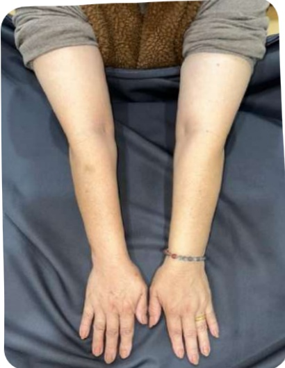

右側乳癌全切除+LYMPHA，手術後一年無發生乳癌引起之淋巴水腫。## 粉紅護照

## 手術後傷口照護

## 術後内衣

接受乳房保留手術，術後就可穿內衣；若傷口在乳房下緣，建議穿無鋼圈的運動內衣；接受乳房全切除手術者，因傷口有引流管，建議使用專門的術後內衣。

術後一週內避免拉扯，手不便上舉及出力，衣服選擇上下寬鬆、前扣或拉鍊式的。

術後內衣初期建議24小時穿著，需穿著3-6個月，之後可與一般內衣交替穿當作保養用。

1. 手術清醒後，請儘早採漸進下床活動，但要避免跌倒受傷。

2. 手術後，請多做深呼吸及咳嗽運動，以促進肺部擴張，避免呼吸道的合併症。

3. 平躺時，可使用枕頭墊高患側手臂，保持高於心臟以促進靜脈血及淋巴液回流，減輕手臂水腫。

4. 傷口拆線後，可用紙膠布密貼1-3個月以增加傷口密合及支持力。

5. 做化療或放射治療期間皮膚較敏感，應避免曬傷，白天外出時，可穿長袖衣物或撐遮陽傘阻隔陽光直接照射。## 手術後傷口照護

## 不可做

1. 在1-2個月內患側禁止任何治療，例如：量血壓、抽血、注射。

2. 在1-2個月內患側禁提5公斤以上重物，或將重物懸掛於患側肩膀，避免受傷。

## 注意事项

若出現以下症狀，請馬上就醫。

1. 大量鮮紅色引流液

2. 傷口有異常分泌物

3. 皮下血腫並且有擴大之情形

4. 傷口裂開

5. 體溫 > 38.5℃| 引流管位置 | 日期 | 引流量 | 颜色 |
|-----------|------|--------|------|## 18 手術後傷口照護

## 植入式注射座（port-A）認識與介紹

## 一、 何謂植入式注射座（port-A）：

Port-A (venous access implantable port, Port-A) 俗稱人工血管，是一種人工靜脈血管，它是一種矽質合成品，分為球體部及導管兩個部份，有一個注射入口和一條含鎖扣的導管（圖一），管子長約70公分（植入體內大約15-20公分），經由頭臂靜脈到上腔靜脈通到右心房上方。注射區植入鎖骨下胸腔壁的皮下組織，因此不會干擾正常生活，外觀看起來大小如十元硬幣般突起（圖二）。

## 二、 如何裝置植入式注射座（port-A）：

一般病人可安排住院或門診經由外科醫師局部麻醉下或全身麻醉，由鎖骨下方切開約4~5公分的小傷口，將導管由週邊靜脈進入中央靜脈內，再將注射座植入皮膚下。

## 三、 為何要裝置植入式注射座（port-A）及有何好處：

長期接受化學治療的病人其血管及皮膚上都可能出現靜脈栓塞或變硬的現象，進而增加注射的困難及病人身體和心理上的痛苦，倘若不慎造成化學藥劑滲漏時，可能因此造成局部血管及組織壞死。

植入式注射座（port-A）的設計是特別為需要長期及重複輸注藥物的病人設計；免除病人反覆靜脈穿刺注射的痛苦，所以既安全又簡便；不僅可以做藥物注射或連續性藥物輸注，且可用來血液抽取檢驗，甚至血液製品、營養物或其他液體亦可從此注入。## 粉紅護照

## 手術後傷口照護

植入式注射座（port-A）認識與介紹

四、植入式注射座（port-A）日常自我照顧：

1. 術後傷口會貼有美容膠並以無菌紗布覆蓋。美容膠不需更換，讓它自然脫落就可以，但每天須注意傷口有無紅、腫、熱、痛或分泌物、滲血過多等體溫變化情形；若有上述情形，表示傷口可能有感染，應立即回診給醫師診視。

2. 手術當日醫師會預約回診時間，返家期間洗澡請用擦澡方式，回診醫師評估傷口癒合後才可採淋浴方式。

3. 活動方面並不受限制，但需避免太激烈的運動，裝置人工血管之同側手臂，應避免360度的旋轉、提舉超過4.5公斤重物，直接的碰撞或按壓突出處，以免人工血管移位。

4. 人工血管若不使用，須定期每1-2個月返診或視情況開單；經批價後至注射室，以含抗凝劑（Heparin）的生理食鹽水沖洗一次，以免導管阻塞。

5. 請留意每次人工血管的回血情形，以提供醫師或護理師下次判斷人工血管功能的重要訊息。

## 化學藥物治療

| 藥名 | 中文名 | 給藥途徑 | 副作用 | 注意事項 |
|------|--------|----------|--------|----------|
| Capecitabine (Xeloda; Calveda) | 截瘤達 | 口服 | 腹瀉、口腔炎、手足症候群、疲倦。 | ①一天2次，餐後服用。②多補充水分。③加強手足保護：塗抹保濕乳液、做家事請戴手套、穿著包頭鞋或透氣軟墊鞋。 |
| Carboplatin (Paraplatin) | 佳鉑帝·卡鉑(二代白金) | 靜脈注射 | 噁心、嘔吐、白血球減少、血小板減少、腹瀉、便秘、輕微掉髮。 | ①偶有腎功能損傷。②此期間應注意避免感染或傷口。 |## 粉紅護照

## 化學藥物治療

| 藥名 | 中文名 | 給藥途徑 | 副作用 | 注意事項 |
|------|--------|----------|--------|----------|
| Cisplatin (Kemoplat; CDDP) | 克莫·順鉛 (白金) | 靜脈注射 | 白血球數量減少、腎功能受損、耳鳴或聽力障礙、手腳麻木、噁心、嘔吐。 | ① 此期間應注意避免感染。② 多補充水分。③ 有耳鳴或高頻率聽力喪失請立即就醫。④ 加強手足保護:塗抹保濕乳液、做家事請戴手套、穿著包頭鞋或透氣軟鞋墊。⑤ 出現噁心、嘔吐副作用可與醫師討論是否開立藥物或針劑降低不適。 || 藥名 | 中文名 | 給藥途徑 | 副作用 | 注意事項 |
|------|--------|----------|--------|----------|
| Doxorubicin (Adriblastina) | 艾黴素 (小紅莓) | 靜脈注射 | 掉髮、 噁心、 嘔吐、 白血球 減少症、 血小板 減少、 口腔 黏膜炎、 心臟毒性 | ① 心臟功能不全者 因謹慎使用。 ② 注射時防藥物外 滲，造成血管永 久傷害。 ③ 保護頭皮並使用 無酒精洗髮精。 ④ 此期間應注意避 免感染。 ⑤ 加強手足保護： 塗抹保濕乳液、 做家事請戴手套 穿著包頭鞋或透 氣軟鞋墊。 ⑥ 加強口腔清潔。 |
| Cyclophosphamide (Endoxan) | 則得星 | 口服、靜脈注射 | 掉髮、 噁心、 嘔吐、 白血球 減少症、 無月經 | ① 此期間應注意避 免感染。 ② 多補充分。 ③ 保護頭皮並使用 無酒精洗髮精。 |## 粉紅護照

## 化學藥物治療

| 藥名 | 中文名 | 給藥途徑 | 副作用 | 注意事項 |
|------|--------|----------|--------|----------|
| Epirubicin (Pharmo-rubicin、Epicin) | 泛艾黴素益彼欣(二代小紅莓) | 靜脈注射 | 髮、噁心、嘔吐、白血球減少症、血小板減少、口腔黏膜炎、心臟毒性經、貧血、體溫過高 | ① 此期間應注意避免感染。② 多補充水分。③ 保護頭皮並使用無酒精洗髮精。④ 血色素過低時由醫醫療團隊評估是否輸血。 |
| Eribulin (Halaven) | 賀樂維 | 靜脈注射 | 髮、噁心、嘔吐、白血球減少症、手腳麻木感、貧血、心律不整 | ① 此期間應注意避免感染。② 加強手足保護：塗抹保濕乳液、做家事請戴手套、穿著包頭鞋或透氣軟鞋墊。③ 若出現嚴重(手腳麻木感、刺痛感、燒灼感)請告知醫師。 |化學藥物治療

| 藥名 | 中文名 | 給藥途徑 | 副作用 | 注意事項 |
|------|--------|----------|--------|----------|
| Fluorouracil(5-Fu、Fluorouracil) | 好復 | 靜脈注射、口服 | 頭痛、掉髮、噁心、嘔吐、腹瀉、皮疹、瘡癢、光敏性、食慾下降、手足症候群、口腔黏膜炎 | ① 此期間應注意避免感染。② 加強手足保護：塗抹保濕乳液、做家事請戴手套、穿著包頭鞋或透氣軟鞋墊。③ 加強口腔清潔。 |
| Gemcitabine(Gemzar、Gemmis) | 健擇健仕 | 靜脈注射 | 噁心、嘔吐、掉髮、貧血、白血球減少症、血小板減少、口腔黏膜炎、心臟毒性經、體溫過高 | ① 此期間應注意避免感染。② 多補充水分。③ 保護頭皮並使用無酒精洗髮精。④ 血色素過低時由醫醫療團隊評估⑤ 是否輸血。 |## 粉紅護照

## 化學藥物治療

| 藥名 | 中文名 | 給藥途徑 | 副作用 | 注意事項 |
|------|--------|----------|--------|----------|
| Ixabepilone (Ixempra) | 易沙平 | 靜脈注射 | 噁心、掉髮血球低下、手腳麻木、 | ① 此期間應注意避免感染。② 加強手足保護：塗抹保濕乳液、做家事請戴手套、穿著包頭鞋或透氣軟鞋墊。③ 若出現嚴重（手腳麻木感、刺痛感、燒灼感）請告知醫師。 |
| Liposomal (Doxorubicin) (Lipo-dox) | 力得 (微脂體小紅莓) | 靜脈注射 | 掉髮、噁心手足症候群口腔黏膜炎心臟毒性 | ① 此期間應注意避免感染。② 加強手足保護：塗抹保濕乳液、做家事請戴手套、穿著包頭鞋或透氣軟鞋墊。③ 若出現嚴重（手腳麻木感、刺痛感、燒灼感）請告知醫師。 || 藥名 | 中文名 | 給藥途徑 | 副作用 | 注意事項 |
|------|--------|----------|--------|----------|
| Methotrexate (MTX) | 胺基甲基葉酸注射劑(小黃莓) | 靜脈注射、口服肌肉注射 | 輕微噁心、嘔吐、腹瀉、白血球減少、血小板減少、口腔潰瘍、肝及腎功能受損、色素沉著、皮膚紅疹。 | 加強防曬可預防臉部黑斑及皮膚、指甲顏色改變。 |
| Nab-paclitaxel (Abraxane) | 亞伯杉(奈米白蛋白太平洋紫杉醇) | 靜脈注射 | 噁心、疲倦、血球低下、周邊神經病變掉髮、水腫、便秘、紅疹、肝功能異常。 | 注意注射期間過敏反應。 |## 粉紅護照

## 化學藥物治療

| 藥名 | 中文名 | 給藥途徑 | 副作用 | 注意事項 |
|------|--------|----------|--------|----------|
| Paclitaxel(Phyxol、Taxol) | 輝克癒蘇汰癌勝(太平洋紫杉醇) | 靜脈注射 | 輕微噁心、嘔吐、貧血、掉髮、水腫、過敏反應、白血球及血小板過低、末梢神經異常(手腳麻木、刺痛)、肌肉痠痛、心律不整。 | 用藥前會先給予預防過敏藥物(類固醇抗組織胺、抗潰瘍藥)。 |
| Vinorelbine(Navelbine) | 溫諾平 | 靜脈注射、口服 | 白血球減少、便秘、掉髮、中度噁心嘔吐、神經不適(麻痺、刺痛、虛弱)、疲倦、口腔黏膜破損。 | ① 口服膠囊需冷藏；若膠囊壓碎液體外露時禁止服用。② 防注射時藥物外滲造成血管永久傷害。 |## 28 化學藥物治療

療程：共次，每週一次起始日期：

| 日期 | 藥名/劑量 | 副作用記錄/出現日期 | 備註事項 |
|------|-----------|----------------------|----------|
|      |           |                      |          |
|      |           |                      |          |
|      |           |                      |          |
|      |           |                      |          |
|      |           |                      |          |## 粉紅護照

## 化學藥物治療

療程：共___次，每___週一次 ●起始日期：

| 日期 | 藥名/劑量 | 副作用記錄/出現日期 | 備註事項 |
|------|-----------|----------------------|----------|
|      |           |                      |          |
|      |           |                      | 體重     |
|      |           |                      |          |
|      |           |                      | 體重     |
|      |           |                      |          |
|      |           |                      | 體重     |
|      |           |                      |          |
|      |           |                      | 體重     |## 賀爾蒙藥物治療

|  | 口服藥名 | 中文名 | 副作用 |
|---|---|---|---|
| 停經前 | Tamoxifen (Nolvadex) | 諾瓦得士 (泰莫西芬) | 熱潮紅、高血壓、水腫、體重增加、皮膚疹、背痛、陰道分泌物及出血、外陰搔癢、月經不規律或無月經、子宮內膜肥厚 |
| 停經後 | Exemestane (Aromasin) | 諾曼癌素 | 芳香環酶抑制劑熱潮紅、出汗、疲倦、關節痛、關節炎、骨頭痛、骨質疏鬆、外陰部乾燥、噁心、皮膚疹 |
| 停經後 | Letrozole (Femara) | 復乳納 | 芳香環酶抑制劑熱潮紅、出汗、疲倦、關節痛、關節炎、骨頭痛、骨質疏鬆、外陰部乾燥、噁心、皮膚疹 |## 初紅護照

賀爾蒙藥物治療

| 注射藥藥名               | 中文名稱       | 給藥途徑                     | 副作用                                   |
|--------------------------|----------------|------------------------------|------------------------------------------|
| Fulvestrant (Faslodex)   | 法洛德、福坦   | 肌肉注射 (1個月)             | 注射部位疼痛、噁心、衰弱無力、肝毒性。   |
| Goserelin (Zoladex)      | 諾雷德         | 皮下注射 (1或3個月)          | 注射部位疼痛、熱潮紅、盜汗、噁心、失眠、皮膚疹、背痛。 |
| Leuprorelin (Leuplin)    | 柳菩林         | 皮下注射 (1或3個月)          | 注射部位疼痛、熱潮紅、盜汗、噁心、失眠、皮膚疹、背痛。 |
| Triptorelin (Diphereline)| 達菲林 (長效)  | 肌肉/皮下注射 (3個月)        | 注射部位疼痛、熱潮紅、盜汗、噁心、失眠、皮膚疹、背痛。 |## 32 賀爾蒙藥物治療

療程：共 次，每 週一次 起訖日期：

| 日期 | 藥名/劑量 | 副作用記錄/出現日期 | 備註事項 |
|------|-----------|----------------------|----------|
|      |           |                      |          |
|      |           |                      |          |
|      |           |                      |          |
|      |           |                      |          |
|      |           |                      |          |
|      |           |                      |          |## 粉紅護照

## 賀爾蒙藥物治療

療程：共___次，每___週一次起訖日期：

| 日期 | 藥名/劑量 | 副作用記錄/出現日期 | 備註事項 |
|------|-----------|----------------------|----------|
|      |           |                      |          |
|      |           |                      | 體重     |
|      |           |                      |          |
|      |           |                      | 體重     |
|      |           |                      |          |
|      |           |                      | 體重     |
|      |           |                      |          |
|      |           |                      | 體重     |## 標靶藥物治療

| 使用條件 | 藥名 | 中文名 | 給藥途徑 | 副作用 |
|---------|------|--------|----------|--------|
| ER/PR:陽性HER2:陰性CDK4/6抑制劑 | Abemaciclib(Verzenio) | 速寧 | 口服 | 白血球減少、貧血、腹瀉、噁心、嘔吐、食慾不振、感染、疲倦、頭痛、落髮。 |
| ER/PR:陽性PI3K抑制劑HER2:陰性PIK3CA基因:陽性 | Alpelisib(Piqray) | 愛克利 | 口服 | 肝功能異常、腹瀉、噁心、食慾不振、口腔炎、高血糖、皮疹、影響心臟功能。 |## 粉紅護照

## 標靶藥物治療

| 使用條件 | 藥名 | 中文名 | 給藥途徑 | 副作用 |
|---------|------|--------|----------|--------|
| 血管新生抑制劑 | Bevacizumab (Avastin; Mvasi) | 艾法施癌思停 | 靜脈注射 | 頭痛、高血壓、輕微蛋白尿。 |
| TRK抑制劑NTRK基因融合:陽性 | Entrectinib (Rozlytrek) | 羅思克 | 口服 | 疲倦、噁心、血球數減少、認知改變、心臟相關反應 |
| ER/PR:陽性HER2:陰性MTOR抑制劑 | Everolimus (Afinitor) | 剛伏妥 | 口服 | 紅疹、口腔黏膜潰瘍、血糖升高、間質性肺炎。 |## 標靶藥物治療

| 使用條件                         | 藥名               | 中文名     | 給藥途徑 | 副作用                                                                 |
|----------------------------------|--------------------|------------|----------|------------------------------------------------------------------------|
| 小分子HER2標靶藥HER2:陽性       | Lapatinib(Tykerb)  | 泰嘉錠     | 口服     | 腹瀉、手足症候群、噁心、嘔吐、皮膚紅疹、虛及厭食。                       |
| 小分子HER2標靶藥HER2:陽性       | Neratinib(Nerlynx) | 賀儷安     | 口服     | 嚴重腹瀉、噁心、腹痛、疲倦、口腔炎。                                     |## 粉紅護照

標靶藥物治療

| 使用條件 | 藥名 | 中文名 | 給藥途徑 | 副作用 |
|---------|------|--------|----------|--------|
| PARP抑制劑BRCA1/2:突變HER2:陰性 | Olaparib(Lynparza) | 令癌莎 | 口服 | 貧血、疲倦、噁心嘔吐、頭痛、腹痛、食慾減退、肌肉骨骼痛、血球數減少、皮膚疹。 |
| CDK4/6抑制劑ER/PR:陽性HER2:陰性 | Palbociclib(Ibrance) | 愛乳適 | 口服 | 白血球減少、疲倦、頭痛、噁心嘔吐、腹瀉、口腔炎、感染。 |## 標靶藥物治療

| 使用條件           | 藥名                         | 中文名   | 給藥途徑       | 副作用                                   |
|--------------------|------------------------------|----------|----------------|------------------------------------------|
| HER2: 陰性         | Pertuzumab (Perjeta)        | 賀疾妥   | 靜脈注射        | 輕微發熱、腹瀉、過敏。                  |
| HER2: 陽性         | Pertuzumab + Trastuzumab (Phesgo) | 賀雙妥   | 皮下注射        | 噁心、掉髮、過敏、影響心臟功能。        |## 粉紅護照

標靶藥物治療

| 使用條件 | 藥名 | 中文名 | 給藥途徑 | 副作用 |
|---------|------|--------|----------|--------|
| CDK4/6抑制劑ER/PR:陽性HER2:陰性 | Ribocilcib(Kisqali) | 擊癌利 | 口服 | 白血球減少、肝功能異常、影響心臟功能、疲倦、噁心、腹瀉、掉髮、頭痛。 |
| ADC抗體藥物複合體(標靶+化療)三陰性乳癌 | GovitecanSacituzumab(Trodelvy) |  | 口服 | 噁心、嘔吐、疲倦、掉髮、腹瀉、便秘、皮疹、貧血、白血球減少。 |## 標靶藥物治療

| 使用條件 | 藥名 | 中文名 | 給藥途徑 | 副作用 |
|---------|------|--------|----------|--------|
| HER2:陽性 | Trastuzumab (Herceptin; Herzuma;) | 賀癌平;赫珠瑪 | 靜脈注射皮下注射 | 輕微發熱、頭痛、過敏、影響心臟功能。 |
| 新一代ADC 抗體藥物 複合體(標靶 +化療) HER2:陽性 | Trastuzumab deruxtecan (Enhertu) | 優赫得 | 靜脈注射 | 疲勞、嘔吐、掉髮、腹瀉、血球低下、間質性肺炎。 |## 粉紅護照

標靶藥物治療

| 使用條件 | 藥名 | 中文名 | 給藥途徑 | 副作用 |
|---------|------|--------|----------|--------|
| ADC抗體藥物複合體(標靶+化療)HER2:陽性 | Trastuzumab Emtansine (Kadcyla) (T-DM1) | 賀癌寧 | 靜脈注射 | 肝毒性、血小板減少、貧血、發燒、末梢神經病變 |

~副作用因人而异，樂觀的好心情 + 生活好習慣，抗癌效果更好～

## 標靶藥物治療

療程：共 次，每週一次 起始日期：

| 日期 | }}}_{劵名/劵量 | 副作用記錄/出現日期 | 備註事項 |
|------|----------------|----------------------|----------|
|      |                |                      |          |
|      |                | 體重                 |          |
|      |                |                      | 體重     |
|      |                |                      | 體重     |
|      |                |                      | 體重     |
|      |                |                      | 體重     |## 粉紅護照

## 標靶藥物治療

療程：共___次，每___週一次 ●起始日期：

| 日期 | 藥名/劑量 | 副作用記錄/出現日期 | 備註事項 |
|------|-----------|----------------------|----------|
|      |           |                      |          |
|      |           |                      | 體重     |
|      |           |                      |          |
|      |           |                      | 體重     |
|      |           |                      |          |
|      |           |                      | 體重     |
|      |           |                      |          |
|      |           |                      | 體重     |## 放射線治療

## 乳癌放射線治療照護須知

放射線治療是乳癌術後輔助性治療中重要的一環，治療的原理主要是利用高能量的X光或粒子射線，來破壞癌細胞可以減少患側乳房日後復發的機會。放射線治療通常每天一次，一週五次，每次治療時間約五至十分鐘，療程短則大約為三至四週、長則大約為五至六週。雖然在每次治療當中不會有任何疼痛、發燙或被電擊的感覺，身體也不會殘留放射性物質，但是接受放射線治療部位的皮膚，慢慢會發生不同等級之皮膚反應，稱之為放射線皮膚炎（radiation dermatitis）。

## 一 般而言共分為四級：

一級：局部輕微發紅，乾性脫皮。

二級：發紅範圍更廣，小塊濕性脫皮侷限於皮膚皺褶處。

三級：皮膚皺褶外也出現大片濕性脫皮，可能伴隨出血。

四級：皮膚壞死潰爛，自發性出血，並可能危及生命。

從治療後的第二或三週起，皮膚顏色會慢慢變深、些微發紅，就像曬太陽過久的變化。放射線造成的急性皮膚發炎反應是暫時性的，療程結束後二至四週，皮膚反應就會逐漸恢復。大部分的皮膚反應都為局部輕微發紅、脫皮，少數的患者才會出現較嚴重反應。

預防勝於治療，所以，如何減輕放射線皮膚炎，是放射線治療中的重點項目。放射線治療中，皮膚照護最主要的原則為維持清潔、維持皮膚完整性及促進舒適。# 粉紅護照

## 放射線治療

## 預防放射線皮膚炎之照護原則

## (一) 維持皮膚清潔

盡量保持照射部位皮膚清潔乾燥，勿泡澡、游泳或泡溫泉。使用40℃以下溫水淋浴即可，或加上敏感性肌膚專用的肥皂或沐浴乳，弱酸性（pH值4-6）、不含香精為佳，輕柔清洗照射部位皮膚，並以輕拍的方式用毛巾將皮膚小心按壓吸乾，避免用力磨擦。

## (二) 維持皮膚完整性

避免於照射部位的皮膚上按摩，或有抓搔、搓揉的動作。避免於照射部位上使用膠布。

盡量穿寬鬆軟質衣物，並避免穿胸罩，減少皮膚摩擦受傷。背包或皮包應避免背於患側，患側手臂可叉腰，減少腋下皮膚摩擦。

治療部位須用衣物覆蓋，避免陽光直接照射治療部位的皮膚。

治療部位避免剃刀直接除毛，建議使用電動除毛器。

## (三) 促進舒適

減少流汗以避免汗水對皮膚的刺激。

皮膚皺褶處避免使用嬰兒痱子粉及玉米粉。

避免使用含刺激性成分的皮膚產品，例如酒精、香料或果酸。

凡士林、嬰兒油、綿羊油等油性產品，因清潔不易，在照射期間先避免使用。

含或不含金屬成分的除臭劑（deodorants），若有需要，可繼續使用。## (四) 其他预防措施

(四) 其他預防措施

局部塗抹中弱效價的類固醇（betamethasone and mometasone）藥膏，目前的研究中顯示可以減少嚴重放射線皮膚炎的發生機會，在醫師的醫囑下可以短期使用。或可考慮含矽凝膠敷料（Silicone-based gel dressings），自然風乾後會形成一層透明且具有韌性的保護層，在小規模的研究中顯示可以減少放射線皮膚炎的發生。

蘆薈可能會增加放射線皮膚炎的嚴重程度，建議避免使用。

其餘各式各樣的護膚產品，在目前的實證醫學上，並沒有足夠的證據顯示有預防放射線皮膚炎的效果。如要使用，請先與醫師討論。

## 参考文献

1. 張黎露、周繡玲、邱文姿、謝嘉芬、李佳諭、洪敏瑛、江孟冠、謝忱希、蔡玉真（2015）。放射線治療之皮膚炎預防及照護指引。腫瘤護理雜誌，(15)，81-98。https://doi.org/10.3966/168395442015121503006

2. https://www.uptodate.com/contents/radiation-dermatitis

3.MASCC clinical practice guidelines for the prevention and management of acute radiation dermatitis: part 1) systematic review. Behroozian T, el al. EClinicalMedicine. 2023 Mar 27;58:101886. doi:10.1016/j.eclinm.2023.101886. eCollection 2023 Apr.

4. Multinational Association of Supportive Care in Cancer (MASCC) clinical practice guidelines for the prevention and management of acute radiation dermatitis: international Delphi consensus-based recommendations. Behroozian T, el al. Lancet Oncol. 2023 Apr;24(4):e172-e185. doi: 10.1016/S1470-2045(23)00067-0.| 起訖日期 | 部位 | 1 | 2 | 3 | 4 | 5 | 6 | 7 | 8 |
|---------|------|---|---|---|---|---|---|---|---|
|         |      |   |   |   |   |   |   |   |   |
|         |      |   |   |   |   |   |   |   |   |
| 9       |      |   |   |   |   |   |   |   |   |
|         |      |   |   |   |   |   |   |   |   |
| 17      |      |   |   |   |   |   |   |   |   |
|         |      |   |   |   |   |   |   |   |   |
| 25      |      |   |   |   |   |   |   |   |   |
|         |      |   |   |   |   |   |   |   |   |
| 33      |      |   |   |   |   |   |   |   |   |
|         |      |   |   |   |   |   |   |   |   |
| 總劑量  | 副作用記錄 |   |   |   |   |   |   |   |   |
|         |      |   |   |   |   |   |   |   |   |
|         |      |   |   |   |   |   |   |   |   |## 術後第一階段復健

● 適用時機：手術後第一週

目的：促進手臂淋巴測肢回流，減輕手臂腫脹。

避免術後淋巴水腫及活動受限，影響日常生活。

1握拳和打開

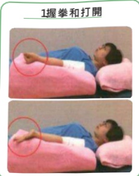

2. 手腕運動

3. 手肘運動

## 術後第一階段復健

適用時機：手術後第一週

目的：避免肩關節、手臂活動受限。

注意事項：避免傷口過度拉扯。

跟著影片動一動

肩關節屈曲、外展小於等於90度。

1划船運動

2. 輕拍手運動

3. 前抬運動

4. 側抬運動

手肘不能高

過肩勝喔！！## 物紅護照

## 復健運動

## 術後第二階段復健

☑ 適用時機：手術後第二週，可循序漸進做到第四週。

☑ 目的：避免肩關節、手臂活動受限，以回到術前角度為目標。

1.爬牆運動(正面)

肩膀運動

2.爬牆運動(側面)

跟著影片動一動

3. 擴胸運動

4. 上背部拉筋運動

5. 下背部抓癢運動

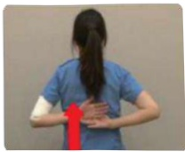

術後第三階段復健

適用時機：術後傷口恢復

目的：循序漸進提升肌力，回到日常生活或工作。

## AWS腋網症候群

成因：術後淋巴管的沾黏或阻塞。

☑ 症状：

1.由腋窩開始會形成一條索狀物或樹枝狀，一直延伸到手臂內側、手肘到大拇指根部。

2. 上肢活動受限、疼痛。

3.容易淋巴水腫。

## 物理治療：

1.經皮神經電刺激，改善疼痛。

2.筋膜放鬆術，放鬆條索。

3.淋巴引流術，消除水腫。

4. 疤痕按摩，避免沾黏。

5.衛教病人居家自主伸展牽拉運動、肩關節運動。

## 粉紅護照

## 復健運動

## 術後淋巴水腫

成因：1. 淋巴管或淋巴结結構受損或功能不全，使得運輸能力受損。

2.蛋白質沈積在組織間，組織滲透壓上升，水分容易滯留組織間。

發生率：手臂淋巴水腫的發生率8.4%~21.4%。

## 國際淋巴學會分期

| 期別         | 症狀                                                                 | 處置                     |
|--------------|----------------------------------------------------------------------|--------------------------|
| Stage 0      | 運輸能力下降。                                                      | —                        |
| Stage I      | 有壓陷性水腫，但可回彈。                                            | 抬高肢體，水腫下降       |
| Stage IV     | 抬高肢體無效且組織纖維化，皮膚變厚變硬。                            | 整合性去腫治療           |
| Stage III    | 組織愠性發炎、象皮症、免疫力下降，指甲指間真菌感染。                | 可能須手術               |## 皮膚照護

## 可做

1.保護皮膚，預防乾燥

2. 搭飛機時，一定要穿戴彈性手套

3. 穿寬鬆的服裝

4. 抬高患肢做幫浦運動

5.補充水分，減少鈉離子攝取

## 不可做

1. 避免皮膚破皮感染

2. 抽血、打針、量血壓避開患肢

3. 避免熱環境(蒸氣浴、泡溫泉、日光浴)

4. 避免局部热敷、深部按摩

5. 避免勒痕(戴飾品、豎口袖套)## 粉紅護照

## 整合性去腫治療

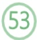

## 徒手淋巴引流

徒手淋巴引流目的：

軟化皮下組織、減少蛋白質的沉積、改善皮下組織纖維化、促進淋巴的側邊支流、將滯留的淋巴導向正常未受損的淋巴流域。

徒手淋巴引流必須由專業受訓練的治療師執行，因此當發生淋巴水腫時，建議至復健科看診，經醫師評估後，由物理治療師執行淋巴引流。

由物理治療師評估淋巴阻塞區域

進行徒手淋巴引流，重新建立淋巴引流路徑

回家後，配合治療師指示，進行自主淋巴引流## 壓力治療

## 1 循環機

◦ 又稱間歇性充氣式壓縮

● 使組織間隙壓力>淋巴血管壓力

此時組織間液流入靜脈或淋巴循環

## 壓力設定

→不超過舒張壓，避免阻斷血流

→上肢40-60mmHg

## 2 繃帶加壓治療

低張力彈性繃帶

目的：控制、预防水腫

建議每天包紮20小時以上，只有洗澡時脫下

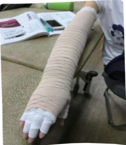
## prost 镀照

## 整合性去腫治療

## 3 壓力套

☑ 又稱彈性衣

目的：控制、预防水腫

建議每天穿戴22小時以上，只有洗澡及洗後1小時脫下

☑ 適合穩定期(維持期)穿戴

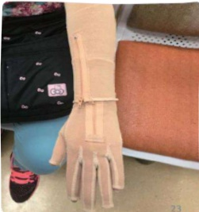

## 消腫性運動

穿戴繃帶或壓力套下運動效果最好

☐ 目的：

1. 肌肉幫浦作用

2.心跳上升(動脈脈動牽拉深層淋巴管)

3. 肌肉組織充血，增加氧氣進入組織

4. 肺收缩，胸腔内壓，加速淋巴液流入左右靜脈角

5.透過腹式呼吸，使胸管被動收縮擴張

消腫運動種類

腹式呼吸 開通深層淋巴管

鎖骨、腋下、鼠蹊淋巴結按摩開通淋巴結

上肢消腫運動-躺姿/坐姿

上肢彈力帶運動 肌力訓練

## 粉紅護照

## 乳癌中醫治療

## 中醫藥在癌症化療的應用

癌症治療中，化學藥物能直接抑制或殺傷癌細胞，但很多化療藥物缺乏選擇性，給身體帶來損害，導致造血系統、免疫系統、消化系統、神經系統等副作用，一些藥物還有延遲性毒性。根據中醫扶正祛邪原則，利用中藥調理，可提高療效，減輕副作用。

## 中醫對癌症患者飲食營養的指導原則

癌症患者的飲食以易消化，富有營養，清淡為宜，不要過食厚味。乳癌患者忌攝入高脂肪(動物脂肪)，高動物蛋白的食物。

## 避免繼續食用含致癌物質的食物

1. 不新鮮或久放食物，以及含亞硝酸鹽的食物

2. 霉變後含有霉毒素的食物，如穀類及其加工製品

3. 煙燻食物

4. 含人工食物添加剂的食物

5. 種植過程常會使用大量農藥的農作物

## 注意保護脾胃功能

1. 手術 / 化療 / 放療均能損傷脾胃

2. 過飢過飽會損傷脾胃

3. 大劑量長時間的苦寒中草藥也會損傷脾胃

*對癌患者來說，如果脾胃功能減退(即“胃氣”衰敗)，就意味着治療上的困難，建議於經過治療後，再接受客製化的中醫輔助醫療，有助提升生活品質及療效。## 58 乳癌中醫治療

## 注重扶正與驅邪相結合

1. 當接受手術、放療、化療等攻邪抗癌的治療時，除扶正補虛的中草藥外，營養的輔助也很重要。例如蕈類食物含香菇多醣，可增強腫瘤患者的抗體免疫功能。胡蘿蔔、番茄、南瓜等含β-胡蘿蔔素、維他命C、微量元素鋅、錳、銅等，具抗氧化功能。綠色蔬菜含豐富維他命C。大蒜、洋蔥有強大的抑菌和抗癌作用。

2. 選擇既是食物，又具有抗癌作用的菜蔬，如馬齒莧、金針花、薏仁、核桃、紫菜、海藻、荸薺、菱角、慈菇、芋頭等。

## 注意食物的性味功用，要辨證施食

《金匱要略》：「所食之味，有與病相宜，有與身為害，若得宜則益體，害則成疾。」霉變後含有霉毒素的食物。

1. 陽熱偏盛忌食桂圓、荔枝、羊肉等熱性食物，宜多吃清熱食物。

2. 虛寒體質忌食西瓜、綠豆、黃瓜等寒涼食物，宜多吃溫陽食物。

3. 陰虛體質忌食辣椒、蔥、薑等辛辣食物，宜多吃滋陰食物，如黑木耳、黑豆、黑棗、黑桑子、雪耳、豐水梨、蓮藕、淮山等。

4. 請中醫師判定您的體質，以決定適合食物，並定期追蹤，適時調整。## 初紅護照

## 中醫養生藥膳

## 忌口 (戒口)

1. 癌症病人無嚴格忌口，但不提倡吃「發物」。

2. 何謂「發物」？

指辛辣燥熱刺激，肥甘厚味及某些海產生物等類食物。

公雞、豬頭肉、羊肉、蝦、蟹、蚌、煙、酒等可動風化火，觸發陳疾宿痰，瘡瘍腫癲。

蝦、蟹、無鱗魚等容易引發過敏反應。

3.忌口不宜太嚴，食譜不宜太窄，須視脾胃消化吸收功能的強弱以及病情的寒熱虛實予以必要的食補和食療。

## 飲食建議

1. 減少動物性飽和脂肪酸與ω-6脂肪酸(玉米油、黃豆油與葵花油)，以ω-3脂肪酸(魚油與芥花油)與ω-9脂肪酸(橄欖油、芥花油、苦茶油與花生油)取代。

2. 宜減少紅肉，多選擇深海魚。

3.少吃全脂乳製品，改選低脂或脫脂乳製品。

4.多攝取蔬菜、水果、全穀類與核果類食物，以增加纖維、維生素A、C、E與類胡蘿蔔素等抗氧化物的攝取（膳食纖維可以增加女性荷爾蒙的排出，降低血中女性荷爾蒙濃度）。

5. 少喝酒。

6. 規律作息及多運動。## 化療病患-養生藥膳

化療病患經常會出現免疫功能下降、胃腸系統障礙、造血功能的抑制及其他生理功能的紊亂。在中醫養生保健的觀念，尋求藥膳輔助，提昇病人生活的品質，是為中西醫輔助療法中的重要一環。

化療時，病人臨床最常見消化道反應(如：噁心、嘔吐、食慾不振等)，和骨髓功能抑制(白血球減少、貧血等)，在飲食調理上要注意增加食慾和食用營養豐富之食品。

宜多服健脾和胃，補骨生髓之品。如：山藥、薏仁、山楂、麥芽、柑橘、猴頭菇、香菇、蘿蔔、雞蛋、黑木耳等。

同時添加補氣益血的食物，如：紅茶、枸杞子、赤豆、核桃、蓮子、菠菜、桂圓肉等。忌腥味。

## 化療藥膳的特點

將食物與藥物結合，能促進身體保健，又有防治疾病的作用，故化療藥膳又稱為抗癌藥膳。化療藥膳的原料，包括食品與中藥兩部份，彼此之間考慮改善口味外，更能相輔相成，提高藥效。## 粉紅護照

## 中醫穴位建議

## 《食慾不振飲食藥膳》麥芽青皮飲

【材料】麥芽30克、青皮10克。

【作法】上二味洗淨，放入鍋內，倒入適量清水，先用大火煮沸後，改用小火煮5分鐘，過濾去渣取汁飲用。

【效用】疏肝、理氣、消食之功效。用於多種腫瘤的肝氣鬱結型，兩肋疼痛腫脹，食慾不振，納食無味等症。

## 《噁心嘔吐飲食藥膳》生薑烏梅飲

【材料】烏梅肉、生薑各10克、紅糖適量。

【作法】將材料加入水200毫升煎煮即可。

【效用】和胃止嘔，生津止渴。

## 《口乾飲食藥膳》 山藥甘蔗飲

【材料】山藥50克、甘蔗汁30克、石榴汁18克。

【作法】山藥去皮洗淨，切成小塊，放入鍋內，倒入適量清水，大火煮沸，改用小火煮半小時，過濾取汁，與甘蔗汁、石榴汁一起放入杯內即可。

【效用】補虛潤肺，止咳生津。用於肺癌，或放療後，乾咳不止，口乾舌燥者。## 中醫穴位建議

《治療噁心、嘔吐、食慾不佳》

可因各種治療發生噁心、嘔吐、食慾不振的症状，若無禁忌症均可使用以下兩組穴位。

## 足三里 上巨虚 下巨虚

【位置】外側膝眼往下三寸，由脛骨外緣向外1寸為足三里，足三里穴往下三寸足三里為上巨虛、再往下三寸為下巨虛。

【主治】便祕、腹瀉、消化不良、噁心、

嘔吐、腹胀。

【操作】按壓刺激穴位。

## 內關

【位置】前臂內側腕橫紋往上2寸，正中央兩筋之間。

【主治】胃痛、嘔吐、心悸、胸痛、失眠。

【操作】按壓刺激穴位。

## 《化療患者睡眠障礙的穴位》

化療患者常因為心理因素或服用藥物的影響造成睡眠障礙，以下兩個穴位均有幫助安心助眠，可以使用按壓，適合患者居家保養之用。

## 三 陰交

【位置】足內踝上3寸，脛骨後緣凹陷中。

【主治】睡眠不佳、婦科疾病、脾胃虛弱。

【操作】按壓刺激穴位。

# 粉紅護照

## 中醫穴位建議

## 安眠穴

【位置】耳根後凹陷往後5分為安眠1穴，再往後5分為安眠2穴。

【主治】失眠、精神緊張、興奮。

【操作】按壓刺激穴位。

## 化療患者按壓穴位的禁忌

1. 過度飢餓、過飽、飲酒後均不可按壓穴位。

2. 放射治療及化學治療後白血球下降容易感染，不可按壓穴位。

3. 放射治療及化學治療後血小板降低，常有異常出血的情形，不可按壓穴位。

4. 手術側之手臂不宜按壓穴位。

5. 合併糖尿病血糖過高不可按壓穴位。

6. 合併心臟疾病且裝有心臟節律器患者不可重按壓穴位。

## 營養衛教

## 治療前飲食

維持正常體重，保持體力

每日飲食可增加200~300卡的熱量

每天吃五種或更多不同的蔬菜水果

均衡攝取營養，不偏食

● 選擇自然穀類，盡量不加工

● 限制食用高脂質和加工過的肉類

Fleast謹照

營養衛教 $ ^{65} $ 

## 治療中飲食

## 热量需求

☑ 體重不足者(BMI < 18.5): 每公斤體重35~40大卡

體重正常者(18.5≤BMI＜24)：每公斤體重35大卡

體重過重者(BMI≥24)：每公斤體重30大卡

 $ ^{*} $ BMI計算 = 體重(公斤) ÷ 身高 $ ^{2} $ (公尺)

【舉例說明】

一位身高158公分，體重55公斤的女生，其BMI為55÷(1.58) $ ^{2} $ =22為體重正常者，則每日需要熱量為：55×35=1925大卡。

動手算算看

我的 身高 ___ 公尺 · 體重 ___ 公斤

我的BMI為___體重___ = ___，我是體重___者

我的體重每公斤需要 ___ 大卡熱量

我每日需要热量為：體重 × ___ = ___ 大卡## 66 營養衛教

|  | 1500大卡 | 1800大卡 | 2000大卡 | 2200大卡 |
|---|---|---|---|---|
| 全穀雜糧類(份) | 9 | 12 | 14 | 15 |
| 豆魚蛋肉類(份) | 5 | 6 | 6 | 7 |
| 乳品類(杯) | 1 | 1 | 1 | 1 |
| 蔬菜類(份) | 3 | 3 | 3 | 3 |
| 水果類(份) | 2 | 2 | 2 | 2 |
| 油脂與堅果種子類(份) | 5 | 6 | 6 | 7 |

六 大 類 食 物 代 換 份 量

| 每份 | 全穀雜糧類(提供熱量70大卡,蛋白質2克) |  |  |  |
|---|---|---|---|---|
|  | =飯1/4碗=粥/麵/地瓜1/2碗=饅頭1/4颗=薄吐司1/2片=餃子皮3張=燕麥片3湯匙 |  |  |  |

| 每份 | 豆魚蛋肉類(提供熱量75大卡,蛋白質7克) |  |  |  |
|---|---|---|---|---|
|  | =雞蛋1颗=魚/肉1兩重=棒棒腿1/2支=肉鯽魚1/2尾=豆腐1/2塊=黑豆干1/3塊 |  |  |  |

| 每份 | 乳品類(提供熱量120大卡,蛋白質8克) |  |  |  |
|---|---|---|---|---|
|  | =奶粉3湯匙=牛奶240毫升=起士2片=無糖優格180克=無糖優酪乳200毫升 |  |  |  |

| 每份 | 蔬菜類(提供熱量25大卡,蛋白質1克) |  |  |  |
|---|---|---|---|---|
|  | =100克生重蔬菜=1/2碗煮熟蔬菜 |  |  |  |

| 每份 | 水果類(提供熱量60大卡,蛋白質0克) |  |  |  |
|---|---|---|---|---|
|  | =可食重量約100克(80~120克)=蘋果/柳丁1颗拳頭大=葡萄13颗=芭蕉1根 |  |  |  |

| 每份 | 油脂與堅果種子類(提供熱量45大卡,蛋白質0克) |  |  |  |
|---|---|---|---|---|
|  | =植物油1/3湯匙=杏仁果5粒=帶殼花生5粒=核桃2粒=杏仁粉1湯匙 |  |  |  |

*定量工具:碗-內直徑10公分、湯匙-免洗湯匙## prost 镀照

## 營養衛教

## 醣類

1. 大約佔總熱量55%~60%。

2. 提供足夠熱量，節省蛋白質消耗、肌肉流失。

3. 可選用未精緻的全穀雜糧類，如糙米、十穀米、玉米、芋頭、馬鈴薯等。

## 脂質

1. 攝取不超過總熱量30%為原則。

2. 提供必需脂肪酸及热量。

3. 選擇飽和度較低的植物油，如：橄欖油、核仁油、亞麻仁油。

4. 避免膽固醇含量較高的食物，如：內臟類、肥肉等。

5. 每日補充至多2g魚油，有助於延緩發炎。## 營養衛教

## 蛋白質

1.幫助身體組織的生長及修復。

2. 維持健康的免疫系統。

3.需要量：1.2~2.0g/每公斤體重/day。

4. 攝取富含omega-3多元不飽和脂肪酸的深海魚類，如：鮭魚、鯖魚、沙丁魚等。

5. 攝取高生物價蛋白質，如：豆、魚、蛋和肉類。

6. 避免高脂肪的蛋白質食物及加工製品，如：肥肉、五花肉、秋刀魚、香腸、熱狗等。

## 維生素、礦物質

1. 可調節生理機能。

2. 促進蛋白質及熱量的有效利用。

3. 目前被認為較具抗癌效果的有：

維生素A、維生素C、維生素E、β-胡蘿蔔素、蕃茄紅素、葉酸及礦物質鋅、硒。## Profit複照

## 營養衛教

## 水

1. 正常狀況，每日應攝取水份約1500~1800c.c

2. 使用藥物或化療，每日應增加為2000~3000c.c

3. 若有水腫情形，請詢問醫生是否需要限制水份攝取，視病況給予個人化建議。

## 治療後飲食

均衡飲食

適當運動

維持理想體重

避免菸害

1. 治療結束後，與飲食有關的副作用大多會逐漸消失。但有時食慾不振、口乾、味覺和嗅覺改變、吞嚥困難或體重減輕，可能還會持續一段時間。

2.漸進式回到一般飲食型態，與一般人促進健康的生活型態並無差異。## 營養衛教

## 治療副作用及改善方式

## 白血球低下

1.進食後口腔清潔，減少感染機會。

2.以熟食為主，避免生魚片、生菜(如:精力湯、生菜沙拉)、生蛋、醃漬食物(如:蜜餞)。

3. 水果盡量以去皮水果為宜，若無法去皮則應使用飲用水沖洗過後再食用。

4. 避免飲用市售含冰塊飲料(如：手搖飲料)。

5.生食與熟食砧板、菜刀等器具，建議分開使用。

6. 均衡飲食，攝取高熱量、高蛋白食物(豆、魚、蛋和肉類)以及富含植化素之蔬菜、水果，如菇類、綠花椰菜、胡蘿蔔、茄子、蘋果、奇異果、芭樂、火龍果等。

## 貧血

1. 補充富含鐵質的食物：紅肉類、鮭魚、蛋黃、全穀類、深綠色的葉菜類或紫菜。

2.多攝取富含蛋白質食物，如奶類、豆類、魚類、蛋類和肉類。

3. 含維生素 C 食物(促進鐵質的吸收)如深綠色、黃紅色之蔬菜水果。

4. 維生素B12是製造紅血球重要元素之一，維生素B12大多存在動物性食物，植物性來源有紫菜、昆布。## 超人護照

## 營養衛教 $ ^{71} $ 

## 噁心、嘔吐

1. 清淡、冰冷的飲料或酸味、鹹味較重的食物，可減輕症狀。

2. 少量多餐，避免空腹或腹胀及食用太甜或太油的食物。

3. 避免冷的、熱的食物同時攝食，易刺激症狀。

4. 液態食物最好在飯前30-60分鐘飲用。

5. 在接受放射或化療前2小時內應避免進食，以防止嘔吐。

6. 注意水份及電解質平衡。

7.飯後適度休息，勿激烈運動、勿平躺。

## 食慾不振、體重減輕

1. 少量多餐；提供高熱量、高蛋白飲食、點心、飲料或營養補充品。

2. 經常變化烹調方式與型態，注意色、香、味的調配以增加食慾。

3. 用餐前，適度活動或食用少許開胃食物。

4.用餐時，先食用固體食物，再飲用液體湯汁或飲料。

## 便秘

1. 多選用含高纖維質的食物，如：蔬菜、水果、全穀雜糧類。

2. 喝足夠的水分或液體食物。

3. 心情放輕鬆，適度運動並養成良好的排便習慣。## 營養衛教

## 腹瀉

1. 採用低纖維食物來減少糞便體積。

2. 注意水分及電解質的補充(如：運動飲料)。

3. 多選用鉀含量高的食物(如：清肉湯、橘子、蕃茄汁、香蕉、馬鈴薯)。

4. 少量多餐。

5. 若牛奶及奶製品會加重腹瀉，可改成無乳糖產品。

6. 避免攝取油炸類食物或者是過甜的食物。

## 腹脹

1. 避免食用易產氣(如：帶殼豆類、洋蔥、馬鈴薯)、纖維粗糙(如：竹筍、芹菜菜梗)食物與碳酸飲料(可樂、汽水)。

2. 輕微運動或散步可減輕腹脹感。

3. 減少甜膩食物。

4.進食時勿講話以免吸入過多空氣。

## 骨質疏鬆

1. 增加鈣質攝取

(1)牛奶及乳製品補充(每天1.5~2杯，每杯240毫升)。

(2)補充含鈣高的食物：吻仔魚、小魚乾、豆腐、豆干、黑芝麻、海帶、芥藍菜、莧菜。

(3)鈣片補充劑。

2. 補充維生素D、適度曬太陽。

3.規律的運動習慣。## 初紅護照

## 營養衛教 $ ^{73} $ 

## 口腔黏膜炎

1. 選擇質地軟嫩、細碎食物以助咀嚼與吞嚥(如：豆花、布丁、果泥、蒸蛋、豆腐)。

2. 改變食物製備方式：將食物剁碎、盡量煮軟、利用勾芡或加入肉湯，或利用果汁機或食物攪拌器將食物磨細打碎或打成流質。

3.補充左旋麩醯氨酸(L-glutamine)，不建議預防性補充，出現症狀再考慮使用。

## 破解飲食迷思

## 有哪些食物不能吃？

癌症病患應攝取充足均衡的營養，而非限制自己的飲食。飲食上諸多限制，反而會造成病患營養不良，影響病人的治療中斷、導致細胞組織無法自我修護，或是藥物作用困難等情況。

## 鴨肉、蝦蟹比較毒，癌症病人不能吃

鴨肉、海鮮與牛、羊、豬、雞、魚、蛋都屬於『豆魚蛋肉』類，都是屬於蛋白質食物，可幫助傷口癒合及提升免疫力。建議選擇去皮肉類、瘦肉部分，避免選用加工肉類(香腸、火腿)。## 74 營養衛教

## 黄豆及豆製品可以吃嗎

在亞洲國家的研究結果發現，攝取黃豆製品可降低乳癌發生率、復發率，從天然食物(豆漿、豆腐)適量攝取是安全的，不建議攝取高劑量大豆異黃酮補充劑。

## 吃得太營養使腫瘤長得更快？！

想用少吃營養的食物來控制癌細胞，反而是先餓壞自己，不但沒有餓死癌細胞，自己反而不斷消瘦，導致抵抗力減弱，癌細胞趁機蔓延得更快。

## 生機飲食是否比較好？！

生機飲食大部分偏向生食(生菌數高)，治療期間白血球低下，免疫力較差，容易增加腹瀉、感染，治療期間避免生機飲食。

## 癌細胞喜歡吃糖，不能吃澱粉

天然食物中的『醣』，會在消化系統中分解成葡萄糖和果糖。是體內的所有細胞能量來源，適量攝取醣類食物，包括全穀雜糧類、乳品類、水果類。避免額外攝取『精緻糖』，指製造或製備食物與飲料時額外添加的糖。## 回診記錄 $ ^{75} $ 

日期

日期

日期

日期

日期

日期

日期

營養科## 心理調適

罹患癌症面臨到生命威脅，對身體與心理都是一個極大的衝擊，在罹患癌症的初期，對疾病的不熟悉、恐慌害怕，及在診斷和治療過程中的各項侵入性療程，令人感到焦慮和痛苦，然而因攸關生死，必須思考的面向很多，每個人的處境也不盡相同。

## 初次罹癌心理反應

## 否定

癌症這樣意料之外的病症，將生命往未知與死亡拉近，通常會讓癌友及家人朋友一時之間無法接受，甚至會懷疑自己是否真的罹患癌症，有時會堅持回到過去的生活而迴避治療。

## 憤怒

當確診病情、選擇治療方式、開始治療，一切按部就班的過程中，憤怒的感受可能會浮現，隨之而來的情緒可能是害怕、孤單、悲傷等，憤怒及隱含的情緒被文化包袱絪綁，導致這樣的情緒無法紓緩。

## 討價還價

不論有無宗教信仰的人都可能會求和的向著老天爺說：能不能當作這一切都只是個惡夢。## 物糾言護照

## 心理調適

## 沮喪

在這時期裡，病友可能會對生活毫無動力、無法感受到生命的意義，但這樣的狀態幫助病友在生命中艱難的時刻暫時隔絕外界的訊息，直至心境緩和找出困境中的轉折點才慢慢走出這個階段。

## 接受

指病友從這撼動自己生命的過程中，承認事件發生後自己真實所失去的種種，需要真誠面對自己，沒有人比自己更清楚能接受到甚麼程度。「接受」本身並不是一個可以定義的終點，也可以是一種靈性的狀態。

透過認識罹癌心理反應五階段，目的並非要標籤化癌友的狀態，而是期望透過稍具結構的模型能讓我們知道自己正處於何種過程之中，認知到有許多人也與自己有相同歷程感受時，也許我們能以一顆較為安穩的心情去盤點自身擁有的資源，並嘗試思考能為自己做些什麼，這需要我們選擇以勇氣及智慧，睿智的檢視自身境地。

當你試著向內張望，也許會有一時片刻能在手術傷口內看見真實又陌生的自己，那流竄在你血液的一切，不再只是化學藥劑，還有機會成為面對生死的勇氣~

你不是變得膽怯，只是在感受生命珍貴，別人開始不懂你，但你有機會更認識自己。## 心情溫度計

我罹癌了，莫名焦慮、失落憂鬱、煩擾到入睡困難、身體外表跟之前不一樣、社會會接受我嗎？我與家人親密關係會改變嗎？總總擔憂不知如何開口。

提供簡易小測試，簡單測試評分：

|  | 不會 | 輕微 | 中等 | 嚴重 | 非常嚴重 |
|---|---|---|---|---|---|
| 1. 睡眠困難，譬如難以入睡、易醒或早醒 | 0 | 1 | 2 | 3 | 4 |
| 2. 感覺緊張或不安 | 0 | 1 | 2 | 3 | 4 |
| 3. 覺得容易苦惱或動怒 | 0 | 1 | 2 | 3 | 4 |
| 4. 覺得憂鬱、心情低落 | 0 | 1 | 2 | 3 | 4 |
| 5. 覺得比不上別人 | 0 | 1 | 2 | 3 | 4 |
| ★有自殺的想法 | 0 | 1 | 2 | 3 | 4 |

請填寫測驗結果，總分：____分，自殺想法：____分

1. 圈選最近一周(含今天)各項困擾的程度

2. 第一至五题总分A.0~5：身心狀況良好。  
B.6~9：輕度困擾，建議家人或朋友談談，抒發情緒。  
C.10~14：中度情緒困擾，建議尋求專業心理諮詢。  
D.15以上：重度情緒困擾，建議轉介精神科治療。

3. ★自殺傾向附加題，若前5題總分小於6分，但本題為2分以上時建議立即至精神科就診。## 粉紅護照

## 心理調適

## 癌因性疲憊症

## 什麼是癌因性疲憊症？

長時間感到難以遏止的精疲力竭，身、心、靈都變差的一種主觀狀態，無法藉由休息而恢復，通常在治療結束之後仍會持續。

## 與一般疲憊的不同

癌因性疲憊是一種異常或過度的全身性疲累，無法藉由睡眠紓解，疲憊有可能是急性的(持續一個月或以下)或慢性的(持續一到六個月或以上)，但無論時間長短，這樣的疲憊往往會影響到患者的日常工作及生活品質。

## 「癌因性疲憊」找上門了嗎

約有八成的癌症患者會有疲憊症狀的發生，尤其是有接受治療的患者。疲憊症的成因相當複雜，包括生物性、心理性或行為上的原因。

若你有下列感受，可能已被疲憊症找上門，包括：疲倦、耗竭感、無力、無法運動、缺乏能量、虛弱、睏意、憂鬱、動作遲緩、身體沉重。

## 心理調適

## 影響「癌因性疲憊症」的相關因子

癌症治療：化學治療、放射線治療、生物療法、手術

● 貧血

營養狀態

身體功能

☑ 藥物使用

睡眠狀態

☑ 合併症

情緒因素

## 台灣版簡明疲勞量表測驗

簡單的思考下面三個問題：

1. 你現在有任何累或疲憊的感覺嗎？

2. 如果有，從0到10分(0分為完全不累，10分為想像中最疲憊的狀態)找出一個適合描述您每天疲憊狀態的分數。

3. 這樣的疲憊是否有影響您日常生活的機能(例如工作、家務等)。

您可透過「台灣版簡明疲勞量表測驗」來幫助自己了解瘧因性疲勞症的現況與影響程度。

|  | 1 | 2 | 3 | 4 | 5 | 6 | 7 | 8 | 9 | 10 |  |
|---|---|---|---|---|---|---|---|---|---|---|---|
| 我們大多數人一生有時會感覺非常疲勞或勞累。您最近一週內是否有不尋常的疲勞或勞累？ | ☐是 | ☐否 |  |  |  |  |  |  |  |  |  |
| 1 請圈選一個數值，最恰當的表示您現在的疲勞程度(乏力、勞累) | 1 | 2 | 3 | 4 | 5 | 6 | 7 | 8 | 9 | 10 |  |
| 2 請圈選一個數值，最恰當的表示您在過去24小時內一般疲勞程度(乏力、勞累) | 1 | 2 | 3 | 4 | 5 | 6 | 7 | 8 | 9 | 10 |  |# 粉紅護照

心理調適

|  | 1 | 2 | 3 | 4 | 5 | 6 | 7 | 8 | 9 | 10 |  |
|---|---|---|---|---|---|---|---|---|---|---|---|
| 3. 請圈選一個數值，最恰當的表示您在過去24小時內最疲勞程度(乏力、勞累) |  |  |  |  |  |  |  |  |  |  |  |
| 4. 請圈選一個數值，最恰當的表示您在過去24小時內疲勞對您下述方面的影響： |  |  |  |  |  |  |  |  |  |  |  |
| A. 一般活動 | 1 | 2 | 3 | 4 | 5 | 6 | 7 | 8 | 9 | 10 |  |
| B. 情緒 | 1 | 2 | 3 | 4 | 5 | 6 | 7 | 8 | 9 | 10 |  |
| C. 行走能力 | 1 | 2 | 3 | 4 | 5 | 6 | 7 | 8 | 9 | 10 |  |
| D. 正常工作(包括外出工作和戶內家務) | 1 | 2 | 3 | 4 | 5 | 6 | 7 | 8 | 9 | 10 |  |
| E. 與他人關係 | 1 | 2 | 3 | 4 | 5 | 6 | 7 | 8 | 9 | 10 |  |
| F. 享受生活 | 1 | 2 | 3 | 4 | 5 | 6 | 7 | 8 | 9 | 10 |  |## 82 回診記錄

## 物紅護照

## 心理調適

## 如何改善癌症疲勞

依《癌因性疲憊症之臨床治療指引》中，提供5項解決方案如下：

## 運動

視病人情況與偏好設定運動內容與強度，運動前後各5分鐘的暖身跟緩和運動都不可少。

## 心理社會措施及認知行為治療

心理教育介入和諮商，提升病人處理焦慮、憂鬱及心理困擾之能力，達到改善疲憊的效果。

## 改善睡眠

睡眠治療大多需要藥物協助，病人可向醫護人員提出需求，針對睡眠情形服藥。

## 營養處置

追蹤自己的營養狀況，適時與營養師討論，補充營養，才不會讓身體供需失衡而疲憊。

## 輔助療法

如按摩、針灸等，都能舒緩疲憊造成的不適感，但建議要諮詢完醫生之後再使用。84

## 心理調適

美國國家綜合癌症網絡 (National Comprehensive Cancer Network, NCCN) 提供7項建議，讓癌症病人可以從調整生活方式開始，改善自己的疲憊問題。

盡可能保持身體活躍，走路是相當適合癌友的運動，若可以養成習慣那就更好了

適時休息，但千萬不要過度舉例來說，小於30分鐘的午休就是個不錯的選擇

節省體力，確保每天最重要的任務的優先順序

1

2

3

孳敗「癔因性瘊爐症」的7個訣竅

若有需要，別忘了，家人跟朋友都很樂於釋出援手

4

如果疲憊感沒有改善，要向你的治療團隊反應問題透過放鬆練習，輔導和壓力管理培訓來擊敗壓力

健康飲食和喝大量的水

7

...

6

5

## 粉紅護照

## 心理調適

## 放輕鬆～腹式呼吸技巧

如何自我情緒及身體放鬆-教你簡易式放鬆技巧：

一隻手放在腹部、一隻手放在胸前。

透過鼻子吸氣。確認在吸氣時，腹部也跟著擴張。

屏住呼吸，暫停一下。

接著，透過嘴巴將空氣呼出。

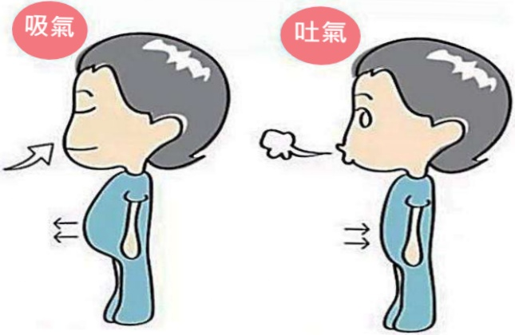

癌友心裡苦

大家一定要記得「出現負面情緒是很正常的！」適時的調整自己和傾聽內心想法是很重要的。若有相關情緒支持請與心理師或身心科醫師諮詢～## 癌症資源中心

不分癌別，不分問題大小，都可直接到癌症資源中心找個案管理師諮詢。

癌症資源中心為病友、家屬提供所需要的資訊、支持及資源，協助取得完善照護資訊、紓解不安與壓力，維持良好的生活品質，度過人生中的難關！

● 索取頭巾/毛帽  
● 租借假髮  
● 康復用品索取  
☑ 民間急難補助諮詢

## 假髮租借記錄

| 租借日期 | 归还日期 | 備註 |
|----------|----------|------|
|          |          |      |
|          |          |      |

## 諮詢專線

義大醫院  
癌治療醫院  
(07)615-0011 分機5209  
(07)615-0022 分機6130

## 諮詢位置

義大醫院  
癌治療醫院  
C棟2樓血液腫瘤科診區內  
1樓大門口右側## 粉紅護照

## 保險相關權益

## 全民健保-重大傷病證明

只要確認罹患癌症(切片報告證實為惡性腫瘤)，經過醫院協助辦理重大傷病卡，會直接註記在健保IC卡上。

為減輕重病者就醫經濟負擔，於全民健康保險法第48條規定，保險對象因重大傷病就醫時，免門急住診自行負擔費用。

若有重大傷病證明問題，可以詢問就診醫院或各地健保業務組。申請與換發注意事項查詢：

## 勞工保險失能給付

勞工遭遇職業傷害或罹患職業病，經治療後，症狀固定，再行治療仍不能改善其治療效果，經全民健康保險特約醫院或診所診斷為永久失能。

符合勞工職災保險失能給付標準規定者，因勞工保險失能給付種類眾多，請參考勞工保險局全球資訊網「勞工保險-給付業務-失能業務」，洽詢電話(02)2396-1266轉2250或申請時可詢問自己主治醫師是否符合標準。

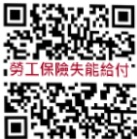
## 保險相關權益

## 教育部-學產急難救助

本要點適用對象：

為各級學校在學學生及幼兒園。

年齡滿二十五歲之學生不得申請。

學生或幼兒之家庭總收入，依最近一年綜合所得總額達新臺幣一百萬元以上，或不動產價值合計達新臺幣一千萬元以上，不予核給。

同一事件以家庭為單位，申請以一次為限。請於事發三個月內申請，歡迎直撥「1957」福利諮詢免付費專線。

## 私人保險-醫療險、癌症險

● 你了解你的保單嗎？保單保障範圍有什麼？

自費品項有理賠嗎？

實支實付理賠上限是多少？

你可從保單中了解符合申請的項目，或詢問你的保險業務員，若有疑問『台灣癌症資源網』可提供免費保險諮詢，預約專線：0809-010580

## 粉紅護照

## 相關資源連結

## 政府機關

中央健保署

勞工保險局

衛生福利部國民健康署

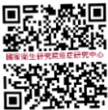

國家衛生研究院癌症研究中心

## 民間單位

癌症希望基金會

乳癌防治基金會

台灣癌症基金會

乳癌病友協會## 相關資源建結

## 希望厨房-鳳書上菜

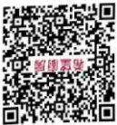

## 希望基金-HOPETV

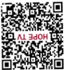

## 希望基金-通动感方

## 勇源輔大乳癌基金會

## 希望基金-友善就美

## 希望基金會-皮膚照護

## 希望基金-乳癌攻略

## 台灣乳房重建協會

## 初紅護照

抽血報告記錄

91

| 項目 | 正常值 | 檢查結果 | 檢查結果 | 檢查結果 | 檢查結果 |
|------|--------|----------|----------|----------|----------|
| WBC/白血球 | 3.5-11.0 10³/uL |  |  |  |  |
| RBC/紅血球計數 | 4.0-5.2 10³/uL |  |  |  |  |
| ANC/嗜中性白血球 | >1500/uL |  |  |  |  |
| Hb/血色素 | 12.0-16.0 g/dL |  |  |  |  |
| Platelet/血小板 | 150-400 10³/uL |  |  |  |  |
| BUN/腎功能 | 6-20 g/dL |  |  |  |  |
| Cr/腎功能 | <1.1 u/gL |  |  |  |  |
| AST(GOT) | 8-38 U/L |  |  |  |  |
| ALT(GPT) | 4-44 U/L |  |  |  |  |## 抽血報告記錄

| 項目     | 正常值           | 檢查結果 | 檢查結果 | 檢查結果 | 檢查結果 | 檢查結果 |
|----------|------------------|---------|---------|---------|---------|---------|
| CA153    | ≤31.3 U/mL       |         |         |         |         |         |
| BNP      | <100 pg/mL       |         |         |         |         |         |
| Trop-I   | <0.026 ng/mL     |         |         |         |         |         |
| CEA      | ≤5 ng/mL         |         |         |         |         |         |
| ALK-P    | <73 U/L          |         |         |         |         |         |## 初紅護照

## 抽血報告記錄

| 項目 | 正常值 | 檢查結果 | 檢查結果 | 檢查結果 | 檢查結果 |
|------|--------|----------|----------|----------|----------|
| WBC/白血球 | 3.5-11.0 10³/uL |  |  |  |  |
| RBC/紅血球計數 | 4.0-5.2 10³/uL |  |  |  |  |
| ANC/嗜中性白血球 | >1500/uL |  |  |  |  |
| Hb/血色素 | 12.0-16.0 g/dL |  |  |  |  |
| Platelet/血小板 | 150-400 10³/uL |  |  |  |  |
| BUN/腎功能 | 6-20 g/dL |  |  |  |  |
| Cr/腎功能 | <1.1 u/gL |  |  |  |  |
| AST(GOT) | 8-38 U/L |  |  |  |  |
| ALT(GPT) | 4-44 U/L |  |  |  |  |## 抽血報告記錄

| 項目     | 正常值           | 檢查結果 | 檢查結果 | 檢查結果 | 檢查結果 | 檢查結果 |
|----------|------------------|---------|---------|---------|---------|---------|
| CA153    | ≤31.3 U/mL       |         |         |         |         |         |
| BNP      | <100 pg/mL       |         |         |         |         |         |
| Trop-I   | <0.026 ng/mL     |         |         |         |         |         |
| CEA      | ≤5 ng/mL         |         |         |         |         |         |
| ALK-P    | <73 U/L          |         |         |         |         |         |## 初紅護照

## 抽血報告記錄

| 項目 | 正常值 | 檢查結果 | 檢查結果 | 檢查結果 | 檢查結果 |
|------|--------|----------|----------|----------|----------|
| WBC/白血球 | 3.5-11.0 10³/uL |  |  |  |  |
| RBC/紅血球計數 | 4.0-5.2 10³/uL |  |  |  |  |
| ANC/嗜中性白血球 | >1500/uL |  |  |  |  |
| Hb/血色素 | 12.0-16.0 g/dL |  |  |  |  |
| Platelet/血小板 | 150-400 10³/uL |  |  |  |  |
| BUN/腎功能 | 6-20 g/dL |  |  |  |  |
| Cr/腎功能 | <1.1 u/gL |  |  |  |  |
| AST(GOT) | 8-38 U/L |  |  |  |  |
| ALT(GPT) | 4-44 U/L |  |  |  |  |## 抽血報告記錄

| 項目     | 正常值           | 檢查結果 | 檢查結果 | 檢查結果 | 檢查結果 | 檢查結果 |
|----------|------------------|---------|---------|---------|---------|---------|
| CA153    | ≤31.3 U/mL       |         |         |         |         |         |
| BNP      | <100 pg/mL       |         |         |         |         |         |
| Trop-I   | <0.026 ng/mL     |         |         |         |         |         |
| CEA      | ≤5 ng/mL         |         |         |         |         |         |
| ALK-P    | <73 U/L          |         |         |         |         |         |## 初紅護照

## 抽血報告記錄

| 項目 | 正常值 | 檢查結果 | 檢查結果 | 檢查結果 | 檢查結果 |
|------|--------|----------|----------|----------|----------|
| WBC/白血球 | 3.5-11.0 10³/uL |  |  |  |  |
| RBC/紅血球計數 | 4.0-5.2 10³/uL |  |  |  |  |
| ANC/嗜中性白血球 | >1500/uL |  |  |  |  |
| Hb/血色素 | 12.0-16.0 g/dL |  |  |  |  |
| Platelet/血小板 | 150-400 10³/uL |  |  |  |  |
| BUN/腎功能 | 6-20 g/dL |  |  |  |  |
| Cr/腎功能 | <1.1 u/gL |  |  |  |  |
| AST(GOT) | 8-38 U/L |  |  |  |  |
| ALT(GPT) | 4-44 U/L |  |  |  |  |## 抽血報告記錄

| 項目     | 正常值           | 檢查結果 | 檢查結果 | 檢查結果 | 檢查結果 | 檢查結果 |
|----------|------------------|---------|---------|---------|---------|---------|
| CA153    | ≤31.3 U/mL       |         |         |         |         |         |
| BNP      | <100 pg/mL       |         |         |         |         |         |
| Trop-I   | <0.026 ng/mL     |         |         |         |         |         |
| CEA      | ≤5 ng/mL         |         |         |         |         |         |
| ALK-P    | <73 U/L          |         |         |         |         |         |## 初紅護照

## 抽血報告記錄

| 項目 | 正常值 | 檢查結果 | 檢查結果 | 檢查結果 | 檢查結果 |
|------|--------|----------|----------|----------|----------|
| WBC/白血球 | 3.5-11.0 10³/uL |  |  |  |  |
| RBC/紅血球計數 | 4.0-5.2 10³/uL |  |  |  |  |
| ANC/嗜中性白血球 | >1500/uL |  |  |  |  |
| Hb/血色素 | 12.0-16.0 g/dL |  |  |  |  |
| Platelet/血小板 | 150-400 10³/uL |  |  |  |  |
| BUN/腎功能 | 6-20 g/dL |  |  |  |  |
| Cr/腎功能 | <1.1 u/gL |  |  |  |  |
| AST(GOT) | 8-38 U/L |  |  |  |  |
| ALT(GPT) | 4-44 U/L |  |  |  |  |## 抽血報告記錄

| 項目     | 正常值           | 檢查結果 | 檢查結果 | 檢查結果 | 檢查結果 | 檢查結果 |
|----------|------------------|----------|----------|----------|----------|----------|
| CA153    | ≤31.3 U/mL       |          |          |          |          |          |
| BNP      | <100 pg/mL       |          |          |          |          |          |
| Trop-I   | <0.026 ng/mL     |          |          |          |          |          |
| CEA      | ≤5 ng/mL         |          |          |          |          |          |
| ALK-P    | <73 U/L          |          |          |          |          |          |## 初紅護照

## 抽血報告記錄

| 項目 | 正常值 | 檢查結果 | 檢查結果 | 檢查結果 | 檢查結果 |
|------|--------|----------|----------|----------|----------|
| WBC/白血球 | 3.5-11.0 10³/uL |  |  |  |  |
| RBC/紅血球計數 | 4.0-5.2 10³/uL |  |  |  |  |
| ANC/嗜中性白血球 | >1500/uL |  |  |  |  |
| Hb/血色素 | 12.0-16.0 g/dL |  |  |  |  |
| Platelet/血小板 | 150-400 10³/uL |  |  |  |  |
| BUN/腎功能 | 6-20 g/dL |  |  |  |  |
| Cr/腎功能 | <1.1 u/gL |  |  |  |  |
| AST(GOT) | 8-38 U/L |  |  |  |  |
| ALT(GPT) | 4-44 U/L |  |  |  |  |## 抽血報告記錄

| 項目     | 正常值           | 檢查結果 | 檢查結果 | 檢查結果 | 檢查結果 | 檢查結果 |
|----------|------------------|---------|---------|---------|---------|---------|
| CA153    | ≤31.3 U/mL       |         |         |         |         |         |
| BNP      | <100 pg/mL       |         |         |         |         |         |
| Trop-I   | <0.026 ng/mL     |         |         |         |         |         |
| CEA      | ≤5 ng/mL         |         |         |         |         |         |
| ALK-P    | <73 U/L          |         |         |         |         |         |## 初紅護照

## 抽血報告記錄

| 項目 | 正常值 | 檢查結果 | 檢查結果 | 檢查結果 | 檢查結果 |
|------|--------|----------|----------|----------|----------|
| WBC/白血球 | 3.5-11.0 10³/uL |  |  |  |  |
| RBC/紅血球計數 | 4.0-5.2 10³/uL |  |  |  |  |
| ANC/嗜中性白血球 | >1500/uL |  |  |  |  |
| Hb/血色素 | 12.0-16.0 g/dL |  |  |  |  |
| Platelet/血小板 | 150-400 10³/uL |  |  |  |  |
| BUN/腎功能 | 6-20 g/dL |  |  |  |  |
| Cr/腎功能 | <1.1 u/gL |  |  |  |  |
| AST(GOT) | 8-38 U/L |  |  |  |  |
| ALT(GPT) | 4-44 U/L |  |  |  |  |## 抽血報告記錄

| 項目     | 正常值           | 檢查結果 | 檢查結果 | 檢查結果 | 檢查結果 | 檢查結果 |
|----------|------------------|---------|---------|---------|---------|---------|
| CA153    | ≤31.3 U/mL       |         |         |         |         |         |
| BNP      | <100 pg/mL       |         |         |         |         |         |
| Trop-I   | <0.026 ng/mL     |         |         |         |         |         |
| CEA      | ≤5 ng/mL         |         |         |         |         |         |
| ALK-P    | <73 U/L          |         |         |         |         |         |## 初紅護照

## 抽血報告記錄

| 項目 | 正常值 | 檢查結果 | 檢查結果 | 檢查結果 | 檢查結果 |
|------|--------|----------|----------|----------|----------|
| WBC/白血球 | 3.5-11.0 10³/uL |  |  |  |  |
| RBC/紅血球計數 | 4.0-5.2 10³/uL |  |  |  |  |
| ANC/嗜中性白血球 | >1500/uL |  |  |  |  |
| Hb/血色素 | 12.0-16.0 g/dL |  |  |  |  |
| Platelet/血小板 | 150-400 10³/uL |  |  |  |  |
| BUN/腎功能 | 6-20 g/dL |  |  |  |  |
| Cr/腎功能 | <1.1 u/gL |  |  |  |  |
| AST(GOT) | 8-38 U/L |  |  |  |  |
| ALT(GPT) | 4-44 U/L |  |  |  |  |## 抽血報告記錄

| 項目     | 正常值           | 檢查結果 | 檢查結果 | 檢查結果 | 檢查結果 | 檢查結果 |
|----------|------------------|---------|---------|---------|---------|---------|
| CA153    | ≤31.3 U/mL       |         |         |         |         |         |
| BNP      | <100 pg/mL       |         |         |         |         |         |
| Trop-I   | <0.026 ng/mL     |         |         |         |         |         |
| CEA      | ≤5 ng/mL         |         |         |         |         |         |
| ALK-P    | <73 U/L          |         |         |         |         |         |
|          |                  |         |         |         |         |         |
|          |                  |         |         |         |         |         |
|          |                  |         |         |         |         |         |## 初紅護照

## 抽血報告記錄

| 項目 | 正常值 | 檢查結果 | 檢查結果 | 檢查結果 | 檢查結果 |
|------|--------|----------|----------|----------|----------|
| WBC/白血球 | 3.5-11.0 10³/uL |  |  |  |  |
| RBC/紅血球計數 | 4.0-5.2 10³/uL |  |  |  |  |
| ANC/嗜中性白血球 | >1500/uL |  |  |  |  |
| Hb/血色素 | 12.0-16.0 g/dL |  |  |  |  |
| Platelet/血小板 | 150-400 10³/uL |  |  |  |  |
| BUN/腎功能 | 6-20 g/dL |  |  |  |  |
| Cr/腎功能 | <1.1 u/gL |  |  |  |  |
| AST(GOT) | 8-38 U/L |  |  |  |  |
| ALT(GPT) | 4-44 U/L |  |  |  |  |## 抽血報告記錄

| 項目     | 正常值           | 檢查結果 | 檢查結果 | 檢查結果 | 檢查結果 | 檢查結果 |
|----------|------------------|----------|----------|----------|----------|----------|
| CA153    | ≤31.3 U/mL       |          |          |          |          |          |
| BNP      | <100 pg/mL       |          |          |          |          |          |
| Trop-I   | <0.026 ng/mL     |          |          |          |          |          |
| CEA      | ≤5 ng/mL         |          |          |          |          |          |
| ALK-P    | <73 U/L          |          |          |          |          |          |
|          |                  |          |          |          |          |          |
|          |                  |          |          |          |          |          |
|          |                  |          |          |          |          |          |## 初紅護照

## 抽血報告記錄

| 項目 | 正常值 | 檢查結果 | 檢查結果 | 檢查結果 | 檢查結果 |
|------|--------|----------|----------|----------|----------|
| WBC/白血球 | 3.5-11.0 10³/uL |  |  |  |  |
| RBC/紅血球計數 | 4.0-5.2 10³/uL |  |  |  |  |
| ANC/嗜中性白血球 | >1500/uL |  |  |  |  |
| Hb/血色素 | 12.0-16.0 g/dL |  |  |  |  |
| Platelet/血小板 | 150-400 10³/uL |  |  |  |  |
| BUN/腎功能 | 6-20 g/dL |  |  |  |  |
| Cr/腎功能 | <1.1 u/gL |  |  |  |  |
| AST(GOT) | 8-38 U/L |  |  |  |  |
| ALT(GPT) | 4-44 U/L |  |  |  |  |## 110 抽血報告記錄

| 項目     | 正常值           | 檢查結果 | 檢查結果 | 檢查結果 | 檢查結果 | 檢查結果 |
|----------|------------------|---------|---------|---------|---------|---------|
| CA153    | ≤31.3 U/mL       |         |         |         |         |         |
| BNP      | <100 pg/mL       |         |         |         |         |         |
| Trop-I   | <0.026 ng/mL     |         |         |         |         |         |
| CEA      | ≤5 ng/mL         |         |         |         |         |         |
| ALK-P    | <73 U/L          |         |         |         |         |         |
|          |                  |         |         |         |         |         |
|          |                  |         |         |         |         |         |
|          |                  |         |         |         |         |         || 項目 | 日期 | 日期 | 日期 | 日期 | 日期 |
|------|------|------|------|------|------|
| 胸部X光 |  |  |  |  |  |
| 乳房攝影 |  |  |  |  |  |
| 乳房超音波 |  |  |  |  |  |
| 電腦斷層攝影 |  |  |  |  |  |
| 骨骼掃瞄 |  |  |  |  |  |
| 心臟超音波 |  |  |  |  |  |
| 腹部超音波 |  |  |  |  |  |
| 其他: |  |  |  |  |  |
| 其他: |  |  |  |  |  |
| 其他: |  |  |  |  |  |## 112 其他檢查

| 項目           | 日期 | 日期 | 日期 | 日期 | 日期 |
|----------------|------|------|------|------|------|
| 胸部X光        |      |      |      |      |      |
| 乳房攝影       |      |      |      |      |      |
| 乳房超音波     |      |      |      |      |      |
| 電腦斷層攝影   |      |      |      |      |      |
| 骨骼掃瞄       |      |      |      |      |      |
| 心臟超音波     |      |      |      |      |      |
| 腹部超音波     |      |      |      |      |      |
| 其他:          |      |      |      |      |      |
| 其他:          |      |      |      |      |      |
| 其他:          |      |      |      |      |      || 項目 | 日期 | 日期 | 日期 | 日期 | 日期 |
|------|------|------|------|------|------|
| 胸部X光 |  |  |  |  |  |
| 乳房攝影 |  |  |  |  |  |
| 乳房超音波 |  |  |  |  |  |
| 電腦斷層攝影 |  |  |  |  |  |
| 骨骼掃瞄 |  |  |  |  |  |
| 心臟超音波 |  |  |  |  |  |
| 腹部超音波 |  |  |  |  |  |
| 其他: |  |  |  |  |  |
| 其他: |  |  |  |  |  |
| 其他: |  |  |  |  |  |## 114 其他檢查

| 項目             | 日期 | 日期 | 日期 | 日期 | 日期 |
|------------------|------|------|------|------|------|
| 胸部X光          |      |      |      |      |      |
| 乳房攝影         |      |      |      |      |      |
| 乳房超音波       |      |      |      |      |      |
| 電腦斷層攝影     |      |      |      |      |      |
| 骨骼掃瞄         |      |      |      |      |      |
| 心臟超音波       |      |      |      |      |      |
| 腹部超音波       |      |      |      |      |      |
| 其他:            |      |      |      |      |      |
| 其他:            |      |      |      |      |      |
| 其他:            |      |      |      |      |      || 項目 | 日期 | 日期 | 日期 | 日期 | 日期 |
|------|------|------|------|------|------|
| 胸部X光 |  |  |  |  |  |
| 乳房攝影 |  |  |  |  |  |
| 乳房超音波 |  |  |  |  |  |
| 電腦斷層攝影 |  |  |  |  |  |
| 骨骼掃瞄 |  |  |  |  |  |
| 心臟超音波 |  |  |  |  |  |
| 腹部超音波 |  |  |  |  |  |
| 其他: |  |  |  |  |  |
| 其他: |  |  |  |  |  |
| 其他: |  |  |  |  |  |## 116 其他檢查

| 項目             | 日期 | 日期 | 日期 | 日期 | 日期 |
|------------------|------|------|------|------|------|
| 胸部X光          |      |      |      |      |      |
| 乳房攝影         |      |      |      |      |      |
| 乳房超音波       |      |      |      |      |      |
| 電腦斷層攝影     |      |      |      |      |      |
| 骨骼掃瞄         |      |      |      |      |      |
| 心臟超音波       |      |      |      |      |      |
| 腹部超音波       |      |      |      |      |      |
| 其他:            |      |      |      |      |      |
| 其他:            |      |      |      |      |      |
| 其他:            |      |      |      |      |      || 項目 | 日期 | 日期 | 日期 | 日期 | 日期 |
|------|------|------|------|------|------|
| 胸部X光 |  |  |  |  |  |
| 乳房攝影 |  |  |  |  |  |
| 乳房超音波 |  |  |  |  |  |
| 電腦斷層攝影 |  |  |  |  |  |
| 骨骼掃瞄 |  |  |  |  |  |
| 心臟超音波 |  |  |  |  |  |
| 腹部超音波 |  |  |  |  |  |
| 其他: |  |  |  |  |  |
| 其他: |  |  |  |  |  |
| 其他: |  |  |  |  |  |## 118 其他檢查

| 項目             | 日期 | 日期 | 日期 | 日期 | 日期 |
|------------------|------|------|------|------|------|
| 胸部X光          |      |      |      |      |      |
| 乳房攝影         |      |      |      |      |      |
| 乳房超音波       |      |      |      |      |      |
| 電腦斷層攝影     |      |      |      |      |      |
| 骨骼掃瞄         |      |      |      |      |      |
| 心臟超音波       |      |      |      |      |      |
| 腹部超音波       |      |      |      |      |      |
| 其他:            |      |      |      |      |      |
| 其他:            |      |      |      |      |      |
| 其他:            |      |      |      |      |      || 項目 | 日期 | 日期 | 日期 | 日期 | 日期 |
|------|------|------|------|------|------|
| 胸部X光 |  |  |  |  |  |
| 乳房攝影 |  |  |  |  |  |
| 乳房超音波 |  |  |  |  |  |
| 電腦斷層攝影 |  |  |  |  |  |
| 骨骼掃瞄 |  |  |  |  |  |
| 心臟超音波 |  |  |  |  |  |
| 腹部超音波 |  |  |  |  |  |
| 其他: |  |  |  |  |  |
| 其他: |  |  |  |  |  |
| 其他: |  |  |  |  |  |## 120 其他檢查

| 項目           | 日期 | 日期 | 日期 | 日期 | 日期 |
|----------------|------|------|------|------|------|
| 胸部X光        |      |      |      |      |      |
| 乳房攝影       |      |      |      |      |      |
| 乳房超音波     |      |      |      |      |      |
| 電腦斷層攝影   |      |      |      |      |      |
| 骨骼掃瞄       |      |      |      |      |      |
| 心臟超音波     |      |      |      |      |      |
| 腹部超音波     |      |      |      |      |      |
| 其他:          |      |      |      |      |      |
| 其他:          |      |      |      |      |      |
| 其他:          |      |      |      |      |      |## 初紅護照

備註 $ ^{121} $