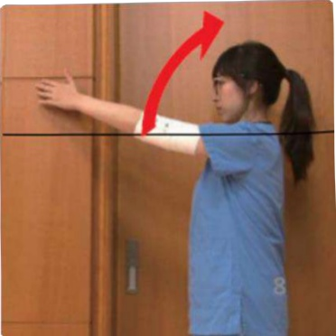

## AWS腋網症候群

成因：術後淋巴管的沾黏或阻塞。

☑ 症状：

1.由腋窩開始會形成一條索狀物或樹枝狀，一直延伸到手臂內側、手肘到大拇指根部。

2. 上肢活動受限、疼痛。

3.容易淋巴水腫。

## 物理治療：

1.經皮神經電刺激，改善疼痛。

2.筋膜放鬆術，放鬆條索。

3.淋巴引流術，消除水腫。

4. 疤痕按摩，避免沾黏。

5.衛教病人居家自主伸展牽拉運動、肩關節運動。

