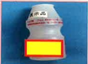

# 低血糖照護

## 什麼是低血糖？

低血糖通常是指血糖濃度低於70mg/dl以下，就會容易產生所謂低血糖的症狀，所以當血糖低於70mg/dl時，就應注意低血糖發生的可能性。

## 為什麼會發生低血糖？

1. 注射或服藥後未按時間進餐

2. 口服藥或胰島素使用過量

3. 突然運動量增加，未補充適當的點心

4. 空腹過久未進食

## 該怎麼處理低血糖？

## 救命15 法則

##  $ ^{*} $ 低血糖有那些症状

1. 血糖低於70mg/dl

立刻補充15公克糖，15分鐘後再測血糖

2. 血糖仍低於70mg/dl

再補一次15公克糖，15分鐘後再測血糖

3. 血糖仍低於70 mg/dl

## 需立即送至急診

## 資料來源：

社團法人中華民國糖尿病衛教學會2022糖尿病衛教核心教材

## 下列各項補充品均相當於15公克糖

5公克方糖3顆

5克砂糖3包

小瓶乳酸菌饮料

一湯匙糖漿或蜂蜜

120cc-150cc含糖饮料

## 聯絡資訊

義大醫院

地址:高雄市燕巢區角宿里義大路1號

義大癌治療醫院

地址：高雄市燕巢區角宿里義大路21號

電話：07-6150011轉5959

義大大昌醫院

電話：07-6150022 轉6406

義大醫療財團法人 21×29.7cm

地址：高雄市三民區大昌一路305號

2024.07印製

電話：07-5599123轉7354

2024.04修訂 HA-7-0014(2)