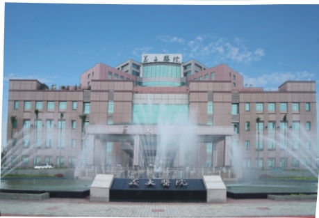

2. 接受移植手術後，為了讓病患瞭解抗排斥藥物及日常生活飲食的攝取，在術後院內專業的藥師及營養師將會到病房親自為您解說，排斥藥物的作用、副作用、食物與藥物的交互影響及注意事項等。

腎臟移植門診、器官移植中心及聯絡電話：

泌尿科 王華斌醫師 禮拜一/禮拜二/禮拜三上午

、禮拜四下午

泌尿科 江朝洋醫師 禮拜三下午、禮拜四早上、禮拜六早上

協調師：

諮詢電話：07-6150011分機5853、5852、5855

## 義大醫院

地址：高雄市燕巢區角宿里義大路1號

電話（07）615-0011

網址: http://www.edah.org.tw

## 腎臟移植手術說明書

這是一份有關於您將要接受腎臟移植手術的方法、效益、風險及替代方案之書面說明，腎移植手術是末期腎衰竭患者治療的優先選擇，可以大大的提升生活品質以及存活率，但此治療方式亦非絕無風險。我們希望您能仔細閱讀及充分瞭解資料的内容，這將有助於您與醫師做進一步的討論。

## 手術的方式與範圍

腎臟移植手術採全身麻醉，手術時間約4-5小時。手術的範圍主要在下腹部。一斜彎型傷口位於您右或左下腹部，腎臟置於近膀胱旁的前腹腔骨盆窝，所移植的腎臟可能來自於腦死的器官捐贈者，或有血緣關係的親屬及配偶的活體捐贈者。手術中需進行腎臟動脈、靜脈與接受者腸骨動脈、靜脈的吻合並將捐贈者的輸尿管縫合於受贈者的膀胱，見後圖。至於原有的腎臟或之前失敗的移植腎是否要切除，則因情況而異。術後會留置尿管、引流管多日，待恢復情況再拔除。

手術的成功機率和風險

手術前均有作組織配對檢查，立即發生排斥機會應不大，但仍有少數病例在多重檢查後發生立刻排斥現象。目前移植腎一年的存活率介於98-100%，五年存活約95%，十年存活率約83%。術前除了嚴謹的手術及麻醉評估外，詳細的免疫學檢查是決定腎臟移植手術成功最主要的因素之一。再者。近年來陸續有新的抗排斥藥物加入，使得腎臟排斥機會減少，對腎臟的預後更加有幫助。

## 手術的風險

我們盡量說明手術的風險，此手術的風險很低，但有些風險是不易在手術前發覺的，有些醫師無法預期的風險未列出，因篇幅關係，也無法列舉所有的風險：

### 1. 麻醉的風險。

2. 輸血。由於腎衰竭易導致貧血，因此手術時為了維持心肺功能及血壓穩定有必要輸血，輸血的副作用在輸血同意書內均告知。若您不同意輸血，請於手術前儘早告知醫護人員。

3. 心臟或腦血管疾病。

4. 有時會發生移植腎延遲發揮功能的情形（機率因腎臟來源不同而異，活體捐贈較少，小於10%、臨終捐贈腎臟可能高至三成），有時甚至會發生移植腎永遠無功能的情形。

5. 捐赠者原有的感染疾病或恶性肿瘤可能传染给受赠者。在移植前的评估时，我們會盡力以現有的常規檢查來排除捐赠者可能有的感染性疾病或惡性腫瘤，但仍有極微少的可能性是疾病空窗期，無法以目前醫學上的方式測出。

## 手術效益

成功的手術使移植腎有功能，能順利排泄體內廢物毒素，維持水分電解質平衡，增進生活品質並延長生命，末期腎衰竭患者接受腎臟移植治療比病人接受血液或腹膜透析的存活率高，長期洗腎除了生活品質較差外，有其副作用。手術效益與風險性的取捨，應由您決定。

## 手術的可能合併症

接受腎臟移植手術可能發生的併發症，如：傷口感染或癒合不良、傷口出血、切口性疝氣、移植腎傳染疾病給受贈者、移植腎無功能。若有嚴重的併發症有必要再次手術。移植醫療團隊會依照病患所產生併發症的程度，而給予適當的醫療處置。

## 手術給付

此項手術及多數長期抗排斥藥物費用均由健保給付，有時依病情需要可考慮使用一些藥品或特殊抗排斥藥物是需自費的項目，該類藥品常在手術進行前或進行中便需使用，故醫師於術前評估完全後再與您討論是否需要使用這類藥物，並請您簽自費同意書，如：多株抗體或抗第二介白質接受體抗體等則須自費。

## 手術後可能出現之暫時或永久症狀

初期傷口會疼痛，在幾星期後會逐漸減退，有時疼痛較久，須服藥止痛。大部分的急性排斥會用更強的抗排斥藥將其治療，有極少數會因急性排斥而永久喪失移植腎的功能。

## 術後之注意事項

1. 手術後必須終生服用抗排斥藥物，這些藥物均有一定的副作用，如：血壓增加、高脂血症、高尿酸，及糖尿病等，有些更抑制骨髓，使白血球、血色素或血小板降低，有些則會造成齒齦增厚，毛髮增長或落髮。此外一些藥物也會造成月亮臉、水牛肩等現象，這些症狀在減低藥物劑量後會改善，有些則無法改善，故須定期回移植門診追蹤治療。