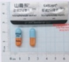

## 肆、 手術後的注意事項

(一)監控有無排斥反應、感染症狀，即每天測量並記錄體溫、血壓變化。觀察尿液和大便的次數、顏色及性質(當發現茶色尿、灰白便時應立即告知移植小組)。

(二)維持正常且規律的生活。

(三)潔淨的衛生習慣，即您和您的家人需維持良好的衛生習慣，例如：勤洗手、進食後刷牙或漱口…等。

(四)避免到人多的場合走動，若無法避免於人多的場合活動時，則應該戴口罩防護。劇烈運動應於手術後6個月才可以進行。

(五)肝臟移植前後B型肝炎疫苗皆為第一優先注射的疫苗。不可施打活性疫苗。小兒麻痺疫苗應改用非活性疫苗，即沙克注射疫苗。

(六) 避免於室內種植植物或進入植物溫室栽培中心，以避免植物病原體的感染。也應避免飼養動物，以減少病媒源的產生和感染。若有腹瀉現象，且12小時水便達6次以上，建議勿使用止瀉劑，而應回院進行糞便培養。

## 伍、 健保給付說明

當通過衛生福利部審核同意肝臟移植後，肝臟移植手術部分及手術後抗排斥藥物皆有健保給付，但新睦樂凍晶注射劑(Simulect)之抗排斥藥物為健保不給付項目，移植手術會使用兩劑。

## 義大醫院

地址：高雄市燕巢區角宿里義大路1號

電話：(07)615-0011

分機：5855、5853、5852

網址: http://www.edah.org.tw

本著作權人非經著作權人同意不得轉載翻印或轉售著作權人：義大醫療財團法人

29.7×21cm 2024.01印製 2023.12修訂 HA-9-0018(2)

## 肝臟移植 手術說明

## 簡介

根據衛生福利部公布現況肝臟移植手術後，一年存活率為93%，五年存活率則為75%。在您即將執行移植手術前，希望藉由此單張能協助您對手術過程、風險和手術後相關照顧注意事項能有充分的了解，並作為您和醫師討論的參考資料。

## 蹟、 手術過程

肝臟移植為長時間且複雜的手術，需先切除不好的肝臟（包含膽囊），接著植入捐贈的肝臟，過程中會將捐贈肝臟的上腔靜脈、門靜脈、肝動脈和膽管與受肝者原本相對結構做縫合銜接。手術時間為8~12小時。

## 貳、手術風險

醫療機構與醫事人員會盡力為病人進行治療和手術，但手術並非必然成功，仍可能發生意外，甚至因而造成死亡。手術可能引起的風險如下：

## (一) 一般手術的風險

(1)肺臟可能會有一小部分塌陷失去功能，導致增加胸腔感染的機率，此時可能需要抗生素和呼吸治療。

(2)腿部可能產生血管栓塞並伴隨疼痛和腫脹，凝結的血塊可能會分散並進入肺臟，造成致命的危險，但此情況並不常見。

(3) 因心臟承受壓力，可能造成心臟病發作，也可能導致中風。

## (二)肝臟移植手術中及手術後可能發生一些併發症，包含：

(1)出血。

(2) 心肺功能不良及其他偶发并发症。

(3) 肋膜積水、腹水。

(4)腸胃道損傷、腸蠕動不佳造成腹脹或腸沾黏導致腸阻塞。

(5) 腹腔内感染、傷口感染、傷口癒合不佳。

(6)膽管阻塞或膽汁滲漏。

(7) 移植後的肝臟功能異常，可能導致肝衰竭，嚴重時需再次換肝。

以上是肝臟移植手術中及手術後可能出現的併發症。當受肝者手術前即存在慢性疾病（例如：高血壓、糖尿病、心臟病…等）、肝臟功能極差、有抽菸史和年紀大者，其可能增加發生併發症的機會。

## 參、移植術後的抗排斥藥物

移植手術後需終身服用抗排斥藥物，這些藥物會抑制您的免疫系統，所以會帶來一些副作用。

| 普樂可復或安瑞福(Tacrolimus;FK506)有三種劑型，前者是短效，後者是長效：0.5mg/cap；1mg/cap；5mg/cap |   |
| :--- | :--- |
| 山喜多或睦體康(Mycophenolate mofetil; Cellcept/Mycophenolate acid; Myfortic)Cellcept為250mg/capMyfortic為180mg/tab |   |
| 樂爾爽錠(Prednisolone)為5mg/tab使用3~6個月 |  |
| 新睦樂康晶注射劑(Basiliximab; Simulect)為20mg/vail健保不給付項目 |  |