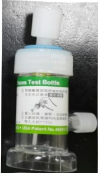
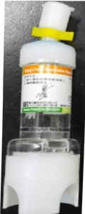

## 冀便檢驗 採檢衛教單

## 一、 檢驗項目：

(糞便量：約花生米大小)

## 二、 探检前注意事项：

## 二、 採檢前注意事項：

## 三、 採檢步驟：

1、需排便於蹲式馬桶、便盆、乾淨垃圾袋或紙上，不得混有尿液或馬桶水或衛生紙，避免污染。

2、旋開瓶子上蓋利用塑膠棒挖取糞便請挑取含有血液、膿液、黏液之糞便，置入瓶子並鎖緊。

3、水便或稀便時可用塑膠吸管吸取約2c.c.的糞便裝入瓶子。

## 四、 採檢後注意事項：

1、糞便常規檢查(Stool routine)、潛血反應檢查【化學法】(OB【Chemical】)：檢體採檢後4小時內室溫送達，若無法當天送達，則先冷藏保存並於24小時內送檢。

2、寄生蟲卵濃縮法(Parasite OVA(Concentrated method))：檢體採檢後1小時內室溫送達。

3、檢體收件時間：

|  | 週一~週五 | 週六 | 聯絡電話 |
|---|---|---|---|
| 義大醫院 | 07:00~21:30 | 07:00~12:00 | 07-6150011 轉 2803 |
| 義大癌治療醫院 | 07:00~17:00 | 07:00~12:00 | 07-6150022 轉 6285 |
| 義大大昌醫院 | 07:00~21:30 | 07:00~12:00 | 07-5599123 轉 7216 |

參考資料來源：EDCP-SOP-O-0008、EDCP-SOP-O-0012、曾永德(2017)。臨床鏡檢學(第4版)。台北：藝軒圖書。

聯絡資訊：

|  |  |  |
|---|---|---|
| 義大醫院地址:高雄市燕巢區角宿里義大路1號電話:07-6150011 | 義大癌治療醫院地址:高雄市燕巢區角宿里義大路21號電話:07-6150022 | 義大大昌醫院地址:高雄市三民區大昌一路305號電話:07-5599123 |

2024.04 修订 HA-9-0021(4)