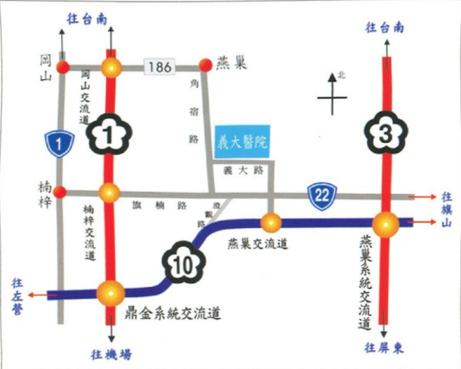

地址：高雄市824燕巢區角宿里義大路1號

電話：07-6150011

網址：http://www.edah.org.tw/

本著作權非經著作權人同意不得轉載翻印或轉售

著作單位：兒童醫學部

著作權人：義大醫院

表單編號：HA-9-0028(1)

義大醫院 21X15cm 100.10印製 100.10修訂

## 新生兒自費 健康檢查

_，預防罄學，從小做起

健康護照

義大醫院 E-DA HOSPITAL I-SHOU UNIVERSITY## 個人基本資料

我的名字：___

病壓號碼：___

出生日期：___

我的性别是：___

我的爸比是：___

我的媽咪是：___

甜蜜的窩：___

電話：

## 給父母的小叮嚀：

此次的檢查報告僅針對構造上的異常做早期的篩檢，各系統的功能將於出生後漸趨成熟，唯有定期回健兒門診追蹤，才能替您寶寶的健康把關。

若有任何疑問，請洽兒童醫學部諮詢專線：（07）6150950或（07）6150011轉5605## *臍帶血過敏指數檢查

☐ IGE>0.9，寶寶為高過敏性體質，請參考衛教事項，以減緩過敏疾病的發生。

☐ IGE<0.9，為低過敏性體質，若有出現過敏症狀，請回小兒科門診。

## 醫師的小叮嚀：

在一歲內幼兒的過敏症狀，最常在皮膚（異位性皮膚炎）及腸胃道（腸絞痛）表現，隨年紀增長，呼吸道過敏症狀會漸漸產生，包括氣喘及過敏性鼻炎，若您的寶寶有以上情況，除臍帶血過敏原數值參考外，仍建議您回小兒科門診做進一步諮詢及預防。

## 檢查醫師簽名

## 親愛的爸爸媽媽：

您的寶寶已經完成的健康檢查，結果如下：

 $ ^{*} $ 心臟超音波檢查：

☐ 目前沒有發現異常。

發現有下列異常：

☐ 開放性動脈導管（直徑約___公釐）

☐ 新生兒遠端肺動脈狹窄(右側、左側、雙側)

☐ 心房中膈缺损（直径约 ___ 公腔）

☐ 卵圓孔（直徑約 ___ 公釐）

☐ 心室中膈缺損（直徑約 ___ 公釐）

☐ 其他：## 醫師建議

☐ 按照一般健兒門診及預防注射即可，無須另外回診。

☐ 請於___個月大時，回小兒心臟科追蹤及檢查。

## 檢查醫師簽名：

## *幼兒聽力檢查（AABR）

☐ 通過，照一般健兒門診及預防注射即可，無須另外回診。

☐ 未通過，請回耳鼻喉科門診做進一步追蹤。

## 醫師的小叮嚀：

聽力損失有程度之分，一般惟有重度以上的聽障，家屬才容易發覺；但即使是輕度聽力喪失亦會造成語言發展遲緩，因此，我們必須再次叮嚀家長，寶寶未通過聽力篩檢者，必須至耳鼻喉科追蹤檢查，勿因為寶寶聽得到聲音就覺得聽力沒問題。

## 檢查醫師簽名：

