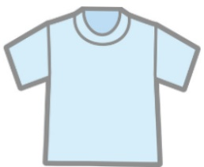
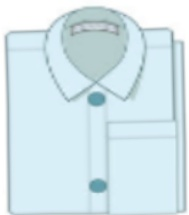

## 放射線治療 衛教手冊

義大醫療

放射腫瘤部

目錄  
一、放射線治療介紹.....1  
二、放射線治療的適應症.....2  
三、放射線治療流程.....3  
四、放射線治療照護須知.....5  
五、放射線治療記錄卡.....17## 一、 放射線治療介紹

放射線治療為癌症治療方式，也可治療特定的良性疾病。放射線治療在台灣常被簡稱為"電療"或者是"放療"，容易與復健科電刺激療法或肝臟腫瘤的電燒灼療法混淆。實則因放射線X光在台語稱作"電光"，"照電光的治療"(台語)被略為"電療"。

放射線治療近年除了一般人認知的X光治療以外，台灣醫療界也引進了質子和重粒子治療等所謂的粒子輻射。無論是哪種治療方式或者是不同的射線來源，在接受放射線治療時並不會感受到任何痛覺、視覺、味覺或者是觸覺的感受，就如同在放射診斷科接受檢查一般。

在講究個人化醫療的年代，放射線治療是極早就採取因人考量的治療策略。當代放射線治療利用醫學斷層影像來構築每位病人不同腫瘤的位置以及正常器官的形狀，能有效集中劑量在治療部位上而減少對正常器官的影響。除了單獨使用在根治性治療上，它也可以配合其他的癌症治療，例如放射同步合併化學治療強化效果，或者是與免疫治療合作期能激發出全身免疫反應。對於身體不適合開刀或者是因個人因素不願意開刀之早期癌症的病人來說，立體定位放射線治療也是另一個可以考量的選擇。## 二、 放射線治療的適應症

<table border=1 style='margin: auto; width: max-content;'><tr><td style='text-align: center;'>治療類型</td><td style='text-align: center;'>目的</td></tr><tr><td style='text-align: center;'>根治型放射線治療</td><td style='text-align: center;'>鼻咽癌、早期喉癌、攝護腺癌；身體狀況不適合開刀的早期癌症病人亦可用立體定位放射治療來達到根治的目的。</td></tr><tr><td style='text-align: center;'>術前放射線治療</td><td style='text-align: center;'>以減少腫瘤侵犯程度：例如食道癌、直腸癌。</td></tr><tr><td style='text-align: center;'>術後放射線治療</td><td style='text-align: center;'>減少局部復發的風險：例如乳癌、頭頸癌、以及腹腔骨盆腔腫瘤術後判斷為高風險的族群。</td></tr><tr><td style='text-align: center;'>癌症出現轉移(數量/部位少)/第四期的癌症病人接受全身性化學療法或免疫標靶治療後偶發部位惡化</td><td style='text-align: center;'>可採取局部放射線治療來處理這些惡化的病灶，來延長病人的生活品質或者是存活率。</td></tr><tr><td style='text-align: center;'>緩和醫療</td><td style='text-align: center;'>腫瘤引起的不適，例如骨頭疼痛、呼吸道壓迫狹窄、靜脈被壓迫引起上或下半身水腫、腦部腫瘤或脊髓腫瘤壓迫引起神經方面症狀，改善病人的生活品質。</td></tr></table>## 三、 放射線治療流程(1/2)

## 三、 放射線治療流程(2/2)

註1：經由門診或者會診途徑，醫師會分析病情來確認是否需要接受放射線治療，以及治療的方式。

註2：為了讓治療品質穩定，治療前會在模擬攝影室量身製作治療用的固定姿勢模具，以及進行在治療姿勢下的電腦斷層掃描讓醫師和醫學物理師做後續的治療計畫規劃，此步驟若為特別治療方式時，為確認是否合用、所需時間將會更多。

註3：治療計畫設計分為兩步驟：

(1) 醫師在影像上選定治療區域以及重要器官，治療劑量的規劃。

(2) 醫學物理師將醫師的要求經由治療計畫系統設計出一到多個不同的方案，讓醫師選擇對病人最有利的選項。由於治療位置因人不同、或者是重複照射的個案而難度提高，此項作業會花較多的時間。

註4：計畫完成後，本科護理師會通知病人或家屬可以開始接受治療，治療時間依照治療部位的多寡或者是治療方式的複雜程度而有數分鐘到半小時的差異。在等候區等待治療時，請耐心等候其他病人的治療過程。

## 四、 放射線治療照護須知

不同的治療部位，所關注與照護的認知與行為將有所不同，以下我們將依不同治療部位進行分別的照護說明，您可依據您放射線治療部位挑選閱讀以下相關內容。

1.腦部放射線治療照護須知.....6  
2.頭頸癌放射性皮膚炎照護須知.....8  
3.頭頸癌放射治療口腔黏膜照護須知.....9  
4.食道癌放射線治療照護須知.....10  
5.乳癌放射線治療照護須知.....11  
6.大腸直腸癌放射線治療照護須知.....13  
7.婦癌放射線治療照護須知.....14  
8.攝護腺癌放射線治療照護須知.....15### 1. 腦部放射線治療照護須知

## (1) 名詞解釋

腦部放射線治療是利用高能量的 X 光照射腫瘤，使其縮小，屬於局部治療。

## (2) 適用對象

當腦部腫瘤因生長的部位及大小，無法靠外科手術完全切除乾淨，經醫師評估後，會於術後安排放射線治療加以輔助。

## (3) 常見副作用及原因

<table border=1 style='margin: auto; width: max-content;'><tr><td style='text-align: center;'>副作用</td><td style='text-align: center;'>原因</td></tr><tr><td style='text-align: center;'>頭痛、頭暈、噁心、嘔吐</td><td style='text-align: center;'>治療期間造成暫時性腦壓上升。</td></tr><tr><td style='text-align: center;'>皮膚發紅搔癢</td><td style='text-align: center;'>頭皮、耳朵、外耳道及後頸部在治療期間可能會有皮膚發炎反應。</td></tr><tr><td style='text-align: center;'>掉髮</td><td style='text-align: center;'>因治療範圍照射至頭皮，使毛囊受損。</td></tr><tr><td style='text-align: center;'>癲癇</td><td style='text-align: center;'>有腦部腫瘤之病人易發生。</td></tr></table>

## (4) 照護方法及注意事項

平時應作息正常、避免熬夜，飲食需注意避免食用刺激性食物，例如：咖啡、濃茶等，選擇清淡飲食，維持體重。<table border=1 style='margin: auto; width: max-content;'><tr><td style='text-align: center;'>副作用</td><td style='text-align: center;'>照護方法及注意事項</td></tr><tr><td style='text-align: center;'>頭痛、頭暈、噁心、嘔吐</td><td style='text-align: center;'>治療期間，須維持良好的排便習慣，避免用力解便造成腦壓升高的風險，若解便不順，可請醫師開立軟便藥物使用。</td></tr><tr><td style='text-align: center;'>皮膚發紅搔癢</td><td style='text-align: center;'>洗髮時，可用溫水輕輕清洗，暫勿使用清潔用品，醫師也會視情況開立藥物使用。</td></tr><tr><td style='text-align: center;'>掉髮</td><td style='text-align: center;'>待治療結束後頭髮會慢慢長回來。</td></tr><tr><td style='text-align: center;'>癲癇</td><td style='text-align: center;'>規律服用抗癲癇藥物，避免操作危險性機械，如：汽機車等。</td></tr></table>

開始治療後，每周至少一次需至門診給醫師評估治療狀況，若有不適，醫師也可依照病人情況予開藥減緩不適情形。

### 2. 頭頸癌放射性皮膚炎照護須知

## (1) 名詞解釋

放射性皮膚炎：因放射線治療引起的皮膚組織傷害及發炎反應。

## (2) 適用對象

接受放射線治療的頭頸癌病人。

## (3) 照護方式及注意事項

頭頸癌病人在開始放射線治療約2～3週後，照射部位的皮膚會出現如曬傷般的反應，皮膚會逐漸變紅及較為敏感，也會變得較為乾燥、脆弱，嚴重者可能脫皮、有滲出液、疼痛或潰瘍等現象。這些都是正常放射線治療反應，在治療停止後會逐漸改善，皮膚也會逐漸回復正常。在放射線治療期間，對於治療範圍的皮膚照護，應遵循下列事項：

放射性皮膚炎照護範圍

1. 每日以溫水淋浴後，使用柔軟毛巾以按壓方式吸乾水份，過程中切勿摩擦或用力擦拭皮膚。

2. 治療範圍應加強皮膚保濕。

3. 禁止使用刮鬍刀片、刮鬍膏或脱毛劑，以免造成皮膚傷害。

4. 避免於照射皮膚有按摩、抓或擦揉動作，以及禁止在照射部位黏貼膠帶包括疼痛貼片或直接使用冷熱敷設備。

5. 除醫師處方開立的藥膏外，不可於照射部位任意塗抹乳液、藥膏、藥粉及保養品等。

## 重要小叮嚀：

放射線治療期間，如因放射性皮膚炎產生疼痛或不適，請立即至放射腫瘤部門診由醫師進行評估。醫師會依據症狀開立處方藥物或給予適當處置。### 3. 頭頸癌放射治療口腔黏膜照護須知

## (1) 名詞解釋

放射性口腔黏膜炎：接受放射線治療的頭頸癌病人，於2~3週後，口腔黏膜會開始出現發炎、紅腫疼痛、甚至潰瘍等症狀。

## (2) 適用對象

接受放射線治療的頭頸癌病人。

## (3) 照護方式及注意事項

a. 治療期間，於白天時段，需每小時或經常性以溫開水漱口，以維護口腔清潔。

b. 進食後須立即以軟毛牙刷刷牙或溫開水漱口，以保持口腔衛生，避免細菌滋生。

c. 禁止抽菸、喝酒、嚼檳榔。

d. 放射治療期間，如口腔內有嚴重發炎或潰瘍導致無法進食時，經醫師評估後，需進行鼻胃管放置的醫療輔助措施，請病人及家屬務必配合，以增進營養攝取。### 4. 食道癌放射治療照護須知

## (1) 名詞解釋

a. 食道癌是食道內的癌症。食道是一根長管，將口中的食物送到胃中。

b. 放射線治療: 是使用高能量放射線來去除腫瘤的方法，也稱為電療。

## (2) 適用對象

食道癌接受放射線治療病人。

## (3) 照護方式及注意事項

<table border=1 style='margin: auto; width: max-content;'><tr><td style='text-align: center;'></td><td style='text-align: center;'></td><td style='text-align: center;'></td></tr><tr><td style='text-align: center;'>衣物選擇以柔軟，舒適，避免有衣領的服飾。</td><td style='text-align: center;'></td><td style='text-align: center;'></td></tr><tr><td style='text-align: center;'>固定敷料時可使用繃帶或紗布，避免身上直接黏貼膠帶。</td><td style='text-align: center;'></td><td style='text-align: center;'></td></tr><tr><td style='text-align: center;'>飲食攝取可採高熱量，高蛋白食物，避免體重下降。</td><td style='text-align: center;'></td><td style='text-align: center;'>↓</td></tr></table>

### 5. 乳癌放射線治療照護須知

## (1) 名詞解釋

乳癌放射線治療是利用高能量 X 光照射乳房腫瘤，使其縮小，屬局部治療。

## (2) 適用對象

乳癌病人經部分切除或全部切除手術後，經評估後接受放射線治療可以提高局部控制的機率，降低復發風險，延長存活率。

## (3) 治療前後照護方式及注意事項

在療程開始第三周後，皮膚反應是最常見的副作用，皮膚呈現輕微紅腫如同曬傷一般，表皮的毛孔也會變得比較明顯，所以自我皮膚照護相當重要。

### a. 治療前自我皮膚照護

<table border=1 style='margin: auto; width: max-content;'><tr><td rowspan="4">保濕</td><td style='text-align: center;'>選擇合適的保濕產品，且無添加香料或精油。</td></tr><tr><td style='text-align: center;'>保濕產品塗抹範圍（如圖A.）：患側鎖骨至乳房下緣做記號處，側邊腋下至手摸的到的範圍皆要塗抹。</td></tr><tr><td style='text-align: center;'>保濕產品每天可塗抹2至3次，不需沖洗，自然風乾即可。</td></tr><tr><td style='text-align: center;'>建議治療前的2小時不要塗抹任何產品。</td></tr><tr><td rowspan="4">減少摩擦</td><td style='text-align: center;'>開始治療後，應避免穿著內衣，防止鋼圈或鬆緊帶勒緊皮膚。</td></tr><tr><td style='text-align: center;'>選擇棉質且透氣上衣為主，避免穿著有領子或蕾絲等縫線過多的上衣。</td></tr><tr><td style='text-align: center;'>背包應避免背於患側，走路時患側手臂可叉腰，減少腋下皮膚摩擦。</td></tr><tr><td style='text-align: center;'>一天洗一次澡，治療部位不可用清潔用品，只需清水沖過，毛巾壓乾。</td></tr></table>

圖 A. 保濕產品塗抹範圍

### b. 治療開始後注意事項

開始治療後，每周至少一次需至門診給醫師評估治療狀況，若有不適，醫師也可依照病人情況予開藥減緩不適情形。

<table border=1 style='margin: auto; width: max-content;'><tr><td rowspan="3">藥膏使用</td><td style='text-align: center;'>若有兩種以上藥膏使用，需間隔15分鐘後再塗抹。</td></tr><tr><td style='text-align: center;'>若皮膚較紅、破皮或是水泡出現，醫師會開立燙傷藥膏使用。因燙傷藥膏不易清理，洗澡時不需完全清洗乾淨，即使有殘留藥膏也可直接敷上新的一層。</td></tr><tr><td style='text-align: center;'>燙傷藥膏塗抹厚度需覆蓋整個皮膚至無法看見，塗抹後可使用紗布覆蓋，避免沾到衣服，但切記絕不可使用任何膠帶黏貼皮膚，避免撕掉膠帶時皮膚會同時被撕起造成破皮。</td></tr></table>### 6. 大腸直腸癌放射線治療照護須知

## (1) 名詞解釋

### a. 大腸直腸癌

消化系統的最低部份稱為結腸，結腸的最後6吋又稱直腸，食物消化後，殘渣通過結腸直腸（俗稱大腸）而排出體外。生長在這個部位的癌症，稱為大腸癌（或結腸、直腸癌）。

### b. 放射線治療

大腸直腸癌病人接受同步放射線，會接受約每天一次，每週五次總共約五週的放射治療。目的在於預防局部復發與可能的轉移；或使病灶範圍縮小，之後再手術切除。

## (2) 適用對象

接受放射線治療的大腸直腸癌病人。

## (3) 治療期間飲食照護

## (4) 注意事项

a. 若有裡急後重或腹瀉的症状，醫師會開立止瀉劑及消炎止痛藥來減輕症狀。

b. 肛门清洁剂使用温水冲洗后，再用毛巾吸乾水分。### 7. 婦癌放射治療照護須知

## (1) 名詞解釋

a. 婦科癌症:包括子宮頸、子宮、卵巢等惡性腫瘤病人。

b. 放射線治療: 是使用高能量放射線來去除腫瘤的方法，也稱為電療。

## (2) 適用對象

等接受放射線治療之子宮頸癌或子宮癌或卵巢癌的病人。

(3) 照護方式及注意事項

<table border=1 style='margin: auto; width: max-content;'><tr><td style='text-align: center;'></td><td style='text-align: center;'></td><td style='text-align: center;'></td></tr><tr><td style='text-align: center;'>衣物選擇以柔軟，舒適；避免穿著過緊、束縛感之衣物。</td><td style='text-align: center;'></td><td style='text-align: center;'></td></tr><tr><td style='text-align: center;'>可使用清水淋浴清潔，避免過度使用沐浴用品清洗。</td><td style='text-align: center;'></td><td style='text-align: center;'></td></tr><tr><td style='text-align: center;'>以均衡飲食，避免過量蔬菜水果。</td><td style='text-align: center;'></td><td style='text-align: center;'></td></tr></table>### 8. 攝護腺癌放射線治療照護須知

## (1) 名詞解釋

攝護腺癌放射線治療是利用高能量的 X 光照射腫瘤，使其縮小，屬局部治療。

## (2) 適用對象

經醫師評估後需進行放射線治療之攝護腺癌病人。

## (3) 副作用及照護方式

鄰近攝護腺的器官為腸子以及膀胱，所以攝護腺癌病人最常發生放射線治療的副作用，大多為腸胃道以及泌尿道反應，這些症狀皆屬於正常情形。

<table border=1 style='margin: auto; width: max-content;'><tr><td rowspan="3">腸胃道</td><td style='text-align: center;'>若腹瀉或肛門發炎情形出現，注意排便後須使用清水沖洗肛門，盡量避免使用衛生紙，減少肛門刺激導致破皮的現象。</td></tr><tr><td style='text-align: center;'>排便時可能會發生裡急後重（如解便解不乾淨卻一直想上）的情形，醫師會依據病人狀況開立肛門軟膏使用。</td></tr><tr><td style='text-align: center;'>嚴重腹瀉時，應多補充分，多攝取易消化，且避免辛辣及刺激性食物。</td></tr><tr><td style='text-align: center;'>泌尿道</td><td style='text-align: center;'>治療期間若有頻尿情形發生，除治療期間要求脹尿30分鐘外，平時請多補充分，勿憋尿。</td></tr></table>## 義大醫療財團法人 E-DA HEALTHCARE GROUP

## (4) 注意事项

a. 每日治療時，需脹尿至少 30 分鐘，以及養成每日排便習慣，減少附近膀胱以及直腸的副作用。

b. 治療期間請勿有泡溫泉或三溫暖等活動，避免熱源加重發炎情形。

C. 治療期間應避免久坐，或騎腳踏車等可能對皮膚產生刺激壓迫之動作。

d. 開始治療後，每周至少一次需至門診給醫師評估治療狀況，若有不適，醫師也可依照病人情況予開藥減緩不適情形。

e. 肛門軟膏使用方法：塗抹少許藥膏在肛門外圍，同時將軟管裝上，並伸進肛門擠一點藥膏在裡面，可減輕不適感（如下圖 A.）。

圖 A. 肛門軟膏使用方法
## 五、 放射線治療記錄卡

## 主治醫師姓名：

## 預計次數/劑量：

部位：

<table border=1 style='margin: auto; width: max-content;'><tr><td style='text-align: center;'>1</td><td style='text-align: center;'>2</td><td style='text-align: center;'>3</td><td style='text-align: center;'>4</td><td style='text-align: center;'>5</td><td style='text-align: center;'>6</td><td style='text-align: center;'>7</td><td style='text-align: center;'>8</td><td style='text-align: center;'>9</td><td style='text-align: center;'>10</td></tr><tr><td style='text-align: center;'></td><td style='text-align: center;'></td><td style='text-align: center;'></td><td style='text-align: center;'></td><td style='text-align: center;'></td><td style='text-align: center;'></td><td style='text-align: center;'></td><td style='text-align: center;'></td><td style='text-align: center;'></td><td style='text-align: center;'></td></tr><tr><td style='text-align: center;'>11</td><td style='text-align: center;'>12</td><td style='text-align: center;'>13</td><td style='text-align: center;'>14</td><td style='text-align: center;'>15</td><td style='text-align: center;'>16</td><td style='text-align: center;'>17</td><td style='text-align: center;'>18</td><td style='text-align: center;'>19</td><td style='text-align: center;'>20</td></tr><tr><td style='text-align: center;'></td><td style='text-align: center;'></td><td style='text-align: center;'></td><td style='text-align: center;'></td><td style='text-align: center;'></td><td style='text-align: center;'></td><td style='text-align: center;'></td><td style='text-align: center;'></td><td style='text-align: center;'></td><td style='text-align: center;'></td></tr><tr><td style='text-align: center;'>21</td><td style='text-align: center;'>22</td><td style='text-align: center;'>23</td><td style='text-align: center;'>24</td><td style='text-align: center;'>25</td><td style='text-align: center;'>26</td><td style='text-align: center;'>27</td><td style='text-align: center;'>28</td><td style='text-align: center;'>29</td><td style='text-align: center;'>30</td></tr><tr><td style='text-align: center;'></td><td style='text-align: center;'></td><td style='text-align: center;'></td><td style='text-align: center;'></td><td style='text-align: center;'></td><td style='text-align: center;'></td><td style='text-align: center;'></td><td style='text-align: center;'></td><td style='text-align: center;'></td><td style='text-align: center;'></td></tr><tr><td style='text-align: center;'>31</td><td style='text-align: center;'>32</td><td style='text-align: center;'>33</td><td style='text-align: center;'>34</td><td style='text-align: center;'>35</td><td style='text-align: center;'>36</td><td style='text-align: center;'>37</td><td style='text-align: center;'>38</td><td style='text-align: center;'>39</td><td style='text-align: center;'>40</td></tr><tr><td style='text-align: center;'></td><td style='text-align: center;'></td><td style='text-align: center;'></td><td style='text-align: center;'></td><td style='text-align: center;'></td><td style='text-align: center;'></td><td style='text-align: center;'></td><td style='text-align: center;'></td><td style='text-align: center;'></td><td style='text-align: center;'></td></tr></table>## 主治醫師姓名：

## 預計次數/劑量：

部位：

<table border=1 style='margin: auto; width: max-content;'><tr><td style='text-align: center;'>1</td><td style='text-align: center;'>2</td><td style='text-align: center;'>3</td><td style='text-align: center;'>4</td><td style='text-align: center;'>5</td><td style='text-align: center;'>6</td><td style='text-align: center;'>7</td><td style='text-align: center;'>8</td><td style='text-align: center;'>9</td><td style='text-align: center;'>10</td></tr><tr><td style='text-align: center;'></td><td style='text-align: center;'></td><td style='text-align: center;'></td><td style='text-align: center;'></td><td style='text-align: center;'></td><td style='text-align: center;'></td><td style='text-align: center;'></td><td style='text-align: center;'></td><td style='text-align: center;'></td><td style='text-align: center;'></td></tr><tr><td style='text-align: center;'>11</td><td style='text-align: center;'>12</td><td style='text-align: center;'>13</td><td style='text-align: center;'>14</td><td style='text-align: center;'>15</td><td style='text-align: center;'>16</td><td style='text-align: center;'>17</td><td style='text-align: center;'>18</td><td style='text-align: center;'>19</td><td style='text-align: center;'>20</td></tr><tr><td style='text-align: center;'></td><td style='text-align: center;'></td><td style='text-align: center;'></td><td style='text-align: center;'></td><td style='text-align: center;'></td><td style='text-align: center;'></td><td style='text-align: center;'></td><td style='text-align: center;'></td><td style='text-align: center;'></td><td style='text-align: center;'></td></tr><tr><td style='text-align: center;'>21</td><td style='text-align: center;'>22</td><td style='text-align: center;'>23</td><td style='text-align: center;'>24</td><td style='text-align: center;'>25</td><td style='text-align: center;'>26</td><td style='text-align: center;'>27</td><td style='text-align: center;'>28</td><td style='text-align: center;'>29</td><td style='text-align: center;'>30</td></tr><tr><td style='text-align: center;'></td><td style='text-align: center;'></td><td style='text-align: center;'></td><td style='text-align: center;'></td><td style='text-align: center;'></td><td style='text-align: center;'></td><td style='text-align: center;'></td><td style='text-align: center;'></td><td style='text-align: center;'></td><td style='text-align: center;'></td></tr><tr><td style='text-align: center;'>31</td><td style='text-align: center;'>32</td><td style='text-align: center;'>33</td><td style='text-align: center;'>34</td><td style='text-align: center;'>35</td><td style='text-align: center;'>36</td><td style='text-align: center;'>37</td><td style='text-align: center;'>38</td><td style='text-align: center;'>39</td><td style='text-align: center;'>40</td></tr><tr><td style='text-align: center;'></td><td style='text-align: center;'></td><td style='text-align: center;'></td><td style='text-align: center;'></td><td style='text-align: center;'></td><td style='text-align: center;'></td><td style='text-align: center;'></td><td style='text-align: center;'></td><td style='text-align: center;'></td><td style='text-align: center;'></td></tr></table>## 聯絡資訊

## ➢義大醫院

地址：高雄市燕巢區角宿里義大路1號

電話：07-6150011-2205

## ➢義大癌治療醫院

地址：高雄市燕巢區角宿里義大路 21 號

電話：07-6150022-6787

本著作權人非經著作權人同意不得轉載翻印或轉售

著作權人：義大醫療財團法人

實實在在關心您健康的好厝邊

義大醫療財團法人 14.8x21cm 2023.12 印製