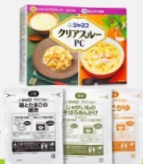
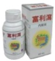
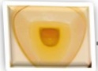
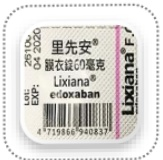
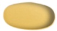
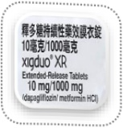
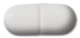
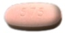
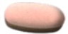

## 胃腸鏡檢查前飲食及清腸劑Fulisay（富利鴻)服用注意事項

## 親愛的貴賓：

為能了解您的健康狀況，請於健檢前三日先掃描QR Code完成相關的評估問卷；若有急性發燒（額溫超過37.5度或耳溫若超過38度）

、呼吸道、咳嗽、味覺症狀等身體不適症狀，請盡速就醫，並延後

健康檢查

敬請於

年 月

評估問卷

點鐘 至 義大醫院六樓

健診中心

## 攜帶物品

身份證

健保卡

糞便檢體盒

常規服用藥物

## 請勿攜帶

耳環

項鍊

戒指

隱形眼鏡

## 卸除美甲

雙手「食指」的

指甲油

光療水晶指甲

交通工具

接受麻醉者請勿自行開車或騎車來院

## 檢查說明書QR Code

消化道檢查說明書

鎮靜止痛說明書

冠狀動脈CT說明書

核磁造影說明書

## 影像學檢查注意事項

檢查項目包含冠狀動脈血管攝影（含顯影劑）、腹部或頭部電腦斷層（含顯影劑）檢查前二天及檢查後二天須停止服用糖尿病藥物（metformin）

## 胃腸鏡檢查前注意事項

長期服用慢性病藥物（如高血壓、心臟疾病及甲狀腺藥物）請依照醫師指示可繼續服用。不需停藥；唯糖尿病藥物請於檢查當日早上暫勿服用，並隨身攜帶藥物至健診中心選擇消化道檢查者，如要加選胃幽門桿菌測試，需額外自費

經鼻高流量濕化氧氣治療：BMI≥35 者經麻醉專科醫師評估適合無痛鏡檢者，一律需額外自費使用以提升麻醉過程呼吸安全（BMI≥30~34 者則建議使用）

胃腸鏡檢查前注意事項

水分攝取

每天2000c.c.以上

## 低渣飲食

## 檢查前兩天

稀飯

麵條

去皮鱼肉

運動飲料

## 代餐飲食

## 【檢易沖泡式餐點】

早、中、晚餐可各食用一包

將一包加入500c.c.滾熱開水均勻攪拌

水分攝取

靜置10分鐘後即可食用

## 清腸劑使用

肉湯

清腸衛教動畫國語版

檢查前一天

吐司

檢查前一週內每天至少補充2000c.c.水分

請勿食用蔬菜水果、奶類製品、油炸類食物

健檢前請確認糞便檢體是否已留取

間隔1小時

補水 2000c.c.

禁食

第一瓶+250c.c.水稀释

蒸蛋

饅頭

清腸衛教動畫台語版

直接微波爐加熱或隔水加熱

#### 每天2000c.c.以上

早餐：饅頭一顆

午餐：兩包 / 晚餐：一包

用藥提醒APP(Android)

用藥提醒(ios)

檢查當天

05:00 禁食

間隔30分鐘

儘量蹲坐馬桶，促進便意產生，蹲坐馬桶可用椅凳墊高以利排便

第二劑+250c.c.水稀釋

補水 750c.c.

多走動按摩腹部，以溫水沖肛門刺激排便期間會有數次排便，可用溫水清洗減少擦拭肛門口

## 溫馨提醒

喝完瀉劑後開始作用，持續觀察糞水狀態【如左圖】請將最後一次排便情形用手機拍照下來，以利護理人員評估

## Aspirin (Bokey)

## Clopidogrel (Plavix) 75mg/tab

## 舒栓寧膜衣錠

## Cilostazol (Pletaal)

## Dipyridamole

## 25 mg/tab

## 降血糖藥物

## Warfarin(Cofarin)(Mafarin)

## Dapagliflozin and Metformin (Xigduo XR)

Metformin 1000mg/tab

## Glimepiride and Metformin (Glimet)

利控糖膜衣錠

## Metformin (Ankomin)

## Sitagliptin and Metformin(Janumet)

+ Metformin 500mg/tab

## V ildagliptin and Metformin(Galvus Met)

## 長期服用藥物請依照醫師指示繼續服用，不需停藥；唯糖尿病藥物請於檢查當日早上暫勿服用，並隨身攜帶藥物至健診中心

服用抗血小板、抗凝血劑、銀杏、納豆、魚油、Q10等藥物，請與您的醫師評估停藥7天之可行性，以減少息肉切除術後傷口出血的機率## ☕ ☐

## 01 天然災害

因應天然災害例如颱風，健檢當日高屏區宣布停班時，基於安全考量，健檢相關業務將暫停提供服務；後續擇日排檢事宜，由專人協助安排企業客戶請洽專責承辦人！

## 03 糞便檢體

依檢體收集說明進行採檢，採集完成後放入綠色塑膠袋內置放陰涼處

##  $ ^{*} $ 本说明仅供参考。

## 02 女性生理期間

不建議檢查雌激素代謝、糞便、尿液和抹片檢查，請於經期結束後7天，再回健診中心補檢；如已確定懷孕或目前正在準備懷孕與有可能懷孕者，不適宜做檢查，請延期！

## 04 停車優免券

停車場位於「義大醫院急診」旁，可洽健診索取停車優免卷，請勿停「私人民營停車場」

義大醫療免費停車券

免費停車：___ 小時

使用時間：___ 年 ___ 月 ___ 日

發券單位：健康管理中心

※本券限當日有效

## 05 禁食

健檢前一天，晚上12點過後即開始禁食（包含口香糖、酸梅、檳榔）、禁水（除了檳查當天早上瀉劑）

義大醫療財團法人 義大醫院 健診中心

## 06 回檢貴賓尊享優惠

感謝貴賓的支持與愛護，如攜帶本健診中心所提供之「健檢服」，可擇一贈送抽血檢查項目。活動內容請於健檢當日洽詢櫃台服務人員

院址：高雄市燕巢區角宿里義大路1號6F

諮詢電話：(07) 615-0011轉5705、5707、5713、5691

健檢服務時間：週一至週五：08:00～17:00

週六：08:00～12:00（例假日休息）

非上班時間或夜間及假日

藥物諮詢電話：(07)615-0011轉2000

## 参考文献：

fibre diet does not improve colonoscopy preparation results compared