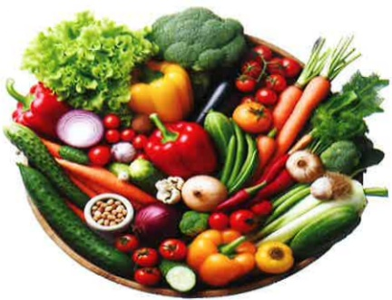
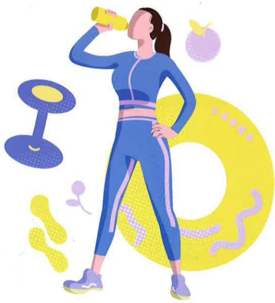
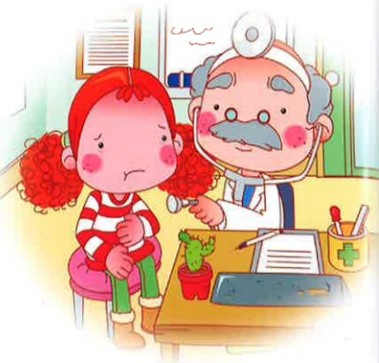
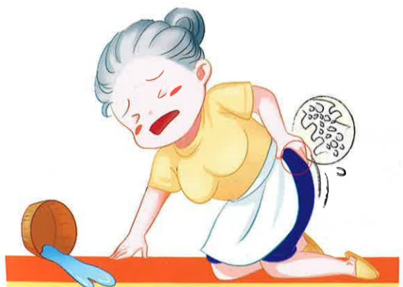

## 健診中心 衛教手冊

## B

## 健診中心衛教手冊

## 目錄

1. 糖尿病衛教.....3  
2. 糖尿病飲食.....5  
3. 高脂血症飲食.....11  
4. 低普林飲食(高尿酸血症/痛風飲食).....14  
5. 高血壓.....17  
6. 十二指腸潰瘍.....20  
7. 何謂膽結石.....22  
8. 認識痔瘡及注意事項.....24## B

## 健診中心衛教手冊

## 目錄

9. 泌尿道感染..... 26  
10. 攝護腺保健..... 28  
11. 認識椎間盤突出..... 30  
12. 認識退化性關節炎..... 32  
13. 骨質疏鬆..... 34  
14. 認識骨質密度檢測..... 36  
15. 菸的危害知多少..... 41

16.參考資料..... 43

## 糖尿病教

## 壹、 何謂糖尿病

糖尿病是一種全身性新陳代謝異常的疾病，主要是體內胰島素分泌缺乏或作用不良，引起醣類、蛋白質和脂肪等代謝異常，造成血中葡萄糖過多，經由腎臟，隨著尿液排出，造成尿中出現糖份的現象。

## 貳、糖尿病有哪些症狀？

主要症狀除了一般人所說的『三多』：吃多、喝多、尿多；另外還有一些如體重減輕、容易疲倦等典型症狀。其他症狀還包括皮膚搔癢、傷口不易癒合、腳部酸麻刺痛、視力減退等等。

## 参、哪些人易得糖尿病？

近親是糖尿病患者、肥胖體型的人、中老年人、缺乏運動者、高血壓、高膽固醇等。

## 肆、 糖尿病的種類可分為？

## 一、 第1型糖尿病：

屬胰島素依類型，通常發生於兒童及年齡小於30歲的年輕人。因為胰臟無法製造胰島素，大多需終身注射胰島素。

## 二、 第2型糖尿病：

屬非胰島素依賴型，通常危及40歲以上的成年人，但目前也可同時影響到年輕人。這類是由貝它細胞（$\beta$ cell）的功能衰退以及身體細胞用胰島素的能力下降所致，此型糖尿病經常有家族性遺傳的背景，再加上肥胖以及不健康的生活作息和環境危險因素都會促進其發生。## 伍、 糖尿病診斷

糖尿病的診斷主要是以血糖濃度為檢測標準，根據2011年美國糖尿病協會所公佈的診斷依據包括：

一、HbA1C ≥ 6.5%。

二、空腹8小時以上血糖 ≥ 126mg/dL或以口服葡萄糖耐受試驗其2小時後的血糖≥200mg/dL。

三、有高血糖的典型症状或高血糖危象，而其随機血糖≥200mg/dL，即可診斷為糖尿病。

## 陸、糖尿病的治療

一、第1型糖尿病患者：

目前的治療方式是需要終身使用胰島素來控制。

## 二、 第2型糖尿病患者：

治療的第一步是健康飲食及合理的運動治療，若仍無法使血糖達到控制的目標，則可開始使用口服降血糖來治療。

## 柒、 低血糖的症状

低血糖指的是血糖值低於 70mg/dL，通常會伴随飢餓、頭昏、冒冷汗、心跳加快、無力感等症狀。若發生低血糖而病人意識清楚可以進食時，可立刻喝半杯120-180c.c.的果汁、一湯匙蜂蜜或3-4顆方糖來補充糖份，若15分鐘後症狀尚未解除，可再吃一次，若低血糖症狀一直沒有改善，則應立刻送醫。

## 糖尿病飲食

壹、定時定量：維持血糖恆定。

## 貳、維持理想體重：肥胖會增加胰島素阻抗。

## 參、均衡攝取六大類食物：

一、奶類：低脂奶、脫脂奶、起司…等。

二、主食類：米飯、饅頭、麵食類、蕃薯、玉米、紅豆、綠豆等。

三、肉魚豆蛋類：雞、鴨、牛、羊、豬、豆腐、蛋類…等。

四、蔬菜類：深色、淺色蔬菜，葉菜類、瓜類、菇類...等。

五、水果類：各類生鮮水果，如橘子、香蕉、芭樂、柚子...等。

六、油脂類：烹調油、核果類如花生、腰果、瓜子...等。

## 肆、 增加纖維質攝取量：

## 一、 纖維質：

(一)可預防飯後血糖快速上升。

(二)增加飽足感。

(三)預防便秘。

二、來源：蔬菜類、大蕃茄、全穀類...等。

三、可預防飯後血糖快速上升。

## 伍、 低油烹調：多採用清蒸、水煮、滷、燉、烤、涮…等方式。

## 陸、降低油脂總攝取量：

一、不吃動物性外皮：肥肉、豬皮、鴨皮、雞皮、魚皮…等。

二、不吃肥肉、五花肉、雞翅膀...等。

三、不吃油炸、油煎、油酥、药芡、濃湯...等。

四、不吃花生、腰果、瓜子、開心果...等堅果類。

五、切忌喝酒。

## 染、減少攝取高膽固醇食物：

如腦、肝、內臟、腰子、蟹黃、蝦卵、魚卵及蛋黃 … 等。| 姓名: | 病歷號碼: |
| --- | --- |
| 日期: | 年 | 月 | 日 |
| 總熱量: | 大卡/日 |
| 醣類: | 公克 |
| 脂肪: | 公克 |
| 蛋白質: | 公克 |
| 餐別食物分数 | 份數 | 早餐 | 早餐點 | 午餐 | 午餐點 | 晚餐 | 晚餐點 |  |
| 全穀雜糧類 |  |  |  |  |  |  |  |  |
| 豆魚蛋肉類 |  |  |  |  |  |  |  |  |
| 奶  類 |  |  |  |  |  |  |  |  |
| 蔬  果 |  |  |  |  |  |  |  |  |
| 水  果 |  |  |  |  |  |  |  |  |
| 油脂與堅果種子類 |  |  |  |  |  |  |  |  |## 食物代换表

## 全穀糧類1份(公克)

70大卡 = 乾飯1/4碗(50)=糯米腸1/2條(50)

=麵條(熟)1/2碗(60)=甜不辣(70)

=饅頭1/3個(中)(30)=馬鈴薯1/2個(中)(90)

=稀飯1/2碗(125)=芋頭1/5個(中)(55)

=漢堡麵包1½=碗粿1/2碗(125)

=薏仁1½湯匙(20)=紅豆、綠豆、花豆2湯匙(乾)(25)

70大卡 = 皇帝豆(65) = 玉米或玉米粒2/3根(85)

= 小餐包1個(25) = 麥片3湯匙(20)

= 南瓜(85) = 蕃薯1/2個(小)(55)

70大卡 = 餛飩皮3-7張(30) $ \frac{1}{2} $ 皮 = 1 $ \frac{1}{2} $ 張(30) 水餃皮3張(30)

= 蘇打餅3片(20) = 吐司1/2~1/3片(30)

70大卡 = 蘿蔔糕1塊(35) $ (6*8*1.5 $ 公分 $ )= $ 蛋餅皮、蔥油餅皮(冷凍)(35)

=燒餅1/4個 $ (+1/2 $ 茶匙油 $ )= $ 油條 $ (+3 $ 茶油 $ )2/3 $ 根(40)

=冬粉(乾)1/2把(15)=米粉1/2碗(濕) $ (40)= $ 藕粉3湯匙(20)

=菱角帶縠8粒 $ (60)= $ 栗子(乾)3粒大(60)

=奶酥麵包 $ (+1 $ 茶匙油 $ )1/3 $ 個小 $ (30)= $ 菠蘿麵包 $ (+1 $ 茶匙油 $ )1/3 $ 個(小)(30)

## ☆肉類1份(可食生重)(公克)

55大卡 = 一般鱼類(35)=瘦肉1兩(35)=雞胸肉(30)

=海參(100)=蝦仁(50)=魚丸(不包肉)(10克碳水化合物)(55)

=豬血(110)=火腿(+5克碳水化合物)(45)

=牛肉乾(+5克碳水化合物)(20)=猪肉乾(+5克碳水化合物)(15)

=小卷(鹹)(35)=花枝(60)=蛋1個

=牡蠣(65)=雞腿(40)=小魚乾(10)

=文蛤(160)=豬大里肌(35)

75大卡 = 虱目魚、烏魚、鮭魚(35)=鱈魚(50)=花枝丸、虱目魚丸(+7克碳水化合物)(60)

=豬肉鬆(+5克碳水化合物)(20)=旗魚丸、魚丸(包肉)(+7克碳水化合物)(60)

=雞翅/雞排(40)=雞爪(30)

120大卡=秋刀鱼(35)=牛肉條(40)

## ☆豆製品1份(可食生重)公克

55大卡=毛豆1/2碗(50)(+10克碳水化合物)=黄豆(20)(+5克碳化合物)

=豆包(濕)2/3個(30)=干絲(40)=麵腸(35克)=無糖豆漿(190毫升)

75大卡=百頁結(50)=油%55)=黄豆干(70)=傳統豆腐(80)=嫩豆腐1/2盒(140)

120大卡=素雞(40)=素魚(35)=百頁豆腐(70)=麵筋泡(15)

## ☆乳品類1份(毫升)

80大卡=脱脂奶粉2.5平匙(25克)=脱脂奶(240毫升)

120大卡=低脂奶粉3平匙(25克)=低脂奶1杯(240毫升)=血糖優酪乳1杯(240毫升)=無糖優格(210克)

150大卡=全脂奶粉4湯匙(30克)=全脂奶1杯(240毫升)=起司片2片(45克)

## ☆油脂與堅果種子類1份(公克)

45大卡 = 葵瓜子、南瓜子(约30粒)(10)=瓜子(约50粒)(15)

=黑(白)芝麻2茶匙(10)=酪梨1/6个(40)

=麻油1茶匙(5)=开心果15粒(10)

=沙拉酱2茶匙(10)=杏仁果5粒(7)=核桃仁2粒(7)

=植物油1茶匙(5)=花生粒10粒(13)

=花生粉1汤匙(8)=腰果5粒(8)

=蛋黄酱1茶匙(8)培根片(25×3.5×0.1公分)(15)

## ☆蔬菜類1份(100公克)

25大卡=各種深色、淺色蔬菜：包含葉菜類、瓜類、菇類、竹筍、蘿蔔...等

## $ ^{*} $ 水果1份(購買重量：公克)

60大卡 = 葡萄柚3/4個(245) = 木瓜1/3個(165)  
= 紅西瓜1片(320) = 香蕉(小)1根(大)1/2根(95)  
= 聖女蕃茄23個(220) = 水梨3/4個(210)  
= 哈密瓜1/4個(300) = 美濃瓜2/3個(245)  
= 蘋果(小)1個(125) = 櫻桃9粒(85)  
= 草莓(小)16個(170) = 龍眼13個(130)  
= 葡萄13個(105) = 楊桃3/4個(180)  
= 土芭樂1個(155) = 鳳梨1/10片(205)  
= 金煌芒果1片(140) = 百香果2个(140)  
= 榴槤1/4瓣(130) = 荔枝9個(185)  
= 奇異果1 1/2個(125) = 棗子2個(140)  
= 柳1个(170) = 橘子1个(150)  
= 蓮霧2個(180) = 火龍果(110)  
= 水蜜桃(小)1個(150) = 釋迦(小)1/2個(105)

## 高脂血症飲食

高脂血症是指血液中的膽固醇及三酸甘油脂增加。血脂異常(高膽固醇血症、三酸甘油脂血症或二者合併)是動脈硬化的主因，會造成冠狀動脈心臟病及腦血管病變的罹患機率增加。

【成人血膽固醇及三酸甘油脂標準】

| 血脂類別               | 標準範圍           | 邊際高危險濃度       | 高危險濃度         |
|------------------------|--------------------|------------------------|----------------------|
| 總膽固醇(非禁食)       | <200mg/dl          | 200-239mg/dl           | ≥240mg/dl            |
| 低密度脂蛋白膽固醇(禁食12小時) | <140mg/dl          | 140-159mg/dl           | ≥160mg/dl            |
| 三酸甘油脂(禁食12小時) | <150mg/dl          | 150-400mg/dl           | >400mg/dl            |

## 壹、 高膽固醇血症飲食

## 一、 維持理想體重。  
二、 少吃膽固醇含量高的食物，如內臟(腦、肝、腰子等)、蟹黃、蝦卵、魚卵…等，若血膽固醇過高，則每週以不超過2-3個蛋黃為原則。  
三、 少吃飽和脂肪酸含量高者。如：動物性食品：肥肉、全脂奶、奶油、豬油、牛油…等。植物性食品：烤酥油、椰子油、棕櫚油等  
四、 炒菜宜選用單元不飽和脂肪酸高的植物油，如花生油、菜籽油、橄欖油...等。  
五、 採取低油烹調，如：蒸、煮、烤、燉、滷、紅燒、燙、涼拌等方式及少吃豬皮、鴨皮、雞皮、魚皮等肉類外皮，減少油脂的攝取。  
六、 選用富含纖維質的食物，如：各式蔬果、未加工的豆類、全穀類…等。  
七、 適量攝取含天然抗氧化物(如多酚類、維生素C、類胡蘿蔔素、異黃酮)的食物，如蔬果類、綠茶，以加強血管抗氧化功能。  
八、 調整生活型態，戒菸、節制飲酒、適度運動、壓力調適。## 貳、高三酸甘油脂飲食

一、控制體重，有助於降低三酸甘油脂濃度。

二、避免食用高油及高糖食物。如：炸雞、薯條、油條、腰果、花生、瓜子、蛋糕、中式糕餅、巧克力、冰淇淋。

三、少吃精緻的甜食、果汁、飲料、各式糖果或糕餅等加糖製品、攝取多醣類食物、如五穀根莖類。

四、多攝取富含 $ \omega $ -3脂肪酸的魚類，如鮭魚、鱈魚、鯖魚等深海魚類。五、其他請參考高膽固醇血症飲食。

## 食物脂膽固醇含量

(每100公克食物可食部份)

| 食物名稱 | 膽固醇量(毫克) | 食物名稱 | 膽固醇量(毫克) | 食物名稱 | 膽固醇量(毫克) | 食物名稱 | 膽固醇量(毫克) |
|----------|----------------|----------|----------------|----------|----------------|----------|----------------|
| 鮮奶     | 10             | 黃魚     | 66.4           | 貓           | 454            | 雞肝     | 358.5          |
| 全脂奶   | 14             | 鯛魚     | 120            | 魚肉製品    | 40             | 雞昽     | 195            |
| 脫脂奶   | 2              | 鰻魚     | 189            | 魚干       | 80             | 火雞肝   | 599            |
| 全脂調味奶 | 8             | 沙丁魚   | 140            | 雞胸肉(土雞) | 58.8           | 雞心     | 143.2          |
| 全脂奶粉 | 109            | 白帶魚   | 69             | 雞胸肉(肉雞) | 56.8           | 豬肚豬腸 | 68             |
| 脫脂奶粉 | 22             | 肉織魚   | 50             | 雞腿肉     | 91             | 豬腎     | 266.5          |
| 雞蛋     | 504            | 鯊魚     | ----           | 全雞       | 60-90          | 豬腦     | 2074.7         |
| 雞蛋白   | 0              | 金線魚   | 63.5           | 鴨         | -              | 豬、牛、羊心 | 274           |

食物脂膽固醇含量

(每100公克食物可食部份)

| 食物名稱 | 膽固醇量(毫克) | 食物名稱 | 膽固醇量(毫克) | 食物名稱 | 膽固醇量(毫克) | 食物名稱 | 膽固醇量(毫克) |
|----------|----------------|----------|----------------|----------|----------------|----------|----------------|
| 雞蛋黃   | 1482           | 蛤、蠔   | 50             | 火雞胸肉  | 77             | 豬、牛、羊肝 | 438            |
| 鴨蛋     | 560            | 海扇     | 53             | 火雞腿肉  | 101            | 豬、牛、羊胰 | 466            |
| 鹿蛋     | 564            | 蟹       | 80             | 牛瘦肉    | 91             | 五穀類    | 0              |
| 魚卵     | 360            | 蝦       | 200            | 小牛肉    | 90             | 蔬菜類    | 0              |
| 豆製品   | 0              | 草蝦     | 157            | 豬瘦肉    | 88             | 水果類    | 0              |
| 鮭魚     | 35             | 龍蝦     | 85             | 豬三層肉  | 65.9           | 天使蛋糕  | 0              |
| 鱈魚     | 55             | 海蜇皮   | 85             | 豬後腿肉  | 67.8           | 水果蛋糕  | 45             |
| 一般海產魚 | 50-60          | 干貝     | 145            | 羊瘦肉    | 100            | 巧克力蛋糕 | 47            |
| 一般淡水魚 | 60-80          | 章魚     | 182.7          | 羊後腿肉  | 70             | 巧克力冰淇淋 | 40           |
| 鮪魚     | 65             | 墨魚     | 180            | 兔肉      | 91             | 香草冰淇淋 | 50            |
| 草魚     | 85             | 鮑魚     | 182            | 火腿      | 32.9           |                |                |
| 鯽魚     | 90             | 鮑魚(乾) | 615            | 香腸      | 65             |                |                |

## 低普林飲食（高尿酸血症／痛風飲食）

## 壹、 飲食原則

一、食物中所含的「核蛋白」經消化分解後產生「普林」，普林再經肝臟代謝成「尿酸」，最後由腎臟將尿酸排出體外。人體內的尿酸約有85%為體內生成，所以除均衡攝取六大類食物、限制高普林含量食物之外，應配合藥物控制治療並維持理想體重。

二、維持理想體重。體重過重時應慢慢減重，每月減少1-2公斤為宜，避免過度節食，以免組織快速分解產生大量尿酸、酮酸引發痛風，急性病發期不宜減重。

三、為避免尿酸產生過多，應控制蛋白質攝取量，每日每公斤體重以攝取1公克蛋白質為佳。

四、急性發作期時，蛋白質最好完全由蛋類、牛奶或奶製品供給：且儘量選擇低普林含量食物，請參考食物選擇表(表一)。

五、高油飲食會阻礙尿酸排泄，故烹調油脂要適量，避免油炸、油煎的食物，烹調多以燙、蒸、烤、滷、涼拌、微波等低油方式。

六、食慾不佳時，可給予適量的含糖液體（如蜂蜜、果汁…等），以避免熱量捨取不足患者體內的脂肪加速分解，抑制尿酸的排泄。（糖尿病患者不宜使用）。

七、非急性發作期時仍應減少食用高普林含量食物，可酌量選用中普林含量食物，並儘量減少食用乾豆類，而平日可多選擇低普林含量食物。

八、高油飲食會阻礙尿酸排泄，故烹調時油脂要適量，避免油炸、油煎的食物，油脂攝取應少於熱量的30%。

九、酒精及含果糖飲料：酒精及含高果糖糖漿及其飲料在體內會代謝為乳酸影響尿酸排泄，並會加速尿酸的形成。

## 十、 應避免暴飲暴食。

十一、患者應儘量多喝水以幫助尿酸的排泄，建議每日應引用3,000毫升的液體。

十二、可可、咖啡、茶的代謝產物不會堆積在體內組織，適度的飲用可提高水分的攝取，加速尿酸的排泄。

十三、適量攝食豆腐顯示可改變血漿中蛋白質的濃度，以及增加尿酸的清除率與排泄。

## E-DA HEALTHCARE GROUP

貳、食物選擇表(表一)

| 食物類別 | (高普林含量)100～1000毫克普林/100公克食物 | (中等普林含量)9～100毫克普林/100公克食物 | (低普林含量)0～9毫克普林/100公克食物 |
|----------|------------------------------------------|------------------------------------------|--------------------------------------|
| 奶類及其製品 |  |  | 各種乳類及乳製品 |
| 肉、蛋類 | 鵝肉、鷗鴣、豬、牛肝、豬腦、豬腎、豬、牛心、豬舌、牛、羊胰臟、豬牛肩胛肉、牛腿肉、雞翅、雞腿、雞胸肉、雞肝、雞胗、義大利香腸 | 鴨肉、牛肉、羊肉(大部份的肉類,除高普林含量所列之食物) | 雞蛋、鴨蛋、皮蛋 |
| 魚類及其製品 | 沙丁魚、鯷魚、鯡魚、鯖魚、竹筴魚、柴魚、鰹魚、鮪魚、飛魚、鯛魚、比目魚、香魚、秋刀魚、鱸魚、鮭魚、鯉魚、小魚乾、蚌類、海扇貝、魚卵、蟹、文蛤、牡蠣、蛤蜊、蟹黃、乾魷魚、花枝、龍蝦、草蝦、劍蝦、章魚 | 鰻魚、魚丸、竹輪、魚板、帝王蟹、海扇、魚、貝殼類(大部份的魚類,除高普林含量所列之食物) | 鹹鮭魚卵 |
| 食物類別 | (高普林含量)100～1000毫克普林/100公克食物 | (中等普林含量)9～100毫克普林/100公克食物 | (低普林含量)0～9毫克普林/100公克食物 |
| 五穀根莖類 |  |  | 糙米、胚芽米、白米、糯米、米粉、小麥、燕麥、麥片、麵粉、麵線、通心粉、玉米、小米、高粱、馬鈴薯、甘薯、芋頭、冬粉、太白粉、樹薯粉、藕粉 |
| 主類及其製品 | 納豆 | 豆腐、大豆、味噌、帶筴毛豆 |  |
| 蔬菜類 | 乾香菇 | 蘆筍、乾豆類、扁豆、蘑菇、豌豆、菠菜、白花菜、花椰菜、金針菇、木耳 | 大部份蔬菜(除中普林含量所列之食物) |
| 水果類 |  |  | 各式水果 |
| 油脂類 |  |  | 各種植物油、動物油、核果類 |
| 其他 | 肉汁、濃肉湯(汁)、雞精、酵母粉。 | 乾昆布、花生、醬油 | 冰淇淋、蛋糕、餅乾、碳酸飲料、巧克力、咖啡、茶、草本植物、橄欖、醃漬物、爆玉米花、布丁、鹽、糖、醋、白醬汁 |

## 高血壓

## ★何謂高血壓？

血壓是指血液自心臟搏出並流至血管，血流衝擊血管所形成的壓力。血壓有兩種表現的方法：

## 壹、 收縮壓(俗稱高的血壓)：

心臟收縮時，血液由心室搏出衝擊動脈管壁所形成的壓力(正常：<120毫米汞柱)。

## 貳、舒張壓(俗稱低的血壓)：

心臟舒脹時，血液在身體動脈系統流動所形成的壓力(正常：<80毫米汞柱)。

## 參、如何判定「高血壓」？

在平靜的狀態下測量血壓，連續兩週內有三次以上血壓記錄，均超過140/90毫米汞柱。

## 肆、 高血壓會有那些「症狀」？

早期往往沒有自覺症狀，大部份病人不知自己患有高血壓，因此高血壓被稱為『無情殺手』，而高血壓的症状，主要因所合併器官受損的程度而定：

一、腦血管循環受阻：症狀如：頭痛、頭暈、頭脹、健忘、注意力不集中、失眠，嚴重者可能因梗塞性或出血性中風而導致諸多後遺症。

二、心臟方面：心悸、心臟衰竭(呼吸困难、下肢水腫等諸症)，心臟冠狀動脈硬化(胸悶、心絞痛)。

三、肾功能不全：蛋白尿、少尿、下肢水腫。

四、眼底血管病變：視力減退、眼底出血。

五、週邊血管硬化：間歇性跛行、四肢麻木（因動脈硬化導致下肢血流減少或缺血）。## 伍、 誰易患高血壓？

一、肥胖者。

二、40歲以上。

三、長期精神壓力過大者。

四、攝取鈉鹽過多者。

五、受遺傳因素影響。

## 陸、高血壓患者注意事項

一、充分睡眠及休息，避免过度疲劳。

二、不要用太熱、太冷的水洗澡或浸泡太久。

三、隨天氣變化增減衣服，注意保暖。

四、依照醫生指示服藥，勿自行停藥，勿亂服偏方。

五、血壓不穩時，最好每天測量並記錄，以供醫師參考。

六、採低鈉飲食。

七、控制體重。

八、戒菸少酒。

九、保持大便通畅。

十、適當的運動。以不要太激烈的運動最理想，如散步、健身操、游泳，起床前在床上伸屈四肢。

## 柒、 運動的注意事項

一、不要在飯後一小時內運動。

二、每天都要運動，每次20-30分鐘。

三、當高血壓完全控制時，運動量可酌量增加。

四、運動過程中，如有身體不適，請停止

運動，並測量血壓。

五、經休息後症狀若未改善，請就醫。

## 捌、 保持情緒平穩

## 玖、 高血壓患者飲食忌宜

一、多攝取含高纖維質的食物，如：新鮮水果、蔬菜，以預防便秘。

二、少攝取含高鈉質的食品：如鹽、醬油、味精、醃製品(如泡菜、豆腐乳、醬瓜、臘味等)。

三、避免攝取高膽固醇食物如：動物內臟、肥肉、豬油、蝦、蟹、牡蠣、魚卵、蛋糕、蛋黃等。

四、烹調時佐料可利用蔥、薑、八角、肉桂、蒜、五香粉，使口味豐富變化。使用植物油，如葵花油、橄欖油等。

五、三餐定時定量，維持理想體重。避免在外用餐，以免進食過多的鹽、味精等。

六、調整生活型態，如：戒菸、運動調適。

## 十二 指腸潰瘍

## 壹、 定義

十二指腸球部和第二部分，當其內壁受到胃酸的侵蝕而出現潰瘍的現象，稱之為「十二指腸潰瘍」。

## 貳、症狀

一、主要是在腹部中央的上方有一部分會出現疼痛。

二、典型的十二指腸潰瘍的疼痛是出現在飯後3~5小時肚子餓的時候，我們稱之為“餓痛”。

三、突然大量出血時，會有吐血的現象。

## 參、合併症：若有以下合併症時，考慮用外科治療。

一、潰瘍穿孔。

二、大量上消化道出血。

三、顽固痛。

四、幽門狹窄或出口阻塞。

## 肆、 預防保健方法：

一、避免抽煙、喝酒及刺激性的食物，例如：茶葉、咖啡、辣椒或太酸、太甜等。

二、三餐定时定量，多吃些肉類或魚類。

三、不要熬夜，儘量在晚上10點至10點半前就寢，需熬夜時，應多進食一餐。

四、除非有出血，儘量少吃流質食物。

五、心情放鬆，減少壓力。

六、依醫囑按時服用制酸劑。

七、合併有幽門桿菌感染時，需追加使用抗生素。

## 伍、 飲食原則

消化性潰瘍的食物選擇依潰瘍程度不同分為三期：

第一期：自出血至止血後的1-3天，飲用牛奶或將食物製成冷流質狀供應為佳。

第二期：止血後1-3天至恢復期，此時最好食用軟質食物或溫和飲食。

第三期：恢復期，可採用一般的普通飲食，應儘量選擇各大類食物。

## 何謂膽結石

## 壹、 前言：

膽結石是一種常見的疾病，會成為一種值得重視的健康問題。

## 貳、分類：

如何形成膽結石的原因仍不清楚。常見膽結石可分為，色素性結石(pigment stones)及膽固醇結石(cholesterol stones)兩種，台灣大多數為色素性結石，約佔60%以上。

## 參、導致膽固醇結石的原因：

一、遺傳：人種不同罹患比率亦有所差異，例如祕魯印第安成人女性可高達80%均有膽固醇結石，遠高過東方民族。

二、性别：成年期以後的女性，均比同年齡男性有較高的罹患率。

三、年齡：年齡越大則罹患率有升高趨勢。

四、懷孕：懷孕期由於膽汁之飽和度增加，加上女性荷爾蒙的生理作用，易使結石情況發生。

五、藥物：長期服用避孕藥及停經後使用女性動情激素明顯膽結石發生率增加

六、肥胖：肥胖的病人，膽汁中有較高膽固醇濃度及分泌，且膽固醇合成作用也較高，故容易結石。

七、糖尿病：糖尿病人易產生結石，多因膽固醇分泌過多及膽囊運動性失張。

八、胰臟疾病：因造成膽鹽之消化吸收不良所致。

九、腸道手術後：某一些先天性吸收不良的腸道疾病，及發炎性腸病變，例如：克隆氏症，因手術切除後膽鹽再吸收功能失全，致膽結石容易形成。

十、飲食型態：高卡路里、高油膩的食物，易產生膽固醇性結石。

## 肆 併發症：

囊狀管阻塞引起膽絞痛、急性膽囊炎、膽管炎、膽囊破裂、腹膜炎、敗血症及膽結石腸阻塞。膽道性阻塞性黃疸、膽管炎、膽石性胰臟炎、膽道狹窄敗血症。慢性膽囊炎形成的膽囊癌的可能亦有人提起。

## 伍、 檢查：

除了臨床徵候外，腹部超音波是最方便，而且精確性相當高(大於95%)的診斷工具，視需要可藉電腦斷層掃描、逆行性膽胰造影術協助診斷。

## 陸、治療：

一、疼痛的消除：為優先考慮，一般給予平滑肌鬆弛劑，非固醇類止痛劑及麻醉性止痛劑皆有效，但嗎啡則不適用，因嗎啡會引起華特氏括約肌攣縮、增加膽道壓力反而更加劇疼痛。

二、膽囊切除術是治療膽囊結石最有效的治療。

三、膽石溶解術是針對膽固醇結石治療所採取之替代性方式。

## 認識痔瘡及注意事項

## 壹、 定義：

直腸末端，肛門周圍靜脈叢發生病變，形成血凝塊，即稱為痔瘡：可分為內痔、外痔及混合痔。

## 貳、形成原因：

一、排便時，長時間過度擠壓肛門，如便秘。

二、肛門血液回流不好，如懷孕、肝硬化、心臟衰竭。

三、天生痔瘡血管叢缺乏瓣膜。

## 参、症状：

一、肛門疼痛：外痔部份腫脹，或有血栓造成疼痛。

二、出血：因痔瘡組織內血管充血，加上反覆脫出易造成黏膜破裂出血。

三、肛門搔癢：「肛門軟墊組織」功能受損，以致會有液態糞便滲漏情形，刺激皮膚引起搔癢。

四、脫出：因支撐組織被破壞，使痔瘡組織脫出肛門外。

## 肆、 診斷：

一、外痔可藉視診診斷。

二、內痔則須經病史、手指觸診和由肛門鏡觀察來診斷。

伍、内科治療：

一、藥物治療。

二、饮食治療。

三、疼痛處理。

## 陸、外科治療：

一、外科切除法：切除痔瘡，需麻醉，成功率高。

二、橡皮圈結紮法：醫師藉肛門鏡插入後，以橡皮圈緊綁痔瘡，8~10天痔瘡組織因壞死而脫落，不必住院，逐漸成為治療內痔主要方法。

## 染、手術後注意事項：

一、手術後，因麻醉、疼痛、手術位置或肛門敷料的影響，偶有解尿困難現象，可嘗試聽流水聲或溫水坐浴以誘尿，必要時護理人員會給予單次導尿或留置導尿。

二、若無頭暈不適，鼓勵多下床活動。

三、維持排便通畅，定時解便，養成良好排便習慣。

四、温水冲洗或坐浴：

（一）目的：清潔手術部位，加強局部血循，促進傷口癒合。

(二) 方法：

1. 開始時間：手術後隔天

2. 水温：约40.5~43.3°C（较體溫稍溫即可）。

3. 次數：每天3~4次及每次排便後。

4. 冲洗：每次以蓬头浄即可。

5. 坐浴：用坐浴盆，每次浸泡5-10分鐘。

6. 沖洗或坐浴後局部處理：拭乾，視需要塗藥膏於傷口以紗布（或棉球）覆蓋。

7. 坐浴時若有頭暈、冒冷汗、心悸等不適狀況，可能是空調不良或姿位性低血壓引起，請即暫停坐浴，休息一下應能改善。避免水溫過熱或採漸進性延長坐浴時間，可減少上述不適情況發生。

## 捌、 日常照護：

一、養成良好的排便習慣，不可久坐馬桶。

二、避免便秘或下痢。

三、平日多吃蔬菜、水果等高纖維食物，避免酒類、油炸及辛辣等刺激性食物。

四、養成規律的生活習慣、適當運動及休息，避免熬夜。

五、坐或站立時，避免一直保持同樣姿勢，久坐工作者每隔一小時最好能走動 3～4 分鐘。

六、使用灌腸劑與瀉劑都易養成習慣尿液貯留，故應避免自行購買使用。

七、有異常現象時，如大便帶血、肛門口有腫塊，應立刻找直腸外科醫師就診；勿聽信密醫或廣告，以免弄巧成拙。

## 泌尿道感染

## 壹、 泌尿系统的功能

泌尿系統是指人體中從腎臟、輸尿管、膀胱到尿道等所有器官，除了負責排泄人體代謝廢物之外，對於電解質平衡、造血、骨質代謝、內分泌調節、血壓及水份控制都扮演著很重要的角色。

## 貳、為什麼有泌尿道感染？

尿液在正常健康的泌尿系統中是無菌的，但是因為我們的尿道口是人體對外的自然開口之一，難免會有細菌或其他微生物由此開口進入泌尿道。尿道口離肛門很近，因此從肛門來的大腸桿菌很容易逆行至膀胱造成泌尿系統的細菌感染。就像感冒一樣，每個人都可能會得到，所以泌尿道感染並不是什麼難言之隱的疾病。另外導尿或長期放置導尿管等在泌尿系統內也會引起膀胱炎、尿道炎等等。細菌也可以由血液循環系統導致腎臟感染。總而言之，泌尿系統的細菌感染主要來自尿道口的上行性感染，但是也還有其他不同的感染途徑。

## 參、正視泌尿道感染的嚴重性

對於一般健康的成人而言，泌尿道感染或許不是嚴重的疾病，但是受感染時之頻尿、尿急與小便疼痛，常造成生活中的不方便。至於泌尿道感染導致的尿失禁與尿床，往往令人十分尷尬！若是兒童或老人發生泌尿道感染，就需要積極治療，因為很可能會造成腎臟發炎。例如兒童的尿路逆流所導致之多次「急性腎盂腎炎」，則可能會留下腎臟疤痕，影響腎臟發育或造成青年期的高血壓。

## 肆、 什麼樣的人容易發生泌尿道感染？

婦女、孩童、老年人、長期臥床病人，或是患有先天性泌尿道或神經系統疾病、泌尿道結石、腎臟病、糖尿病等的病人，都是泌尿道感染的高危險群。有些人因為工作的因素不能隨時去上廁所，例如司機、股市營業員、老師、護士、門市銷售員等等，也都是泌尿道感染的高危險群。經常便秘的人也是泌尿道感染的高危險群，妥善處理便秘，也有助於預防尿道感染。

## 伍、 生活習慣不佳容易導致泌尿道感染

有不良生活習慣，例如非常在意公廁清潔而常憋尿、便秘、少喝水的人都是泌尿道感染的高危險族群。女性因先天構造尿道短，尿道口與肛門的距離很近，更容易有泌尿道感染問題。所以日常清潔的方向應該由前面尿道口往後面肛門的方向擦拭，避免將肛門口附近的大腸桿菌帶到尿道而造成感染。

## 陸、養成正確就醫態度

由於泌尿道感染的復發率相當高，倘若小看了這個不舒服的徵兆，不好意思或置之不理而沒有即時就醫治療，很可能會使得症狀變本加厲，引發尿道炎、膀胱炎、攝護腺炎、尿路結石，甚至引發排尿困難及腎臟發炎。因此，日常的泌尿系統保健是相當重要的。

## 柒、 預防方法

首先要攝取足夠的水份，依據個人的工作性質、場所，每天排汗量等水份消耗量而調整喝水量，每天要喝1500~2000cc左右的水，或者以達到小便量每天1500cc為參考。其次不要常常憋尿，減少尿液停留在膀胱裏的時間，並藉著排尿沖出泌尿道裏的細菌，降低感染機率。如果常常憋尿，就會使尿液一直停留在膀胱裏，而成為病菌生長的溫床。

## 攝護腺保健

## 壹、 什麼是攝護腺？

攝護腺是男性生殖系統的一個器官，位於膀胱之下、尿道的末端，會分泌攝護腺液，為精液的一部分。

## 貳、攝護腺肥大？

男性從三十五歲到四十五歲間，開始有攝護腺肥大的跡象，實際形成原因仍然是個無解的謎，一般而言，是人體器官在老化後會呈現的現象之一。

## 參、如何發現攝護腺有問題？

如果發現本身有下列六種症狀時，應懷疑攝護腺是否出了問題：

一、小便時尿流變細且微弱無力，有時會中斷。

二、解完小便後，總還會滴滴答答的流下一些無法解乾淨的餘滴。

三、常會尿急至無法控制而流出。

四、覺得膀胱裡的尿液沒有排完，小便後仍覺得尿急。

五、排尿次數增加，尤其是晚上必須起床好幾次去小便。

## 肆、 如何保健？

男性其實是無法預防攝護腺肥大的發生，邁入中老年就不可避免，但卻可以預防它的惡化，避免形成排尿問題。

一、不要蹲、坐、站維持一個姿勢超過30分鐘，因為雙腳在下頭在上的姿勢維持太久，會使骨盆腔及下肢充血，造成攝護腺器官膨脹和尿道縮小，排尿更困難。

二、性行為非但不會影響攝護腺肥大，規則的性生活反而是減緩攝護腺肥大的方法。

三、有攝護腺肥大問題的人，在性行為前先把尿液排空。

因為男性在射精之後膀胱頸會縮小易造成解尿困難。

四、攝護腺肥大的人要避免服用抗組織胺類的藥物，

如暈車藥、過敏藥、感冒藥及止瀉藥。因為

此類藥物會影響神經的作用，使得尿道通

路縮緊，若造成解不出尿來，必須趕緊

至醫院插尿管導尿。

五、平日應注意避免憋尿，飲用過多咖啡、茶或啤酒等飲料，夜間儘量避免飲用多量的水。

六、五十歲以上的男性應該定期健康檢查，瞭解攝護腺的情況，以便及早發現及早治療。

七、平常的食物應把握清淡營養的原則，建議的補充品包括南瓜子和種子類食物、維生素E和鋅片等。

## 認識椎間盤突出

## 壹、 椎間盤的位置：

椎間盤位於每二個脊椎體之間由軟骨構成中央有一個髓核週邊具強韌之纖維環，椎間盤有緩衝壓力的功能。

## 貳、何謂椎間盤突出症：

當椎間盤受到突然的重力或長期承受壓力時，周圍的韌帶會因而受損或弱化，致髓核由韌帶間突出，壓迫或推移到脊神經，稱為椎間盤突出症。

## 參、原因：

一、年齡：三十歲以前常因運動傷害或重物負擔造成，四十歲以後椎間盤的彈性減少，功能較差。

二、外傷：摔傷、撞擊。

三、肥胖：體重過重，致腰椎承受壓力增大。

四、姿勢不正確。

五、舉重物

## 肆、 症狀：

一、下背痛，可向下延伸至大腿后侧。

二、坐骨神經痛或頸神經痛。

三、上下肢體肌肉痙攣，如咳嗽、解便、彎腰、舉物等用力動作後會加劇。

四、深部肌腱反射减弱。

五、患部神經管轄的身體部位感覺遲鈍。

## 伍、 治療：

一、保守療法：

(一)絕對臥床休息二到三週至疼痛消失。

(二)藥物治療。

(三) 物理治療。

## 二、 手術治療：

（一）顯微椎間盤切除術：在顯微鏡下移除疝脫的椎間盤碎片。

(二)椎板切除術：以手術方式疑除部份椎板，以便移除破裂的髓核或始脊髓減除壓力。

(三)脊椎融合術：由骨庫或病人的腸骨棘處取得骨移植片，在脊椎手術時置入椎間腔，使兩個脊椎骨融合在一起，並達到固定效果。

## 陸、手術後注意事項：

一、依手術方式不同，術後須臥床休息天數亦不同，在正常情況下一般為：顯微椎間盤切除術1天，椎板切除術2天，脊椎融合術：3天。

二、臥床休息期間由他人協助以圓滾木翻身及執行日常生活活動，以減少背部肌肉用力的機會。

三、若無特殊情況，於尿管拔除後，應儘早坐起、離床。

四、部份患者需依醫囑穿上背架後，乃能坐起離床。

五、除臥床外，應隨時穿上背架以維持正確姿勢，三個月內避免提重物及騎乘機踏車，一年內避免頸、腰、背部過度勞累。

## 柒、 日常生活事項：

一、背架仍應繼續使用2-3個月，且應正確穿戴。

二、保持床單的平整，睡較硬的床或硬式彈簀床。

三、上下床應保持正確的姿勢。

四、撿取地上物品時請蹲下取物。

五、按醫師指示定期返回門診檢查。

六、如遇到下列情形必须立即返院看诊

(一)傷口發紅、腫脹、發熱或疼痛等發炎情形。

(二)背部再受到外傷或撞擊時。

(三)手術前之症狀又再度復發時。

## 認識退化性關節炎

## 壹、 何謂退化性關節炎？

退化性關節炎是因為人體關節受到機械性損傷，造成滑膜關節的變性，而引起疼痛、變形的關節疾病。

## 貳、形成原因：

一、關節因外力受傷。

二、與遺傳、種族、肥胖、職業、年齡、老化及骨質疏鬆有關。

三、正常軟骨受到長期反覆性的關節活動，以及不當的壓力，而導致關節軟骨的破壞。

四、軟骨有先天的缺陷。

## 参、症状：

一、疼痛。

二、關節僵硬。

三、關節活動受限。

四、關節活動時有「劈啪」聲。

五、關節變形。

六、關節腫脹。

## 肆、 診斷檢查：

一、X光檢查：為最常使用的方法，但初期輕微者無法由此檢查發現診斷。

二、核磁共振檢查：特別可以針對軟骨的完整性作-早期診斷。

三、理學檢查：可以檢查關節是否變形或不穩定。

四、關節鏡手術檢查。

## 伍、 治療方法：

一、急性發作時可用冰敷消腫止痛。

二、慢性關節痛可用熱敷幫助止痛。

三、等張、等長運動可改善循環及肌肉緊張度，避免日後活動有限。

(一)等長運動，指各種肌肉訓練。

(二)等張運動，例如慢跑、游泳、騎腳踏車、有氧舞蹈；但爬山不適合退化性關節炎之患者。

四、按醫師處方服用藥物治療，例如：止痛藥、非類固醇類抗炎藥、皮質類固醇，或關節囊液注射法。

五、藥物及復健無效時則須考慮手術。

六、維持適當體重：由於肥胖的人因膝關節負重較大，以致關節磨損厲害、所以發病率高。

## 陸、日常照護：

一、不論坐姿或直立時，保持良好姿勢，避免脊椎扭曲。

二、保持關節有足夠休息，不要使關節過度勞累。

三、避免太快或突然扭動關節。

四、多使用身體的大關節避免負荷小關節。

五、若有重工作及輕工作時，應交替做，勿一次都做完重工作。

六、選擇合適的護具，如護膝套...等。

## 骨質疏鬆

## 壹、 什麼是「骨質疏鬆症」？

骨骼的骨質自出生後會隨著年紀而增加，大約在二十至三十歲會達到最高峰，之後骨質逐漸減少，女性在停經後，骨質減少的速度會加快，如骨質流失過多，使得原本緻密的骨骼形成許多孔隙，呈現中空疏鬆的現象，就是所謂的「骨質疏鬆症」。

## 貳、骨質疏鬆的臨床症狀表現？

骨頭因疏鬆而變薄、變脆弱、容易造成骨折，特別是前臂骨、股骨及脊椎骨。明顯的症状，就是脊椎壓迫性骨折，它會引起背部痠痛，身高變矮，及駝背現象。患者大多會因為突發性的骨折所引起的劇痛而求醫。較嚴重者會因為脊椎多處骨折，身高會愈來愈矮，背部彎曲駝背，出現瀰漫性慢性背痛，如果脊椎極度彎曲可能會引起呼吸困难。

## 參、骨質疏鬆症的危險因子

可分為「不可控制因素」及「可控制因素」兩類。

## 一、 不可控制因素

(一)女性

(二) 已達更年期或停經

(三)年齡超過七十歲

(四)家庭成員有人患骨質疏鬆症

(五) 身材和體格特別矮小

## 二、 可控制因素

(一)鈣質攝取不足

(二)吸菸

(三)飲酒過量

(四)缺乏運動

(五)喝大量咖啡

## 肆、 骨質疏鬆症的預防方法

## 一、 增加鈣質攝取

二、骨質一旦流失就很難再完全恢復，預防骨質疏鬆宜趁早養足骨本，有效方法包括增加鈣質攝取：鈣質的來源：

（一）牛奶及乳製品：牛奶富含鈣質，且易被人體吸收，其它乳類食品如乳酪、酸乳酪等，也都富含鈣質。

(二)其他含鈣量高的食物：小魚、魚乾、蝦類及牡蠣等。另外熬骨頭湯時，加醋可易於骨中鈣質溶出。

(三)鈣片：鈣質最好是由食物中獲得，若實在無法由食物中攝取足夠的鈣質，可服用鈣片補充，但須注意下列事項：

1. 一次服用不要超過500-600毫克，每日不要超過1500毫克。

2. 同時服用維他命D，或喝少量牛奶，有利鈣質的吸收。

3. 若服用钙片引起脹氣，便秘時，可在服用前多喝水，或於進食時服用。

4. 服用其他藥物的1-2小時內，不可服用鈣片。

## 三、 適當的運動

適度的戶外活動是必要的，因陽光能使身體產維生素D，維生素D可以加強腸胃對鈣的吸收，持續且適量運動，可以防止骨質疏鬆、幫助睡眠、維持活力，選擇適合自己運動，避免需要碰撞或快速移位的運動，以免摔倒。

## 四、 预防跌倒

經診斷罹患骨質疏鬆症的人，必須要預防跌倒，以免發生骨折。

## 認識骨質密度檢測

## 壹、 認識骨質密度與骨質疏鬆的關聯性

一、在我們人體的骨骼組織中，有二種重要細胞，一是『造骨細胞』（就像是蓋房子的工人），另一種是『噬骨細胞』（就像是拆房子的工人）。在年輕的時候，造骨細胞的運作大於噬骨細胞（蓋房子工人的工作量與速度大於拆房子的工人），因此骨質密度較高，骨骼也比較健康。

二、不過到了40歲之後，造骨細胞衰退的速度遠大於噬骨細胞(拆房子工人的工作量與速度大於蓋房子的工人)，導致骨骼中骨質含量開始減少，骨質密度較低。

三、瞭解骨質密度檢測方式

## (一) 常見的骨質密度儀器檢查：

因受檢測身體部位不同，目前最常採用的骨質密度檢測方法，主要有下列二種：

(二) X光檢查：一般 X 光檢查雖具有臨床診斷參考價值，但因為骨質流失必須達 30% 以上，X光檢驗才會顯現異常，因為無法作為骨質疏鬆早期診斷的利器。

|  | 初步檢測 | 進一步檢測 |
|---|---|---|
| 檢測儀器名稱 | 周邊型定量化超音波法(簡稱QUS) | 中央型(或半軸型)雙能量X光吸收量測法(簡稱DXA) |
| 照射部位 | 足跟骨/指骨/橈骨/脛骨 | 脊椎/髖骨/前臂/股骨頸/全身 |
| 優點 | 1.能測量骨密度與微細骨質結構及其彈性。2.無放射線、檢測時間較短。3.價格較便宜而且攜帶方便。 | 1.輻射量少。2.且誤差值小，精確度高。3.目前檢測骨密度之標準方法。 |
| 缺點 | 1.無法測量脊椎骨及髋部。2.這項檢測會因作時受測部位、角度不同而導致結果報到誤差，因此只能當成初步的篩檢工具，一旦發現有異常，還是要以雙能量X光吸收量測法(簡稱DXA)更進一步確認。 | 可能受骨骼疾病，如腰椎骨刺、主動脈壁鈣化或壓迫性骨折而影響測量值。 |

(三)目前骨質疏鬆之臨床診斷，乃是依據 1994 年世界衛生組織(WHO)訂定之T-score(T值)為診斷標準。

(四)何謂T-score(T值)：是指將受測量者之骨質密度與年輕成人之骨質密度平均值相減，除以年輕成人骨質密度之標準差，得出下表所列檢測數值(T值)結果，與其分別代表骨質疏鬆的程度。

| 骨質密度檢測結果 | 骨質疏鬆程度 | 因應對策 |
|---|---|---|
| 標準值(T值)大於等於-1(T≥-1) | 正常骨質 | 恭喜您！你的『骨氣』很正常，請繼續攝取鈣質，維持良好生活及運動習慣！ |
| 標準值(T值)小於-1，大於等於-2.5(-1&gt;T≥-2.5) | 骨質不足 | 可多攝取高鈣飲食、補充鈣片、適度運動。 |
| 標準值(T值)小於-2.5(T&lt;-2.5) | 骨質疏鬆症 | 遠離不良生活習慣，避免跌倒或外力撞擊，以免發生骨折。亦可和醫生討論是否用藥物治療。 |
| 標準值(T值)小於-2.5(T&lt;-2.5且已發生過髋部或脊椎骨骨折) | 嚴重骨質疏鬆症 | 遠離不良生活習慣，避免跌倒或外力撞擊，以免發生骨折。亦可和醫生討論是否用藥物治療。 |

舉例說明：受測者為55歲亞洲女性，測驗出來的結果顯示其骨密標準值（T值）落至-2.5以下，則表示該受測者為骨質疏鬆症患者。（五）BQI（骨質指數）：超音波檢測時，運用聲波傳導速度以及聲波衰減值，所計算出之數值，可代表骨質密度。（骨質密度越高者聲波速度越快）。| 問題 | 內容 | 是 | 否 |
|------|------|----|----|
| 【家族病史】 | | | |
| 1 | 父母曾被診斷有骨質疏鬆症或曾在輕微跌倒後骨折？ | | |
| 2 | 父母中一人有駝背狀況？ | | |
| 【個人因素】(屬於天生且不能改變的因子)為了要減少骨質流失狀況的發生，了解這些危險因子是重要的！ | | | |
| 3 | 實際年齡超過40歲？ | | |
| 4 | 成年後是否曾經因為摔倒而造成骨折？ | | |
| 5 | 是否經常摔倒(去年超過一次)，或者因為身體較虛弱而擔心摔倒？ | | |
| 6 | 您四十歲後的身高是否減少超過3公分以上？ | | |
| 7 | 是否體重過輕？(BMI值少於19)【註1】 | | |
| 8 | 是否曾服用類固醇藥片(例如可體松，強體松)連續超過3個月？(可體松通常為治療氣喘、類風濕性關節炎以及某些發炎的疾病) | | |
| 9 | 是否患有類風濕性關節炎？ | | |
| 10 | 是否被診斷出有甲狀腺或是副甲狀腺亢進的狀況？ | | |
| 【女性朋友請繼續回答以下問題】 | | | |
| 11 | 您是否在45歲或以前便已停經？ | | |
| 12 | 除了懷孕、更年期或切除子宫後，您是否曾停經超過12個月？ | | |
| 13 | 您是否在五十歲前切除卵巢又沒有服用賀爾蒙補充劑？ | | |
| 【男性朋友請繼續回答以下問題】 | | | |
| 14 | 是否曾經因雄激素過低而出現陽痿、失去性慾的症状？ | | |
| 【生活型態您可以藉由生活型態個改變，減輕因為飲食或生活型態而增加的危險因子】 | | | |
| 15 | 您是否每天飲用超過相當於兩小杯份量的酒？【註2】 | | |
| 16 | 有長期吸煙習慣，或曾經吸煙？ | | |
| 17 | 每天運動量少於30分鐘？(包含做家事、走路、跑步等) | | |
| 18 | 您是否避免食用乳製品又沒有服用鈣片？ | | |
| 19 | 您每天從事戶外活動時間是否少於10分鐘，又沒有服用維他命D補充劑？ | | |
| 以上若回答「是」不表示您已經罹患骨質疏鬆症，而是表示您個人骨質疏鬆的危險因子較多，相對罹患骨質疏鬆症的風險較高，建議持本表與專科醫師討論，並至醫院進一步檢測骨質密度！ | | | |

| 肥胖 | 過重 | 一般 | 過輕 |
|------|------|------|------|
| 超過30以上 | 25~29.9 | 18.5~24.9 | 低於18.5以下 |

## 貳、儲存骨本要趁早，及早預防不可少，適當飲食及運動，『骨氣』充足活到老

一、20歲以前，是養成與儲存『骨本』的黃金時期，要養成良好的生活習慣，多運動、不抽菸、不喝酒，同時避免長期過量飲用咖啡、可樂及濃茶等含咖啡因的飲料，藉此強化骨骼，儲存『骨本』。

二、中年時期，尤其是停經後的婦女，應多攝取含鈣豐富的食物，如：魚、蝦、牛奶、豆類製品及綠色蔬菜等，少吃過甜食物，並控制高鹽及高蛋白質食物的攝取，必要時，可遵從醫師建議補充鈣質。

三、養成固定運動的習慣，適度曬曬太陽可幫助體內維生素D形成，促進鈣質吸收。中老年後，以健走、散步、慢跑、騎腳踏車等規律而適度的運動較合適。

四、中老年人，屬於骨質疏鬆高危險群，如經醫師診斷為骨質疏鬆症，切勿驚慌，亦勿胡亂購買服用坊間來路不明的成藥，應積極與醫師配合治療，確保骨骼健康。

五、塑造安全居家環境，加強室內照明、樓梯設置扶手、浴室廚房地板注意防滑等，避免跌倒造成骨折傷害。## 参、Q & A

Q1：請問醫生，我今年45歲，做了骨質密度檢查，結果對方說檢測出來我的骨頭像70歲，這是不是代表我得了骨質疏鬆症？

A1：其實這樣的說法並不正確，因為就算是45歲的女性目前的骨質密度像70歲，但是因為運動、肌肉能力都比70歲的人要好，所以發生骨折的機率還是遠遠低於

70歲的人，因此不必太過於緊張，及早防治就可以。

Q2：我今年48歲，到醫院用雙能量X光吸收儀(DXA)做骨質密度檢測，結果T值小於-2.5，這是不是代表我得了骨質疏鬆症？

A2：年齡小於50歲以下的男性，除了有其他骨折危險因子或是次發性原因造成低骨密度值（例如：服用類固醇藥物超過3個月、性腺功能低下、副甲状腺機能亢進等）之外，臨床人員在做數據判讀時應更保守，不應單憑骨質密度檢測結果就診斷為骨質疏鬆。

## 菸的危害知多少

## 壹、 吸菸對健康的危害

菸草中含有超過7000種化學物質，超過90種已知的致癌物，所有癌症的死亡有30%都可歸咎於吸菸行為，菸草內主要引致癌症的物質來自焦油，可能直接引發的癌症包括肺癌、口腔癌、咽頭癌、膀胱癌、食道癌…等，並造成多種健康傷害如呼吸系統疾病、心血管疾病、牙齦萎縮、牙齒脫落、不孕症、陽萎、記憶力退化、骨質疏鬆、十二指腸潰瘍、胃潰瘍及嬰幼兒的呼吸系統問題…等。

## 貳、何謂「三手菸」？

三手菸指的是菸品燃燒後的煙，附著於環境中（如窗簾、沙發、衣服）殘留的污染物。三手菸中的毒性物質包括用於化學武器的氰化氫、打火機油中的丁烷、油漆稀釋劑心的甲苯、砷、鉛、一氧化碳，甚至還包括具高度放射性的致癌物質針210等，共有11種高度致癌化合物。

## 參、在有人吸菸過的房間活動也是有害健康的？

是的，三手菸亦是有礙健康的。

## 肆、 如何減少「三手菸」？

一、大一、部分成年人都明白二手菸是會危害健康的，但是對於三手菸的認識並不多。有大部分吸菸者會為了保障非吸菸者而開窗，開風扇以驅散菸味；或到戶外地方吸菸，或等自己身上的菸味消散後才回家。卻不知道菸草的有害物質已殘留在衣服上。

二、由於曝露於菸品煙霧並沒有安全程度可言，為自己及家人的健康著想，吸菸者應盡快戒菸，才能確實的保障家人免受二手菸及三手菸的毒害。

## 伍、 想戒菸的民衆可以透過以下方式尋求戒菸的相關服務

一、二代戒菸合約院所可以提供戒菸治療或諮詢衛教服務  

二、衛生福利部國民健康署戒菸專線：0800-63-63-63

三、衛生局（所）辦理的戒菸班

四、參加戒菸就贏活動。

## 陸、何謂二代戒菸服務？

一、本市目前有300多家二代戒菸合約機構，藉由專業醫護人員提供戒菸貼片、口嚼錠、戒菸藥物等方式，幫助民眾輕鬆戒菸。

二、二代戒菸提供一年二次療程，每次8週，90天內完成。

三、戒菸費用，比照健保收費，每次戒菸藥品部分負擔最多200元。

## 參考資料

王治元（2022）·糖尿病教核心教材（文字版）·

社團法人中華民國糖尿病學會。

衛生福利部國民健康署（2020，7月17日）.

「成人腰圍測量及判讀之方法」新版宣導。

https://www.hpa.gov.tw/Pages/Detail.aspx?nodeid=1125&pid=1697

衛生福利部國民健康署（2024，01月17日）.

代謝症候群(Metabolic Syndrome)。

https://www.hpa.gov.tw/Pages/List.aspx?nodeid=221

歐嘉美、尚忠菁、劉劍華、張月娟、石光中、

胡麗霞（2022）內分泌系統疾病與護理·

王桂芸、劉雪娥、馮容芬總校訂，新編內外科護理學下冊·

（六版，p.13-80-p.13-125頁）·永大。

## 義大醫療財團法人 E-DA HEALTHCARE GROUP

義大醫院

地址：高雄市燕巢區角宿里義大路一號

電話：(07)615-1111

義大大昌醫院

地址：高雄市三民區大昌一路305號

諮詢服務電話：(07)559-9123

本著作權非經著作權人同意不得轉載翻印或轉售

著作權人：義大醫療財團法人

2024.09印製 2024.05修訂 HA-90073(2)