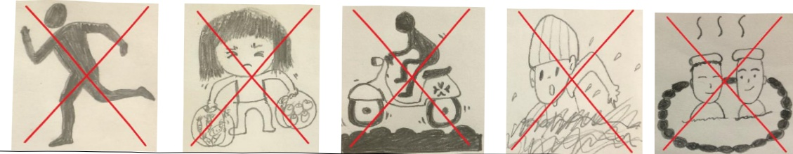

# 腎臟切片檢查後的護理照護

## 一、 名詞解釋

腎臟切片檢查為侵入性檢查。醫師利用超音波為導引，以穿刺針取得三小段的腎臟組織送檢，進行組織病理學的診斷，進而決定治療方針或推測腎臟病變的進展。

## 二、 適用對象

腎臟切片檢查後的病人。

## 三、 照護及注意事項

1. 何時可以開始進食：

檢查結束回病室後1小時，若生命徵象穩定且無不適，可以喝小量水無不適後開始採漸進式進食。

2. 砂袋加壓及臥床時間：

採仰臥平躺姿勢不能起身，在切片部位會以2公斤砂袋加壓止血6小時，砂袋移除後，需再平躺臥床2小時，平躺期間護理人員會遵照醫囑監測血壓及心跳，並診視您的狀況。

2 公斤砂袋固定平躺加壓止血 6 小時
義大驟療財團法人 21×29.7cm 2025.05 印製

## E-DA HEALTHCARE GROUP

### 3. 傷口疼痛和血尿的處理：

(1)腎臟切片後，如有穿刺部位劇痛、腹部劇痛、臉色蒼白、盜汗、心悸或胸悶等症狀，請立即告知醫護人員或立即回診。

(2)請適度喝水，可以促進尿液排泄。

(3)第一次小便時，請告知護理人員察看。

(4)若解尿困難時，請告知護理人員，必要時會協助導尿。

(5)若小便顏色有變紅，請立即告知醫護人員。

### 4. 請多休息：

腎臟切片後1~2個月內不要做劇烈運動，如跑步、彎腰、提重物、顛簸路面上騎車、不要游泳、不要泡溫泉等。

5. 抗血栓藥物或抗凝劑需停用 48 小時：

若原本有服用抗血小板藥物或抗凝劑者，請於腎臟切片後至少停藥48小時以上，並於出院前與醫師討論何時開始繼續服藥，以確保自己的用藥安全。

6. 如有任何狀況或疑問，請至腎臟科門診或本院急診就醫。

## 四、 参考资料

1. 王鈞渝、孫嘉慧、賴昭弟(2022)·創新產品：安心保賢袋·福祉科技與服務管理學刊，10(4)，336-347。

2. 朱宗信、高芷華(1998)·腎臟科：經皮腎臟切片檢查·台灣醫學，2(5)，590-593。

<table border=1 style='margin: auto; width: max-content;'><tr><td colspan="3">聯絡資訊</td></tr><tr><td style='text-align: center;'>義大醫院地址:高雄市燕巢區角宿里義大路1號電話:07-6150011</td><td style='text-align: center;'>義大癌治療醫院地址:高雄市燕巢區角宿里義大路21號電話:07-6150022</td><td style='text-align: center;'>義大大昌醫院地址:高雄市三民區大昌一路305號電話:07-5599123</td></tr></table>

2025.04 修訂 HA-9-0105(3)